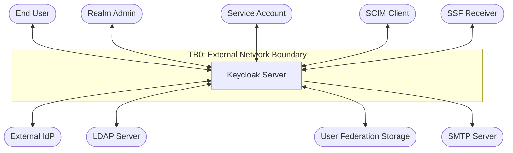
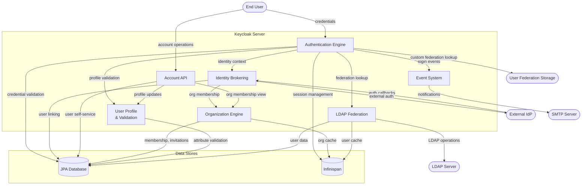
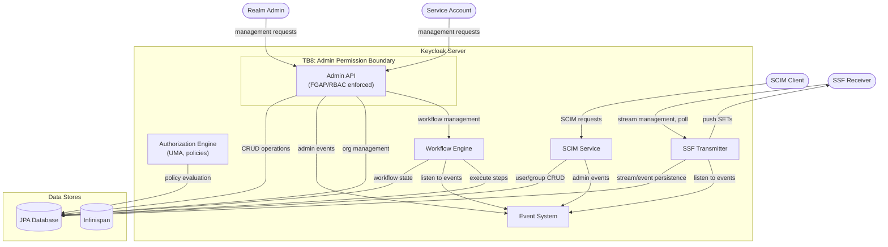

# Keycloak Data Flow Diagrams — Core-IAM Threat Modeling Reference

## Purpose

This is the index for Keycloak's core-iam Data Flow Diagrams (DFDs), used during STRIDE threat analysis. It contains shared 
definitions (actors, trust boundaries, system context) and an index of per-area DFD files under `dfd/`. Each DFD file contains 
its own component-to-file mapping. Coverage is scoped to the areas owned by the core-iam team: fine-grained permissions, RBAC, 
authorization services, identity brokering, LDAP, organizations, user profile, workflows, SCIM, Account API, and SSF.

## How to Use This File

When analyzing a change set with the threat modeling skill:

1. Identify which source files are affected by the change set
2. Use the **Area DFD Files** index below to find the relevant DFD file(s) by area label, then consult each DFD's **Components** table to confirm the affected source files map to that area
3. Read the relevant area DFD files under `dfd/` to understand the diagrams, data flows, and documented threat targets
4. Cross-reference STRIDE findings against the DFD-documented threat targets — prioritize threats at trust boundary crossings and flag documented threats that the change set fails to address

## Notation

- **Rounded boxes** (`([...])`) = External actors
- **Rectangles** (`[...]`) = Processes
- **Cylinders** (`[(...)]`) = Data stores
- **Dashed subgraphs** = Trust boundaries (labeled TB0–TB10)
- **Edge labels** = Data types flowing on that edge
- **Threat targets** listed per diagram = what an attacker would target at each point

## Actor Definitions

| ID | Actor | Description | Appears In |
|----|-------|-------------|------------|
| EU | End User | A human interacting via browser — login, registration, consent, profile management, account console | L0, L1, identity-brokering, organizations, user-profile, account-api |
| RA | Realm Admin | A human administrator performing management operations on a realm via the Admin REST API or Admin Console | L0, L1, admin-api, organizations, ssf-transmitter, workflows, scim |
| SA | Service Account | An OAuth2 confidential client representing a machine identity — a type of Client (CL) that authenticates via client credentials to invoke the Admin REST API or other protected endpoints | L0, L1, admin-api, scim |
| EI | External IdP | A federated identity provider (OIDC or SAML) that Keycloak delegates authentication to during identity brokering | L0, L1, identity-brokering, organizations, user-profile |
| LD | LDAP Server | An external LDAP directory — a built-in user federation implementation used for credential validation and user/group synchronization | L0, L1, ldap-federation |
| UF | User Federation Storage | A custom external identity store integrated via the User Storage SPI to federate user identities, credentials, and attributes into Keycloak | L0, L1 |
| SM | SMTP Server | An outbound mail server used for verification emails, password reset links, and invitation emails | L0, L1 |
| SC | SCIM Client | An external provisioning system that manages users and groups via the SCIM 2.0 REST API | L0, L1, scim |
| SR | SSF Receiver | A client application registered to receive Security Event Tokens (SETs) via the Shared Signals Framework | L0, L1, ssf-transmitter |
| CL | Client | An OAuth2 client application that authenticates with Keycloak and requests tokens or authorization decisions on behalf of itself or a user | authorization-services |
| RS | Resource Server | An OAuth2 resource server that relies on Keycloak-issued tokens to enforce access control on protected resources | authorization-services |

## Trust Boundary Definitions

| ID | Boundary | Description |
|----|----------|-------------|
| TB0 | External Network → Keycloak | All inbound HTTP/HTTPS requests from browsers, admin clients, external IdPs, SCIM clients, SSF receivers |
| TB1 | Keycloak → Persistence | Internal calls to JPA database and Infinispan cache |
| TB2 | Keycloak → External IdP | Outbound calls to federated identity providers |
| TB3 | Keycloak → LDAP/Federation | Outbound calls to user federation sources |
| TB4 | Keycloak → SMTP Server | Outbound email delivery |
| TB5 | Realm Isolation | Cross-realm access prevention — data and operations scoped to a single realm |
| TB6 | Organization Isolation | Multi-tenant boundaries within a realm |
| TB8 | Admin Permission Boundary | FGAP/RBAC authorization checks on admin operations |
| TB9 | SSF Outbound Delivery | Outbound push delivery of Security Event Tokens (SETs) to SSF receiver endpoints |
| TB10 | Workflow Execution Boundary | Authorization boundary between workflow event triggers and automated step execution |

---

## Level 0: System Context

Shows all external actors interacting with Keycloak from a core-iam perspective.

**Threat targets at Level 0:**

| Target | Attack Surface | STRIDE Categories |
|--------|---------------|-------------------|
| End User ↔ Keycloak | Login forms, session cookies, redirect URIs, account UI | Spoofing (credential theft, phishing), Tampering (parameter manipulation), Information Disclosure (token leakage in URL) |
| Realm Admin ↔ Keycloak | Admin REST API, bearer token authentication | Spoofing (admin token theft), Elevation of Privilege (FGAP/RBAC bypass, IDOR), Repudiation (missing admin events) |
| Service Account ↔ Keycloak | Admin REST API, client credentials grant | Spoofing (credential theft), Elevation of Privilege (over-scoped service account roles) |
| Keycloak → External IdP | Outbound HTTP calls, metadata fetch, token exchange | Tampering (SSRF, response forgery), Spoofing (IdP impersonation), Information Disclosure (credential leakage to rogue IdP) |
| Keycloak → LDAP Server | LDAP bind operations, search queries | Tampering (LDAP injection), Information Disclosure (credential exposure), Spoofing (directory poisoning) |
| Keycloak → User Federation Storage | User Storage SPI calls | Tampering (poisoned user data), Information Disclosure (credential exposure), Spoofing (identity injection) |
| Keycloak → SMTP Server | Email delivery with action links | Tampering (email content injection), Information Disclosure (PII in email), Spoofing (sender impersonation) |
| SCIM Client ↔ Keycloak | SCIM REST API, bearer token authentication | Elevation of Privilege (unauthorized user provisioning), Tampering (user attribute injection), Spoofing (SCIM client impersonation) |
| SSF Receiver ↔ Keycloak | SSF stream management API, poll/push delivery | Spoofing (receiver impersonation), Tampering (SET manipulation), Information Disclosure (event data leakage), Denial of Service (stream flooding) |

---

## Level 1: Core Subsystems

Expands Keycloak into its core-iam subsystems with inter-subsystem data flows and data stores. Split into two views for readability.

#### L1a: Authentication & Identity

#### L1b: Administration & Integration

**Internal trust boundaries:**

| Boundary | What It Protects | Enforcement Mechanism |
|----------|-----------------|----------------------|
| TB5: Realm Isolation | Data segregation between realms | Realm ID scoping on all queries; realm resolution from URL path |
| TB6: Organization Isolation | Multi-tenant boundaries within a realm | OrganizationProvider membership checks; org-scoped IdP associations |
| TB8: Admin Permission Boundary | Administrative operations | FGAP AdminPermissionEvaluator / Legacy RBAC checks per resource type and operation |
| TB9: SSF Outbound Delivery | SET delivery to external receivers | Bearer token authentication on stream endpoints; JWS signing of SETs; push URL validation |
| TB10: Workflow Execution Boundary | Prevents workflows from escalating beyond configured scope | Step-level permission validation; resource type scoping; condition evaluation |

**Threat targets at Level 1:**

| Subsystem | Key Threats |
|-----------|------------|
| Authentication Engine | Credential brute force, authentication flow bypass, session fixation, required action skip |
| Identity Brokering | IdP response forgery, identity confusion, account linking without consent, SSRF on metadata |
| Authorization Engine | Policy bypass, permission ticket forgery, resource permission confusion |
| Admin API | Missing FGAP checks, RBAC bypass, IDOR, cross-realm access, privilege escalation (Realm Admin and Service Account) |
| Account API | Unauthorized profile modification, credential enumeration, session hijacking |
| Event System | Missing audit events, log injection, repudiation |
| Organization Engine | Cross-org access, membership bypass, invitation token abuse |
| User Profile | Attribute injection, validation bypass, XSS via stored attributes |
| LDAP Federation | LDAP injection, credential exposure, directory poisoning, cache staleness |
| SCIM Service | Unauthorized provisioning, attribute injection, bulk operation DoS |
| SSF Transmitter | SET forgery, stream hijacking, event data leakage, push delivery SSRF |
| Workflow Engine | Privilege escalation via automated steps, event trigger abuse, condition bypass |

---

## Area DFD Files

Each area has a dedicated DFD file with diagrams, threat targets, and component listings.

| Area | Core-IAM Labels | File |
|------|----------------|------|
| Identity Brokering | `area/identity-brokering` | [dfd/identity-brokering.md](dfd/identity-brokering.md) |
| Admin API (FGAP/RBAC) | `area/admin/fine-grained-permissions`, `area/admin/rbac` | [dfd/admin-api.md](dfd/admin-api.md) |
| Authorization Services | `area/authorization-services` | [dfd/authorization-services.md](dfd/authorization-services.md) |
| LDAP / User Federation | `area/ldap` | [dfd/ldap-federation.md](dfd/ldap-federation.md) |
| Organizations | `area/organizations` | [dfd/organizations.md](dfd/organizations.md) |
| User Profile | `area/user-profile` | [dfd/user-profile.md](dfd/user-profile.md) |
| SCIM | `area/scim` | [dfd/scim.md](dfd/scim.md) |
| Account API | `area/account/api` | [dfd/account-api.md](dfd/account-api.md) |
| SSF Transmitter | `area/ssf` | [dfd/ssf-transmitter.md](dfd/ssf-transmitter.md) |
| Workflows | `area/workflows` | [dfd/workflows.md](dfd/workflows.md) |

