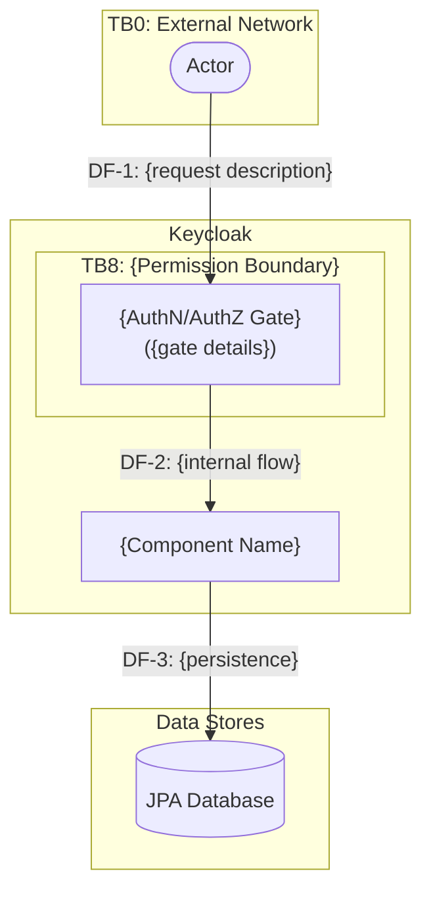

<!-- TEMPLATE INSTRUCTIONS
     =====================
     This is the DFD template for Keycloak core-iam threat modeling.
     Copy this file, rename it to match your area (e.g., identity-brokering.md),
     and replace all {placeholder} values with area-specific content.

     Section names MUST remain exactly as written — the threat modeling skill
     (code-review-threat-modeling) references them by name during STRIDE analysis.

     Required sections: Assumptions, Actors, at least one Diagram, Entry Points,
     Exit Points, Assets, Threat Targets, Components.

     The Instructions section is OPTIONAL — include it only when external
     standards or RFCs apply (e.g., SCIM has RFC 7643/7644, OIDC has RFC 6749).

     Remove all HTML comments (including this block) from the final DFD file.
-->

## {Feature Name} Flow

<!-- Optional section — delete if no external standards apply -->
## Instructions

When running STRIDE analysis, cross-reference threat targets against the following specifications. Fetch the referenced spec sections to verify compliance when a change touches a threat target area.

* [{Spec Name} — {RFC/Standard ID}]({url})

<!-- END optional Instructions section -->

### Assumptions

Consider the following assumptions when flagging threats and evaluating mitigations. Consider all the assumptions to be true unless a threat target explicitly contradicts one or more of them.

<!-- Typical count: 4–8 assumptions.
     Common assumptions to consider for every area:
     - TLS enabled (A1 in most DFDs)
     - Transaction atomicity (JPA/Hibernate)
     - Realm isolation model (explicit column vs. implicit UUID scoping)
     - Access control model (FGAP/RBAC, bearer token, session-based)
     - Feature flag requirements
     - Authentication gate behavior
-->

| # | Assumption | Rationale |
|---|------------|-----------|
| A1 | {Assumption statement} | {Why this assumption holds — reference deployment expectations, code behavior, or design decisions} |

### Actors

<!-- Write an introductory paragraph explaining:
     1. How the authentication gate works for this area (e.g., bearer token, session cookie, API key)
     2. What trust model applies (e.g., "restricted to service accounts", "any authenticated user", "realm admin only")
     3. Any notable access control nuances (e.g., "not restricted to service accounts — see TT-X.Y")
-->

{Introductory paragraph describing the authentication gate and trust model for this area.}

#### Actor Definitions

<!-- Use actor IDs from the reference architecture (core-iam-reference-architecture.md):
     EU (End User), RA (Realm Admin), SA (Service Account), EI (External IdP),
     LD (LDAP Server), SC (SCIM Client), SR (SSF Receiver), CL (Client), RS (Resource Server).
     Add area-specific actors (e.g., SYS for Scheduler, EVT for Event System) as needed.
-->

| ID | Actor | {Feature}-Specific Description | Trust Level |
|----|-------|--------------------------------|-------------|
| {ID} | {Actor name} | {How this actor interacts with this specific feature} | {Authentication/authorization requirements and trust boundaries} |

### {Flow Name}

<!-- DIAGRAM CONVENTIONS:
     - Use `flowchart TD` (top-down direction)
     - Trust boundaries: `subgraph TB{N}["TB{N}: {Boundary Name}"]`
       Use boundary IDs from reference architecture (TB0–TB10) where applicable
     - External actors: `ID(["Label"])`
     - Processes/components: `ID["Label (detail)"]`
     - Data stores: `ID[("Label")]`
     - Data flow labels: `"DF-{N}: {description}"`
     - Number data flows sequentially across all diagrams in the file
     - Create multiple diagrams when the feature has distinct execution paths
       (e.g., management CRUD flow vs. runtime execution flow)
-->

## Entry Points

<!-- Include both REST API endpoints and internal entry points (event listeners,
     schedulers, SPI hooks). Use EP-1 through EP-N numbering.
     Trust Level should state the authentication/authorization requirement.
-->

| ID | Entry Point | Description | Trust Level |
|----|------------|-------------|-------------|
| EP-1 | {HTTP method + path, or internal component name} | {What this entry point does} | {Who can access it and what checks are enforced} |

## Exit Points

<!-- Include all paths where data leaves the system boundary: HTTP responses,
     emails, admin events, logs, outbound HTTP calls, etc.
     Threat Relevance should reference specific threat targets (TT-X.Y) where applicable.
-->

| ID | Exit Point | Description | Data Exposed | Threat Relevance |
|----|-----------|-------------|--------------|------------------|
| EX-1 | {Response type or outbound channel} | {What data exits through this point} | {Specific data elements: PII, tokens, metadata, etc.} | {STRIDE category — how this exit point could be exploited; reference mitigations or threat targets} |

## Assets

<!-- List all protected resources managed or exposed by this area.
     Access Control should state the enforcement mechanism and any gaps.
-->

| ID | Asset | Description | Access Control |
|----|-------|-------------|----------------|
| AS-1 | {Asset name} | {What it is and why it matters} | {How access is controlled — FGAP/RBAC, realm scoping, feature flag, etc.} |

## Threat Targets

<!-- Organize threats into named target categories. Common categories:
     - Authentication & session security
     - Realm isolation
     - Organization isolation (if applicable)
     - Authorization
     - Input validation & parsing
     - Denial of service
     - Repudiation / audit
     - Information disclosure
     - Concurrency control (if applicable)

     Each category gets a ### heading and a table. Threat IDs use TT-X.Y format
     where X is the target number and Y is the threat within that target.

     MITIGATION values: Mitigated | Partial | Missing
     RISK values: Critical | High | Medium | Low
     STRIDE values: Spoofing | Tampering | Repudiation | Information Disclosure | Denial of Service | Elevation of Privilege

     Threat descriptions MUST include code references: `ClassName:lineNumber` or
     `method()` at `File:line` — grounding threats in actual code is what
     distinguishes this from a generic checklist.
-->

### Target TT-1: {Category Name}

| Mitigation | # | Risk | STRIDE | Threat |
|------------|---|------|--------|--------|
| {Mitigated/Partial/Missing} | TT-1.1 | {High/Medium/Low} | {STRIDE category} | {What could happen} — {code reference and mitigation details: `ClassName.method()` at `path/File.java:line`; describe what the code does or fails to do} |

### Target TT-2: {Category Name}

| Mitigation | # | Risk | STRIDE | Threat |
|------------|---|------|--------|--------|
| {Mitigated/Partial/Missing} | TT-2.1 | {High/Medium/Low} | {STRIDE category} | {Threat description with code references} |

## Components

<!-- List ALL Java classes relevant to this area. Use relative paths from the
     repository root. Group logically (SPI interfaces first, then implementations,
     then providers, etc.) but keep a single flat table.
-->

| Component | Class | Primary Source File |
|-----------|-------|---------------------|
| {Display name} | `{fully.qualified.ClassName}` | `{module/src/main/java/path/to/File.java}` |
