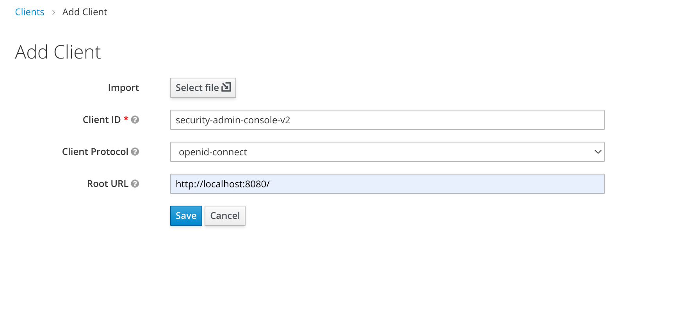

# Keycloak Admin Console V2
This project is the next generation of the Keycloak Administration Console.  It is written with React and [PatternFly 4][1].

### Development Instructions

For development on this project you will need a running Keycloak server listening on port 8180.  You will also need [yarn installed on your local machine.][2]

1. Start keycloak
    * Download and run with one command
        ```bash
        $> ./start.js
        ```
    * or download Keycloak server from [keycloak downloads page][3] unpack and run it like:
        ```bash
        $> cd <unpacked download folder>/bin
        $> standalone -Djboss.socket.binding.port-offset=100
        ```
1. Go to the clients section of the existing Keycloak Admin Console and add the client
    * like this:
    
    * or click on the "Select file" button and import `security-admin-console-v2.json`
    * or run `$> ./import.js`

1. Install dependencies and run:
    ```bash
    $> yarn
    $> yarn start
    ```

### Build and run through Docker
    git checkout git@github.com:keycloak/keycloak-admin-ui.git
    cd keycloak-admin-ui
    docker-compose build
    docker-compose up

You can reach the new admin interface at http://localhost

If your Keycloak instance is not on `localhost:8180`, create a file `.env` with the following:

    KEYCLOAK_ENDPOINT=https:\/\/remoteinstance.keycloak.com

### Additionally there are some nice scripts to format and lint

```bash
$> yarn format
$> yarn check-types
$> yarn lint
```

To switch to a RH-SSO themed version of this console you can run:

```bash
$> npx grunt switch-rh-sso
```

To switch back just do a `git checkout public`

# Keycloak UI Test Suite in Cypress

This repository contains the UI tests for Keycloak developed with Cypress framework

## Run the test suite
### Prerequisites
* `Keycloak distribution` has to be [downloaded](https://www.keycloak.org/downloads) and started on 8081 port.  
**note**: the port in at the test suite side in [cypress.json](cypress.json) or at the Keycloak side, see [Keycloak Getting Started Guide](https://www.keycloak.org/docs/latest/getting_started/#starting-the-keycloak-server),
* `npm package manager` has to be [downloaded](https://nodejs.org/en/download/) and installed.

### via Cypress Test Runner

**By using `npx`:**

**note**: [npx](https://www.npmjs.com/package/npx) is included with `npm > v5.2` or can be installed separately.

```shell
npx cypress open
```

After a moment, the Cypress Test Runner will launch:

 

### via terminal

**By executing:**

```shell
$(npm bin)/cypress run
```

...or...

```shell
./node_modules/.bin/cypress run
```

...or... (requires npm@5.2.0 or greater)

```shell
npx cypress run
```
**To execute a specific test on a specific browser run:**

```shell
cypress run --spec "cypress/integration/example-test.spec.js" --browser chrome
```
**note**: the complete list of parameters can be found in the [official Cypress documentation](https://docs.cypress.io/guides/guides/command-line.html#Commands).

## Project Structure

```text
/assets (added to .gitignore)
  /videos - if test fails, the video is stored here
  /screenshots - if test fails, the screenshot is stored here
/cypress
  /fixtures - external pieces of static data that can be used by your tests
  /integration - used for test files (supported filetypes are .js, .jsx, .coffee and .cjsx)
  /plugins
    - index.js - extends Cypress behaviour, custom plugins are imported before every single spec file run
  /support - reusable behaviour
    - commands.js - custom commands
    - index.js - runs before each test file

/cypress.json - Cypress configuration file
/jsconfig.json - Cypress code autocompletion is enabled here
```
**note**: More about the project structure in the [official Cypress documentation](https://docs.cypress.io/guides/core-concepts/writing-and-organizing-tests.html#Folder-Structure).
## License

* [Apache License, Version 2.0](https://www.apache.org/licenses/LICENSE-2.0)


[1]: https://www.patternfly.org/v4/
[2]: (https://classic.yarnpkg.com)
[3]: https://www.keycloak.org/downloads