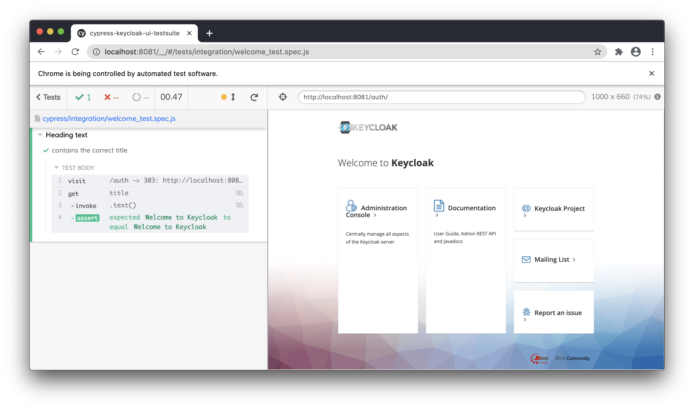

# Keycloak Admin UI

This project is the next generation of the Keycloak Administration UI. It is written with React and [PatternFly 4](https://www.patternfly.org/v4/).

## Development

### Prerequisites

Make sure that you have Node.js version 16 (or later) installed on your system. If you do not have Node.js installed we recommend using [Node Version Manager](https://github.com/nvm-sh/nvm) to install it.

You can find out which version of Node.js you are using by running the following command:

```bash
node --version
```

In order to run the Keycloak server you will also have to install the Java Development Kit (JDK). We recommend that you use the same version of the JDK as [required by the Keycloak server]((https://github.com/keycloak/keycloak/blob/main/docs/building.md#building-from-source)).

### Running the Keycloak server

First, ensure that all dependencies are installed locally using NPM by running:

```bash
npm install
```

After the dependencies are installed we can start the Keycloak server by running the following command:

```bash
npm run server:start
```

This will download the [Nightly version](https://github.com/keycloak/keycloak/releases/tag/nightly) of the Keycloak server and run it locally on port `8180`. If a previously downloaded version was found in the `server/` directory then that one will be used instead. If you want to download the latest Nightly version you can remove the server directory before running the command to start the server.

In order for the development version of the Admin UI to work you will have to import a custom client to the Keycloak server. This is only required during development as the development server for the Admin UI runs on a different port (more on that later).

Wait for the Keycloak server to be up and running and run the following command in a new terminal:

```bash
npm run server:import-client
```

You'll only have to run this command once, unless you remove the server directory or Keycloak server data.

### Running the development server

Now that the Keycloak sever is running it's time to run the development server for the Admin UI. This server is used to build the Admin UI in a manner that it can be iterated on quickly in a browser, using features such as [Hot Module Replacement (HMR) and Fast Refresh](https://www.snowpack.dev/concepts/hot-module-replacement).

To start the development server run the following command:

```bash
npm run start
```

Once the process of optimization is done your browser will automatically open your local host on port `8080`. From here you will be redirected to the Keycloak server to authenticate, which you can do with the default username and password (`admin`).

You can now start making changes to the source code, and they will be reflected in your browser.

## Building as a Keycloak theme

If you want to build the application using Maven and produce a JAR that can be installed directly into Keycloak, check out the [Keycloak theme documentation](./keycloak-theme/README.md).

## Linting

Every time you create a commit it should be automatically linted and formatted for you. It is also possible to trigger the linting manually:

```bash
npm run lint
```

## Theming

It's possible to theme the Admin UI interface, this is useful if you want to apply your own branding so that the product looks familiar to your users. The Admin UI comes with two built-in themes called `keycloak` and `rh-sso`, by default the `keycloak` theme will be used when building the application.

This behavior can be changed by passing in a `THEME_NAME` environment variable, for example if wanted to build the application using the `rh-sso` theme we can do the following:

```bash
THEME_NAME=rh-sso npm run build
```

And likewise if we wanted to start a development server with this theme:

```
THEME_NAME=rh-sso npm run start
```

To make it simpler to build the `rh-sso` theme there are some shorthand NPM scripts available that you can run instead:

```bash
# Run a production build with the 'rh-sso' theme
npm run build:rh-sso

# Or for development
npm run start:rh-sso 
```

### Creating your own theme

All themes are located in the `themes/` directory of the project, if you want to create a new theme you can create a new directory here and name it the same as your theme. Copy the files from the default theme here and customize them to your liking.

## Keycloak UI Test Suite in Cypress

This repository contains the UI tests for Keycloak developed with Cypress framework

### Prerequisites

* `Keycloak distribution` has to be [downloaded](https://www.keycloak.org/downloads) and started on 8081 port.  
**note**: the port in at the test suite side in [cypress.json](cypress.json) or at the Keycloak side, see [Keycloak Getting Started Guide](https://www.keycloak.org/docs/latest/getting_started/#starting-the-keycloak-server),
* `npm package manager` has to be [downloaded](https://nodejs.org/en/download/) and installed.

### via Cypress Test Runner

**By using `npx`:**

**note**: [npx](https://www.npmjs.com/package/npx) is included with `npm > v5.2` or can be installed separately.

```shell
npx cypress open
```

After a moment, the Cypress Test Runner will launch:

 

### via terminal

**By executing:**

```shell
$(npm bin)/cypress run
```

...or...

```shell
./node_modules/.bin/cypress run
```

...or... (requires npm@5.2.0 or greater)

```shell
npx cypress run
```

**To execute a specific test on a specific browser run:**

```shell
cypress run --spec "cypress/integration/example-test.spec.js" --browser chrome
```

**note**: the complete list of parameters can be found in the [official Cypress documentation](https://docs.cypress.io/guides/guides/command-line.html#Commands).

Read more about [how to write tests](./cypress/WRITING_TESTS.md)

## Project Structure

```text
/assets (added to .gitignore)
  /videos - if test fails, the video is stored here
  /screenshots - if test fails, the screenshot is stored here
/cypress
  /fixtures - external pieces of static data that can be used by your tests
  /integration - used for test files (supported filetypes are .js, .jsx, .coffee and .cjsx)
  /plugins
    - index.js - extends Cypress behaviour, custom plugins are imported before every single spec file run
  /support - reusable behaviour
    - commands.js - custom commands
    - index.js - runs before each test file

/cypress.json - Cypress configuration file
/jsconfig.json - Cypress code autocompletion is enabled here
```

**note**: More about the project structure in the [official Cypress documentation](https://docs.cypress.io/guides/core-concepts/writing-and-organizing-tests.html#Folder-Structure).

## License

* [Apache License, Version 2.0](https://www.apache.org/licenses/LICENSE-2.0)
