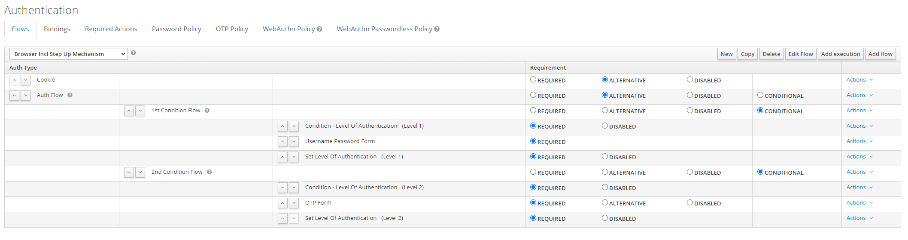
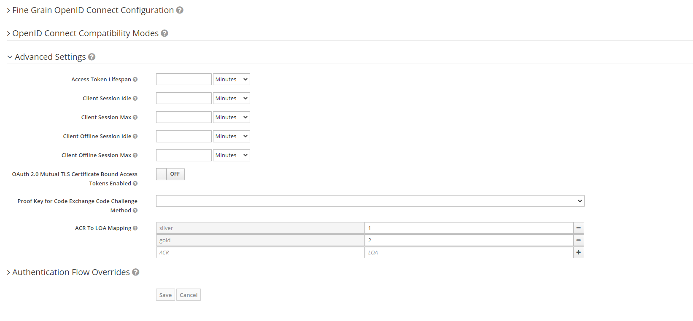

# Step up Authentiation

The Step up mechanism is based on the design proposal [1].

What has been implemented (for OIDC):
* Text mapping in the client configuration to do the text to value translation
* Putting the achieved level of authentication at the 'acr' claim in both the access token and the id token (either as an integer or an textual representation)
* Condition Execution to execute the flow (Condition 1, Condition 2, ...)
* Set Loa on Success Execution (with the option to store the achieved LoA into the user session or not)
* Extension to the Default Authentication Flow in order to determine if a certain level of authentication is reached

## Auth Request for a Specific Level of Authentication
To specify a requested level of authentication (LoA) the claims parameter is used in the auth request.

Example Request:

https://{DOMAIN}/auth/realms/{REALMNAME}/protocol/openid-connect/auth?client_id={CLIENT-ID}&redirect_uri={REDIRECT-URI}&scope=openid&response_type=code&response_mode=query&nonce=exg16fxdjcu&claims=%7B%22id_token%22%3A%7B%22acr%22%3A%7B%22essential%22%3Atrue%2C%22values%22%3A%5B%22gold%22%5D%7D%7D%7D

The claims parameter is specified in a JSON representation:
claims= {
            "id_token": {
                "acr": {
                    "essential": true,
                    "values": ["silver", "gold"]
                }
            }
        }

Please refer to the openid-spec for further details.

## Flow Configuration

## Configure the Text Mapping at the Client
It is possible to map the acr_values to a textual representation at the client.

If configured, both the access token and the id token will include the acr in a textual representation.

## Open Points

### No ACR Value Specified in the Request
The design proposal describes that if no LoA is configured at the client, and in the auth request no LoA (acr_value) is specified, the value -1 shall be used. -1 is a constant that indicates that a full authentication should be performed. 
This means that Keycloak will always do a full authentication, even if the user is already authenticated to a certain level of authentication, e.g.
if a user is authenticated with a LoA of 1, and in the subsequent authentication request no loa is specified, Keycloak will do a full authentication, although the user already has a certain level of authentication.
We have implemented the -1 constant as described in the design proposal: https://github.com/primesign/keycloak/pull/6, but those are breaking changes to the tests. The failing tests check the behaviour that the user is still authenticated when logging in again. We consider this is a design change of keyclaok and would be very happy for some feedback on this. 
UPDATE: This topic was discussed in the dev mailing list [2]. To sum it up: If no acr is requested we solely perform the first level of authentication.

### Additional Feature (Translation Scope to LoA)
As discussed in the dev mailing list [2] the additional feature to translate a scope to a specific LoA can be contributed from our side. But first we would like to focus on the core functionality of step-up authentication before adding the code for this feature. 

[1] https://github.com/keycloak/keycloak-community/blob/master/design/multi-factor-admin-and-step-up.md#design-proposal-for-keycloak-847
[2] https://groups.google.com/g/keycloak-dev/c/vGykpTBxyn4/m/qk0KGOt1AQAJ
