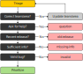
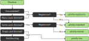

# Bug triage process

## Actions

When triaging a bug in most cases there is a single action required. Actions can be
executed on an GitHub Issue either by adding the label `action-<action name>` or
adding `~<action-name>` as the last line of the comment.

For example if an issue is missing information you could comment:

```
There is not enough information here, and I'm not following the steps-to-reproduce.

~missing-info
```

You could also for example just add the label `action/priority-regression` to an issue.

## Triaging bugs

### Verify the issue

The first step is to verify if the issue is a valid issue following these questions:



If an issue is not valid add a comment with some explanation, and add `~<action-name>` as the last line of the comment
to trigger corresponding action. 

In cases where it is clear that no additional comment is needed you can just add the `action/<action-name>` label. For
example if the description only states `It doesn't work` then there's not much point in explaining what information is
missing.

#### CVE reports on third-party libraries

Known CVEs on third-party libraries will be automatically created as GitHub issues, labeled with `kind/cve`, `kind/bug`, and `status/triage`. The triager identifies the responsible team for the dependency and assigned the appropriate `team/...` label. This process is similar to the bug triage process previously mentioned.

When evaluating the CVE report, assess the impact on the codebase by determining if we are vulnerable or affected. "Vulnerable" means that we use the code reported in the CVE, while "affected" means that we have the dependency with the CVE present but do not use the vulnerable code, making it impossible to exploit the CVE. If closing an issue as "not planned," include a proper explanation and the reason for closing it for future reference.

### Prioritize the issue

Second step is to prioritize the bug depending on how common the use-case is, if it's a regression, 
or not blocking anything, for example a typo:



When selecting the priority for an issue add the `action-<action-name>` label to the issue.


## Missing information

Bugs with insufficient information are assigned the labels `status/missing-info` and `status/auto-expire`, and the
`status/triage` label is removed.

If the original reporter provides additional information the issue is automatically move back to triage by re-adding
the `status/triage` label. Otherwise, if the reporter does not provide additional information within 14 days the issue 
is automatically closed.

This effectively means that teams do not actively have to look at issues with missing information, since the issue
will be moved back to their triage backlog of more information is provided.

To prevent an issue with missing information to be automatically closed, remove the `status/auto-expire` label.


## Low and normal priority issues

In most cases these are not issues we will fix, and we will look for contributions (by adding the `help wanted` label) 
to resolve them. As such the team does not actively monitor issues with these priorities.

The bot will automatically bump the priority based on reactions added to the issue description:

* Low priority bumped to normal if there are 10 or more reactions
* Normal priority bumped to important if there are 20 or more reactions

To prevent an issue from being automatically bumped, remove the `status/auto-bump` label.

If there are no updates to low or normal priority issues they will be automatically closed:

* Low priority are closed after 90 days
* Normal priority are closed after 180 days

To prevent an issue from being automatically closed, remove the `status/auto-expire` label.


## Changing priority

To change the priority of an issue that has already been triaged simply add the new priority label. 
The bot will take care of removing the existing priority label. It will also remove auto bumping and auto expiration 
for the issue if the priority is set to important or blocker.

The priority for an issue is also bumped to important if the `team/rh-iam` label is added.


## Backporting

When triaging or fixing an issue consider if the fix should be backported. If it should be backported add the
corresponding `backport/<release branch>` label.

For convenience, use the `.github/scripts/pr-backport.sh` to help create the backport PRs. 

By adding a `backport/<release branch>` label to the issue it is automatically added to the patch release project, and
additionally when merging the PR the `backport/<release branch>` is automatically replaced with a `release/x.y.z` label.
Please do not add `release/x.y.z` manually!  