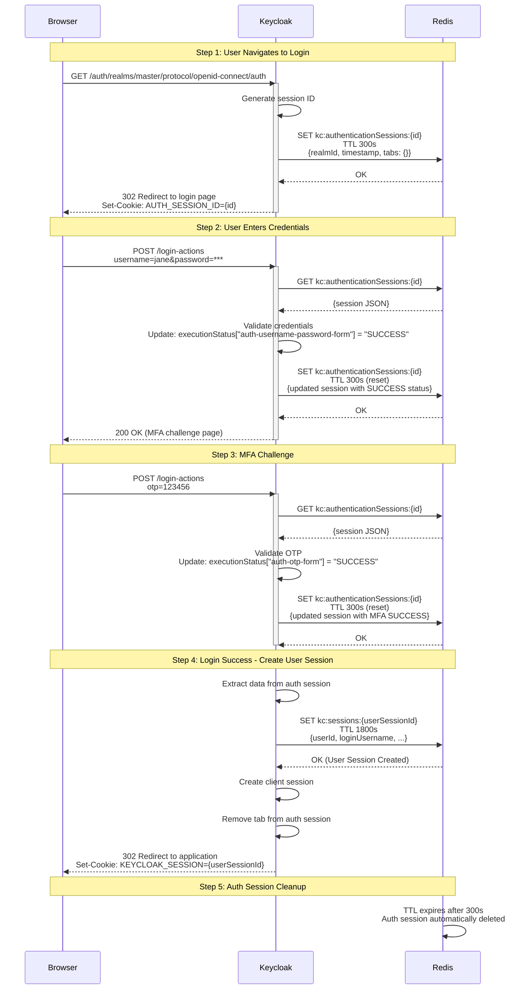
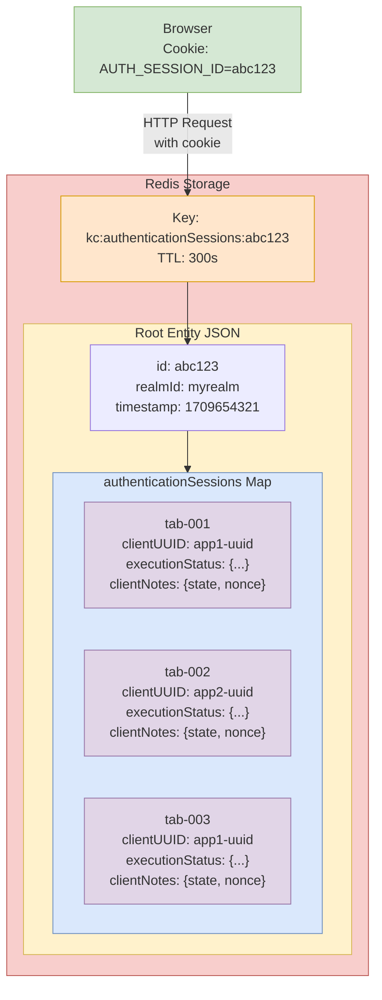
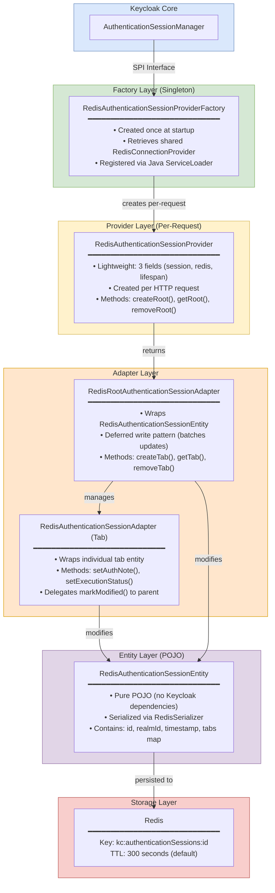
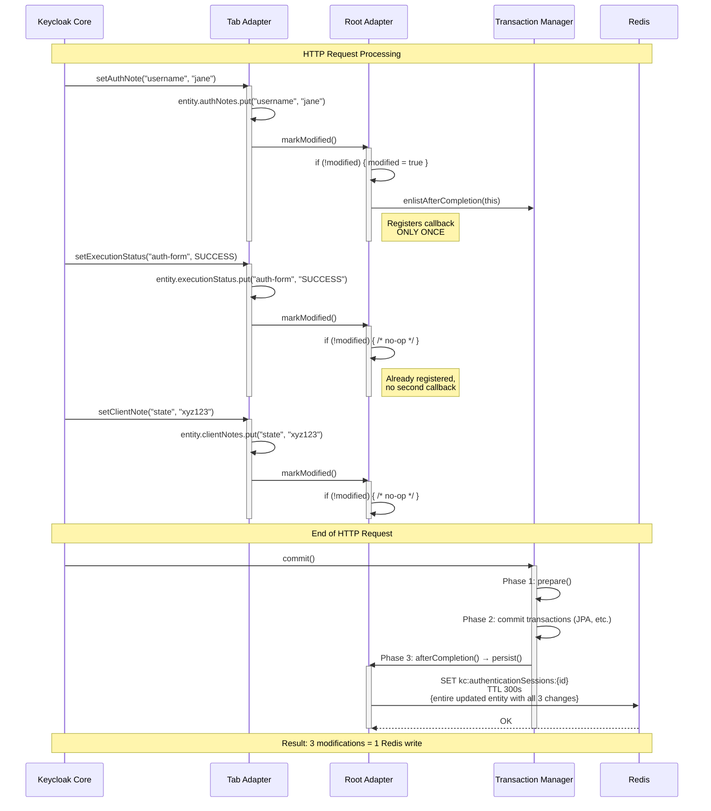

<!--
Copyright 2026 Capital One Financial Corporation and/or its affiliates
and other contributors as indicated by the @author tags.

Licensed under the Apache License, Version 2.0 (the "License");
you may not use this file except in compliance with the License.
You may obtain a copy of the License at

http://www.apache.org/licenses/LICENSE-2.0

Unless required by applicable law or agreed to in writing, software
distributed under the License is distributed on an "AS IS" BASIS,
WITHOUT WARRANTIES OR CONDITIONS OF ANY KIND, either express or implied.
See the License for the specific language governing permissions and
limitations under the License.
-->

# Redis Authentication Session Provider

This document explains how the Redis SPI handles **authentication sessions** — the short-lived sessions Keycloak creates during login flows.

## Table of Contents

1. [What Is an Authentication Session?](#what-is-an-authentication-session)
2. [Architecture Overview](#architecture-overview)
3. [Key Design Patterns](#key-design-patterns)
4. [Configuration](#configuration)
5. [Data Model](#data-model)
6. [Performance Characteristics](#performance-characteristics)
7. [API Reference](#api-reference)

---

## What Is an Authentication Session?

### Authentication Session vs. User Session

Keycloak has two distinct session types that serve fundamentally different purposes:

| Aspect | Authentication Session | User Session |
|--------|------------------------|--------------|
| **Purpose** | Tracks flow *during authentication* (credentials, MFA, consent) | Represents a logged-in user *after authentication* succeeds |
| **Lifespan** | Seconds to minutes | Hours to days |
| **Created when** | User navigates to a login page or any auth flow begins | Login flow completes successfully |
| **Destroyed when** | Login succeeds (explicitly deleted) or abandoned (TTL expiry) | User logs out, admin revokes, or idle/max timeout reached |
| **Contains** | OAuth parameters (`state`, `nonce`), execution progress, authenticator notes | User identity, realm roles, active client connections (client sessions) |

### The Handoff Moment

The critical transition happens when login succeeds. When all authentication steps complete, Keycloak performs a handoff:

1. **Reads** data from the authentication session (user identity, client info, auth notes)
2. **Creates** a new user session (long-lived) with that data
3. **Creates** a client session under the user session (linking the user to the specific application)
4. **Removes** the tab from the authentication session (its job is done)*

> *In our Redis implementation, the root authentication session is not immediately deleted — the Redis **TTL** handles cleanup (default: 300 seconds).

After this point, the authentication session is effectively abandoned. The user session takes over and is what Keycloak checks on every subsequent request to determine "is this user still logged in?"

### Example JSON: What Each Session Looks Like in Redis (Standalone mode)
- Note: In cluster mode, the keys would have hash tags like `kc:authenticationSessions:{<id>}` and versions would be `kc:authenticationSessions:{<id>}:_ver`

**Authentication Session** — `kc:authenticationSessions:<id>`, TTL 300s:

```json
{
  "id": "a1b2c3d4-...",
  "realmId": "myrealm",
  "timestamp": 1709654321,
  "authenticationSessions": {           // ← tabs map (one entry per browser tab)
    "tab-001": {
      "tabId": "tab-001",
      "clientUUID": "f47ac10b-...",     // ← which app is being logged into
      "authUserId": "user-8a3b4c5d",
      "executionStatus": {              // ← tracks each authenticator step
        "auth-username-password-form": "SUCCESS",
        "auth-otp-form": "CHALLENGED"
      },
      "clientNotes": {                  // ← OAuth params (discarded after login)
        "state": "xyzRandom123",
        "nonce": "abc987nonce",
        "code_challenge": "E9Melhoa..."
      },
      "authNotes": { "username": "jane.doe" }
    }
  }
}
```

**User Session** — `kc:sessions:<id>`, TTL hours/days:

```json
{
  "id": "b2c3d4e5-...",
  "realmId": "myrealm",
  "userId": "user-8a3b4c5d",           // ← who is logged in
  "loginUsername": "jane.doe",
  "ipAddress": "192.168.1.42",
  "started": 1709654325,
  "lastSessionRefresh": 1709654325,
  "state": "LOGGED_IN",                // ← post-login identity facts only
  "offline": false
}
```

> Notice the auth session is all about **in-progress flow state** (execution statuses, OAuth challenge params like `state`/`nonce`/PKCE) while the user session is just **identity facts**. The OAuth parameters are discarded after login — they never appear in the user session.

### Why Two Separate Session Types?

- **Security isolation** — Authentication sessions contain sensitive in-progress data (partial credentials, MFA challenges). Keeping them separate and short-lived minimizes the window of exposure.
- **Different lifecycles** — An auth session lives for seconds; a user session lives for hours. Mixing them in one entity would complicate TTL management and cleanup.
- **Different access patterns** — Auth sessions are written frequently (every authenticator step updates execution status). User sessions are read-heavy (checked on every API call) with infrequent writes (token refresh, session extension).
- **Clean separation of concerns** — In our Redis code, each session type has its own Provider, Adapter, Entity, and Redis key prefix. They share only the `RedisConnectionProvider` singleton.

### Browser Login Flow

The most common flow is a browser-based login (username/password). Here's what happens between the browser, Keycloak, and Redis at each step:



**Key insights:**
- Each authentication step follows the same Redis pattern: `GET` the session → validate and update in memory → `SET` the updated session at request commit
- TTL is reset on every write, giving the user 5 minutes per step
- Auth session is NOT explicitly deleted on success — Redis TTL handles cleanup
- User session (long-lived) is created only after all authentication steps complete

### Authentication Flow Types

All flows use the same `RedisAuthenticationSessionEntity` and `RedisAuthenticationSessionProvider`:

| Flow Type | Example | Lifespan | Notes |
|-----------|---------|----------|-------|
| **Browser Login** | Username + password + OTP | ~seconds to minutes | Most common; walkthrough above |
| **ROPC** (Resource Owner Password Credentials) | Token endpoint direct call | Very short | No browser UI; session created and destroyed in one request |
| **Client Credentials** | Service-to-service token | Very short | No user involved; minimal auth session |
| **Device Authorization** | Smart TV login | Minutes (user code entry) | Auth session lives until user enters code on second device |
| **Identity Brokering** | "Login with Google" | Seconds | Auth session tracks state across redirect to external IdP |
| **Step-Up Authentication** | Re-auth for sensitive action | Seconds | New auth session created even if user session already exists |
| **Action Tokens** | Password reset link | Minutes to hours | Auth session created when user clicks the link |
| **CIBA** (Client-Initiated Backchannel Auth) | Push notification login | Minutes | Auth session tracks backchannel polling state |

---

## Architecture Overview

### Root vs. Tab — Visual Mental Model

- A **root session** is a single Redis key (`kc:authenticationSessions:<id>`) containing one JSON blob
- Inside that JSON blob, a `ConcurrentHashMap` holds **tab entities** keyed by tab ID
- Each tab can be logging into a **different application** with independent OAuth parameters (`state`, `nonce`, `code_challenge`)
- Two tabs logging into the **same** app still get separate tab entities (different `redirect_uri`, independent `executionStatus`)
- All tabs share one `AUTH_SESSION_ID` cookie → one Redis key → one JSON blob
- When **any** tab modifies its state, the **entire** root entity is rewritten to Redis



### Layer Diagram

Our authentication session code follows the standard Keycloak SPI (Service Provider Interface) pattern: **Factory → Provider → Adapter → Entity**.



**Key points:**

- **Provider** is a **lightweight per-request wrapper** — only 3 fields (~24 bytes): `session`, `redis`, `authSessionLifespan`
- **Redis connection** is a **singleton** — lives for the entire Keycloak process
  - Created lazily on first access
  - Retrieved by all providers via `AbstractRedisProviderFactory.getRedisProvider()`
  - Same connection object shared across all requests, all threads
- **SPI registration**: `META-INF/services/org.keycloak.sessions.AuthenticationSessionProviderFactory` contains a single line pointing to our factory → Java `ServiceLoader` discovers it at startup
- **Entity** has no Keycloak dependencies — it's a pure POJO with no annotations
  - Serialization is handled by `RedisSerializer`, which configures Jackson's `ObjectMapper` with field-level visibility (`PropertyAccessor.FIELD`) and `NON_NULL` inclusion — no annotations needed on the entity itself
  - This means it can be tested and serialized without a running Keycloak instance

---

## Key Design Patterns

| Pattern | Why | Key Benefit |
|---------|-----|-------------|
| **Deferred Write** | Batches N modifications into 1 Redis write per request | Reduces Redis load by 10x+ on auth flows |
| **Defensive Copy on Getters** | Prevents bypassing `markModified()` via direct map mutation | Guarantees consistency |
| **Null-Removes-Entry** | `ConcurrentHashMap` can't store nulls + SPI contract uses null = "clear" | API compatibility |
| **ExecutionStatus String Conversion** | Keeps entity free of Keycloak imports (dependency isolation) | Entity is pure POJO |
| **TTL-Based Expiration** | Redis handles expiry; no background cleanup needed | Zero operational overhead |
| **restartSession() Reuses Root ID** | Avoids breaking `AUTH_SESSION_ID` cookie on failed login | Better UX on retry |
| **Orphan Tab Filtering** | Silently skips tabs whose client was deleted | Graceful degradation |

### Deferred Write

The deferred write pattern is critical for performance — it batches multiple modifications into a single Redis write.

**Problem**: Without batching, every `setAuthNote()`, `setAction()`, `setExecutionStatus()` during a single HTTP request would each trigger a separate Redis `SET`.

**Solution**: `markModified()` registers a transaction callback **once** on first call; the `persist()` method fires at transaction commit.

**Result**: 10 modifications in one request = 1 Redis write



**Implementation**: `RedisRootAuthenticationSessionAdapter` implements the deferred write logic

**Transaction plumbing**: `AbstractRedisPersistenceTransaction` implements `KeycloakTransaction`, with `commit()` calling the abstract `persist()`

### Defensive Copy on Getters

- **Problem**: If `getClientNotes()` returned the entity's internal `ConcurrentHashMap` directly, callers could mutate it without triggering `markModified()`
- **Solution**: Getters return `new HashMap<>(entity.getClientNotes())` — a copy
- **Applies to**: `getClientNotes()`, `getUserSessionNotes()`, `getRequiredActions()`, `getClientScopes()`
- **Trade-off**: Small allocation cost per getter call, but guarantees consistency

### Null-Removes-Entry

- **Problem**: `ConcurrentHashMap` throws `NullPointerException` if you `put(key, null)` — and the SPI contract uses null to mean "remove this note"
- **Solution**: Setters check `if (value == null) map.remove(name) else map.put(name, value)`
- **Applies to**: `setClientNote()`, `setAuthNote()`, `setUserSessionNote()`

### ExecutionStatus String Conversion

- **Problem**: `AuthenticationSessionModel.ExecutionStatus` is a Keycloak enum — storing it directly in the entity would require a Keycloak dependency
- **Solution**: Entity stores execution statuses as `Map<String, String>`
- **Adapter converts**: `status.name()` on write, `ExecutionStatus.valueOf()` on read
- **Benefit**: Entity remains a pure POJO, testable without Keycloak runtime

### TTL-Based Expiration

- **Problem**: Infinispan requires explicit cleanup of expired sessions
- **Solution**: Redis `SET` sets a TTL on every write — expired sessions vanish automatically
- **Result**: `removeAllExpired()` and `removeExpired(realm)` are no-ops that just log
- **Implementation**: Provider sets TTL using `PSETEX` command on every write

### restartSession() Reuses Root ID

- **Problem**: When a login fails and the user needs to retry, Keycloak calls `restartSession()` — if this created a new root session with a new ID, the `AUTH_SESSION_ID` cookie would break
- **Solution**: `restartSession()` clears all tabs and resets the timestamp, but **keeps the same root entity and ID**
- **Benefit**: Browser keeps working with same cookie, seamless retry experience

### Orphan Tab Filtering

- **Problem**: If an admin deletes a client while users have active login tabs for that client, the tab entity references a `clientUUID` that no longer resolves
- **Solution**: `getAuthenticationSessions()` calls `realm.getClientById()` for each tab and **silently skips** tabs where the client is `null`
- **Implementation**: Graceful degradation — other tabs continue to work

---

## Configuration

### Enable Redis Authentication Session Provider

```bash
# Enable Redis authentication session provider
--spi-authentication-sessions-provider=redis

# Configure auth session timeout (seconds, default: 300)
--spi-authentication-sessions-redis-auth-session-lifespan=300

# Redis connection (shared across all providers)
--spi-connections-redis-default-connection-uri=redis://localhost:6379
```

### TTL Management

- **Default TTL**: 5 minutes (300 seconds)
- **Automatic cleanup**: Redis expires keys when TTL reaches zero
- **Extended on activity**: Each write resets the TTL to the configured lifespan
- **No background cleanup**: Unlike Infinispan, Redis handles expiration natively

### Environment Variables

```bash
# Override default lifespan via environment variable
KC_SPI_AUTHENTICATION_SESSIONS_REDIS_AUTH_SESSION_LIFESPAN=600

# Connection URI can also be set via environment
KC_SPI_CONNECTIONS_REDIS_DEFAULT_CONNECTION_URI=redis://redis-cluster:6379
```

---

## Data Model

### Redis Key Structure

```
kc:authenticationSessions:<sessionId>            # Auth session data (JSON) — standalone mode
kc:authenticationSessions:{<sessionId>}          # Auth session data (JSON) — cluster mode (hash-tagged)
kc:authenticationSessions:_ver:<sessionId>       # Optimistic locking version — standalone mode
kc:authenticationSessions:{<sessionId>}:_ver     # Optimistic locking version — cluster mode
```

### Entity Structure

```java
public class RedisAuthenticationSessionEntity {
    private String id;                                    // Root session ID
    private String realmId;                               // Which realm this belongs to
    private int timestamp;                                // Creation timestamp
    private ConcurrentHashMap<String, RedisAuthenticationTabEntity> authenticationSessions; // Tabs map

    // Inner static class — lives inside RedisAuthenticationSessionEntity
    public static class RedisAuthenticationTabEntity {
        private String tabId;                                 // Browser tab identifier
        private String clientUUID;                            // Which client/app
        private String authUserId;                            // User being authenticated
        private String action;                                // Current action (e.g., "AUTHENTICATE")
        private String protocol;                              // "openid-connect" or "saml"
        private String redirectUri;                           // Where to redirect after login
        private Map<String, String> clientNotes;              // OAuth params (state, nonce, PKCE)
        private Map<String, String> authNotes;                // Authenticator notes
        private Map<String, String> userSessionNotes;         // Notes to transfer to user session
        private Map<String, String> executionStatus;          // Authenticator execution statuses
        private Set<String> requiredActions;                  // Required actions (e.g., "UPDATE_PASSWORD")
        private Map<String, String> clientScopes;             // Requested OAuth scopes (stored as Map for ConcurrentHashMap compatibility)
    }
}
```

### Memory Size

- **Root entity**: ~0.5 KB (empty, with one tab)
- **Tab entity**: ~1-2 KB (with OAuth params and execution status)
- **Typical auth session**: ~1.5-2 KB total (one tab)
- **Multi-tab session**: ~1.5 KB + (1 KB × number of tabs)

---

## API Reference

### Provider Methods

**Create root session:**
```java
RootAuthenticationSessionModel createRootAuthenticationSession(RealmModel realm)
RootAuthenticationSessionModel createRootAuthenticationSession(RealmModel realm, String id)
```

**Retrieve root session:**
```java
RootAuthenticationSessionModel getRootAuthenticationSession(RealmModel realm, String authenticationSessionId)
```

**Remove root session:**
```java
void removeRootAuthenticationSession(RealmModel realm, RootAuthenticationSessionModel authenticationSession)
```

**Expiration (no-ops in Redis):**
```java
void removeAllExpired()  // Redis TTL handles this
void removeExpired(RealmModel realm)  // Redis TTL handles this
```

### Root Adapter Methods

**Tab management:**
```java
AuthenticationSessionModel createAuthenticationSession(ClientModel client)
AuthenticationSessionModel getAuthenticationSession(ClientModel client, String tabId)
void removeAuthenticationSessionByTabId(String tabId)
void restartSession(RealmModel realm)  // Clears all tabs, keeps root ID
```

**Getters:**
```java
String getId()
RealmModel getRealm()
int getTimestamp()
Map<String, AuthenticationSessionModel> getAuthenticationSessions()
```

### Tab Adapter Methods

**OAuth parameters:**
```java
void setClientNote(String name, String value)
String getClientNote(String name)
Map<String, String> getClientNotes()
void removeClientNote(String name)
```

**Authenticator state:**
```java
void setAuthNote(String name, String value)
String getAuthNote(String name)
Map<String, String> getAuthNotes()
void removeAuthNote(String name)
```

**Execution status:**
```java
void setExecutionStatus(String authenticator, AuthenticationSessionModel.ExecutionStatus status)
AuthenticationSessionModel.ExecutionStatus getExecutionStatus(String authenticator)
Map<String, AuthenticationSessionModel.ExecutionStatus> getExecutionStatuses()
```

**User session notes:**
```java
void setUserSessionNote(String name, String value)
Map<String, String> getUserSessionNotes()
```

**Required actions and scopes:**
```java
void addRequiredAction(String action)
void removeRequiredAction(String action)
Set<String> getRequiredActions()
void addClientScope(String scope)
Set<String> getClientScopes()
```

---

## Source Code Reference

**Main Files:**
- `model/redis/src/main/java/org/keycloak/models/redis/session/RedisAuthenticationSessionProvider.java` - Provider implementation
- `model/redis/src/main/java/org/keycloak/models/redis/session/RedisAuthenticationSessionProviderFactory.java` - Factory
- `model/redis/src/main/java/org/keycloak/models/redis/session/RedisAuthenticationSessionAdapter.java` - Tab adapter
- `model/redis/src/main/java/org/keycloak/models/redis/session/RedisRootAuthenticationSessionAdapter.java` - Root adapter
- `model/redis/src/main/java/org/keycloak/models/redis/entities/RedisAuthenticationSessionEntity.java` - Entity (POJO)

**Test Coverage:**
- `model/redis/src/test/java/org/keycloak/models/redis/test/session/RedisAuthenticationSessionProviderTest.java` - Unit tests
- `model/redis/src/test/resources/features/auth-sessions.feature` - ATDD scenarios (Cucumber/Gherkin)

---

## See Also

- [User Sessions Provider](user-sessions.md) - Long-lived post-authentication sessions
- [Cluster Provider](cluster.md) - Multi-node coordination and Pub/Sub
- [Architecture Overview](../architecture/overview.md) - Complete system architecture
- [Session Creation Flow Diagram](../architecture/data-flow-session-creation.md) - Visual sequence diagram
