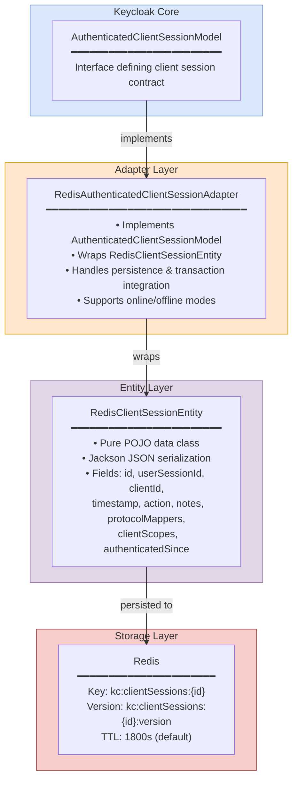
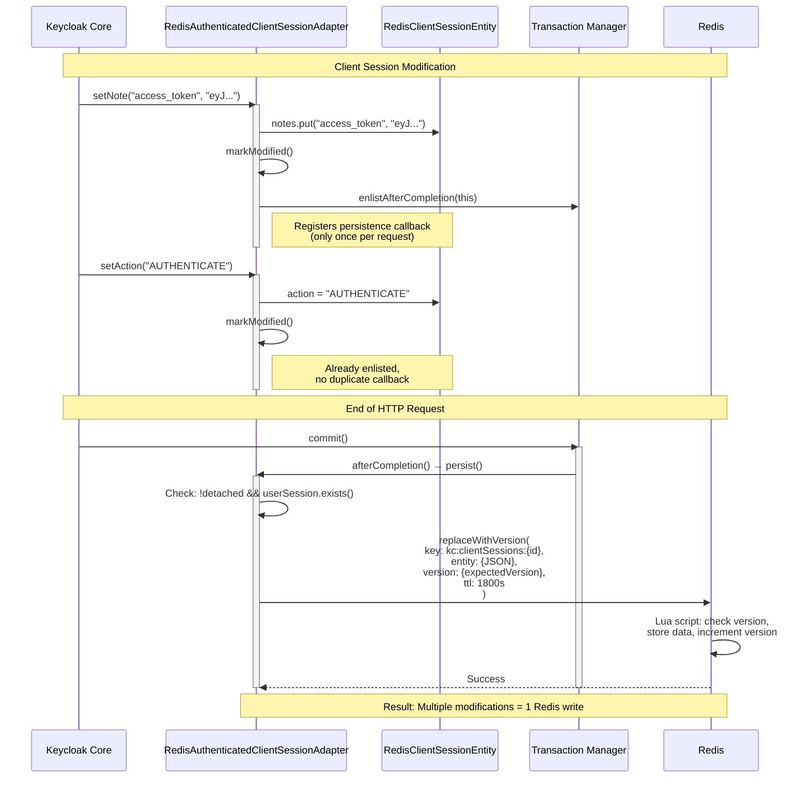
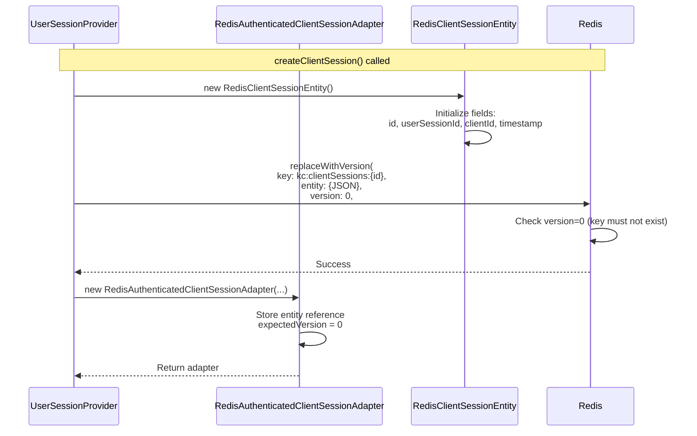
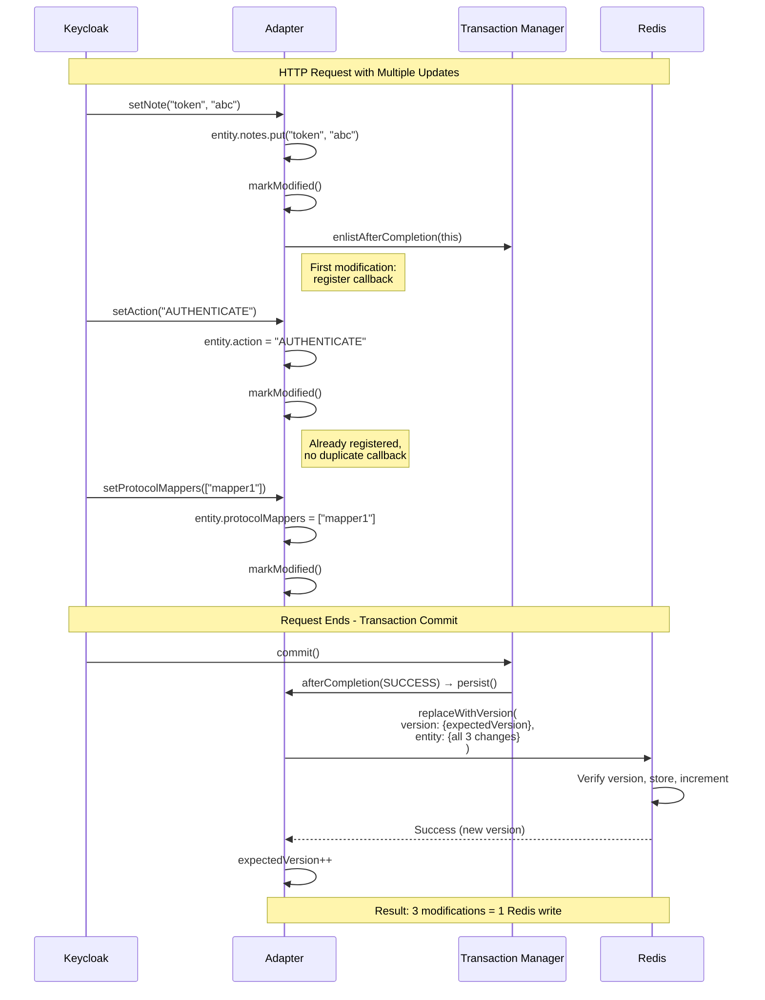
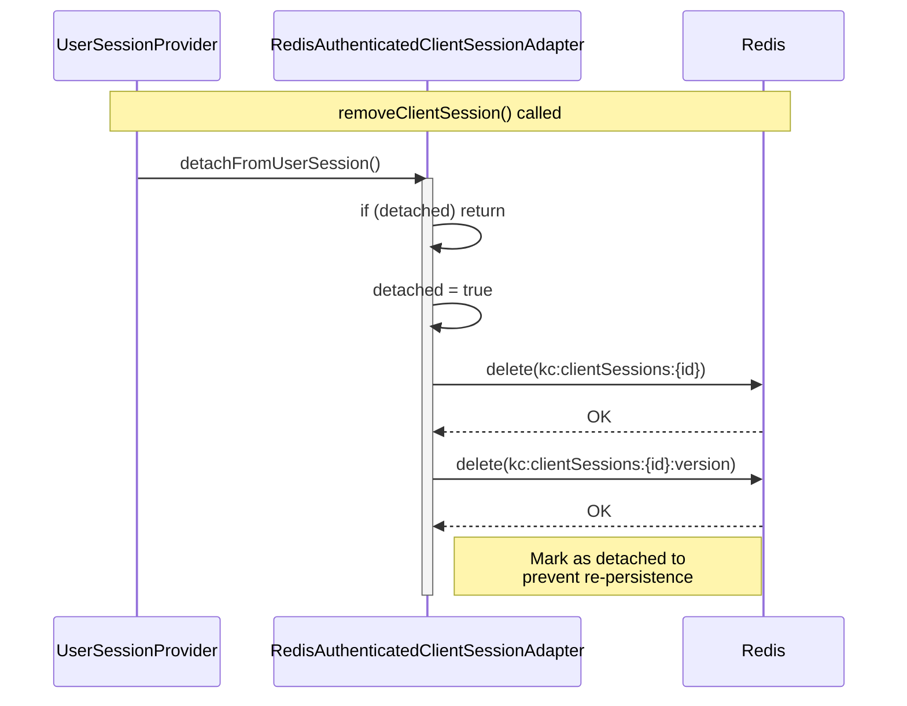
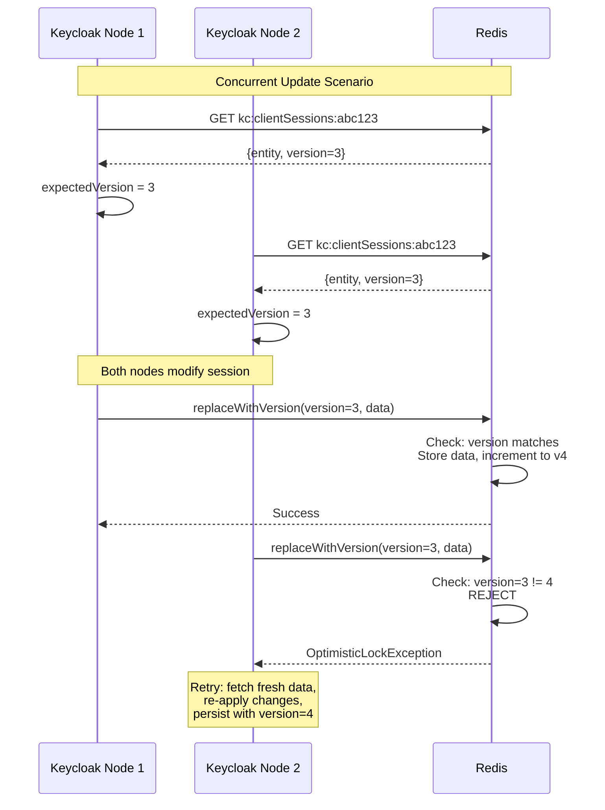

<!--
Copyright 2026 Capital One Financial Corporation and/or its affiliates
and other contributors as indicated by the @author tags.

Licensed under the Apache License, Version 2.0 (the "License");
you may not use this file except in compliance with the License.
You may obtain a copy of the License at

http://www.apache.org/licenses/LICENSE-2.0

Unless required by applicable law or agreed to in writing, software
distributed under the License is distributed on an "AS IS" BASIS,
WITHOUT WARRANTIES OR CONDITIONS OF ANY KIND, either express or implied.
See the License for the specific language governing permissions and
limitations under the License.
-->

# Redis Client Session Adapter

The `RedisAuthenticatedClientSessionAdapter` is the implementation of Keycloak's `AuthenticatedClientSessionModel` interface for the Redis provider. It adapts a `RedisClientSessionEntity` to provide session management for application-specific sessions stored in Redis, supporting both online and offline modes.

## Table of Contents

1. [Overview](#overview)
2. [Architecture](#architecture)
3. [Core Components](#core-components)
4. [Lifecycle Management](#lifecycle-management)
5. [Persistence Patterns](#persistence-patterns)
6. [Critical Implementation Details](#critical-implementation-details)
7. [Performance Characteristics](#performance-characteristics)
8. [Production Considerations](#production-considerations)

---

## Overview

### Purpose

The Client Session Adapter bridges Keycloak's session management with Redis storage, enabling:
- **Application-Specific Session Data** — Track which applications each user is accessing
- **OAuth2/OIDC Protocol Data** — Store tokens, protocol mappers, and client scopes
- **Distributed Session Sharing** — Access session data across multiple Keycloak nodes
- **Transaction Integration** — Ensure atomic persistence with Keycloak's transaction system
- **Optimistic Locking** — Prevent data corruption from concurrent updates

### What is a Client Session?

A **client session** links a user session to a specific application (client). While the user session represents the user's identity, the client session represents their interaction with a particular application.

**Relationship:**
```
User Session (Jane Doe logged in)
  ├── Client Session 1 (using "my-app")
  ├── Client Session 2 (using "admin-console")
  └── Client Session 3 (using "mobile-app")
```

**Key Characteristics:**
- **One-to-Many**: One user session can have multiple client sessions (one per application)
- **Application-Specific**: Each contains protocol-specific data for that application
- **Ephemeral**: Typically short-lived (minutes to hours, not days)
- **Linked Lifecycle**: Removed when parent user session is destroyed

---

## Architecture

### Class Hierarchy



### Component Interaction



---

## Core Components

### 1. Instance Fields

```java
private final KeycloakSession session;              // Per-request Keycloak context
private final RealmModel realm;                     // Which realm this session belongs to
private final RedisClientSessionEntity entity;      // Underlying data POJO
private final RedisConnectionProvider redis;        // Redis operations wrapper
private final boolean offline;                      // Online vs offline session flag
private boolean modified = false;                   // Tracks if changes need persistence
private boolean detached = false;                   // Prevents re-persistence after removal
private int expectedVersion;                        // Optimistic locking version
```

**Key Design Points:**
- **Composition over inheritance**: Uses entity for data storage
- **Modification tracking**: `modified` flag ensures persistence only when needed
- **Detachment pattern**: `detached` prevents writing removed sessions
- **Optimistic locking**: `expectedVersion` prevents concurrent update conflicts

### 2. Constructor

```java
public RedisAuthenticatedClientSessionAdapter(
    KeycloakSession session,
    RealmModel realm,
    RedisClientSessionEntity entity,
    RedisConnectionProvider redis,
    boolean offline
) {
    this.session = session;
    this.realm = realm;
    this.entity = entity;
    this.redis = redis;
    this.offline = offline;
    this.expectedVersion = entity.getVersion();
}
```

**Initialization Steps:**
1. Store required dependencies (session, realm, Redis provider)
2. Capture entity reference for data access
3. Record initial version for optimistic locking
4. Set online/offline mode flag

---

## Lifecycle Management

### Creation Flow



**Key Points:**
- Entity created first with initial data
- Redis write uses `version=0` (create-only semantics)
- Adapter wraps entity after successful Redis write
- Version tracking starts at 0

### Update Flow (Deferred Write Pattern)

The adapter uses a **deferred write pattern** to batch multiple modifications into a single Redis write:



**Benefits:**
- Reduces Redis write operations by 10x+
- Atomic persistence of all request changes
- Lower network overhead
- Better performance under high load

### Deletion Flow (Detachment)



**Key Points:**
- `detached` flag prevents accidental re-write after deletion
- Both data and version keys deleted from Redis
- Idempotent: safe to call multiple times

---

## Persistence Patterns

### Persist Method Flow

```java
@Override
protected void persist() {
    // 1. Safety checks
    if (detached) {
        return;  // Session was removed, don't persist
    }

    UserSessionModel userSession = session.sessions().getUserSession(realm, entity.getUserSessionId());
    if (userSession == null) {
        return;  // Parent user session gone, orphaned client session
    }

    // 2. Determine cache and lifespan
    String cacheName = offline ? OFFLINE_CLIENT_SESSIONS : CLIENT_SESSIONS;
    long lifespan = offline
        ? realm.getOfflineSessionIdleTimeout()
        : realm.getSsoSessionMaxLifespan();

    // 3. Persist with optimistic locking
    boolean success = redis.replaceWithVersion(
        cacheName,
        entity.getId(),
        entity,
        expectedVersion,
        lifespan,
        TimeUnit.SECONDS
    );

    if (success) {
        expectedVersion++;  // Update expected version for next write
    } else {
        // Version mismatch - concurrent update detected
        throw new OptimisticLockException("Client session was modified by another request");
    }
}
```

**Safety Mechanisms:**

1. **Detachment Check**: Prevents writing deleted sessions
2. **Parent Existence Check**: Orphaned client sessions not persisted
3. **Optimistic Locking**: Detects concurrent modifications
4. **Automatic Version Increment**: Tracks successful writes

### Transaction Integration

The adapter integrates with Keycloak's transaction system via `AbstractRedisPersistenceTransaction`:

```java
protected void markModified() {
    if (!modified) {
        modified = true;
        // Enlist once per request
        session.getTransactionManager().enlistAfterCompletion(
            new AbstractRedisPersistenceTransaction() {
                @Override
                protected void persist() {
                    RedisAuthenticatedClientSessionAdapter.this.persist();
                }

                @Override
                protected void rollback() {
                    // Reload entity from Redis on rollback
                    // (implementation detail)
                }
            }
        );
    }
}
```

**Transaction Phases:**

1. **Modification Phase**: Changes made to entity, `markModified()` called
2. **Commit Phase**: `persist()` writes all changes atomically
3. **Rollback Phase**: Changes discarded, entity reloaded from Redis

---

## Critical Implementation Details

### 1. Token Validation Notes

**⚠️ CRITICAL**: Client sessions store notes required for OAuth2/OIDC token validation.

```java
// These notes MUST be set at creation time
entity.setNote(
    AuthenticatedClientSessionModel.STARTED_AT_NOTE,
    String.valueOf(entity.getTimestamp())
);

entity.setNote(
    AuthenticatedClientSessionModel.USER_SESSION_STARTED_AT_NOTE,
    String.valueOf(userSession.getStarted())
);

if (userSession.isRememberMe()) {
    entity.setNote(
        AuthenticatedClientSessionModel.USER_SESSION_REMEMBER_ME_NOTE,
        "true"
    );
}
```

**Why Critical:**
- Keycloak validates refresh tokens using `STARTED_AT_NOTE`
- Missing notes → token validation fails → users logged out
- Must be set during client session creation
- See [User Sessions documentation](user-sessions.md#2-critical-notes-for-token-validation) for details

### 2. Optimistic Locking

**Purpose**: Prevents lost updates in multi-node deployments



**Benefits:**
- Detects concurrent modifications
- Prevents data loss
- No distributed locks needed
- Automatic retry on conflict

### 3. Offline Session Support

The adapter supports both **online** and **offline** client sessions:

| Mode | Use Case | TTL | Cache Name |
|------|----------|-----|------------|
| **Online** | Active login sessions | 30 min (default) | `clientSessions` |
| **Offline** | Refresh token sessions | 30 days (default) | `offlineClientSessions` |

**Implementation:**
```java
String cacheName = offline ? OFFLINE_CLIENT_SESSIONS : CLIENT_SESSIONS;
long lifespan = offline
    ? realm.getOfflineSessionIdleTimeout()
    : realm.getSsoSessionMaxLifespan();
```

**Offline Sessions:**
- Created when user uses "remember me"
- Long-lived (days to weeks)
- Survive server restarts
- Support offline refresh tokens

---

### Deferred Write Impact

**Without deferred write:**
- 10 modifications per request × 1.5ms per write = 15ms
- 1000 TPS × 10 writes = 10,000 Redis writes/sec

**With deferred write:**
- 10 modifications per request × 1.5ms per write = 1.5ms
- 1000 TPS × 1 write = 1,000 Redis writes/sec

**Result:** 10x reduction in Redis load, 90% latency reduction

---

## Production Considerations

### Pros

✅ **Scalable**: Distributed session storage across multiple Keycloak nodes
✅ **Reliable**: Optimistic locking prevents data corruption
✅ **Efficient**: Deferred write pattern reduces Redis load
✅ **Flexible**: Supports both online and offline sessions
✅ **Cloud-Native**: Works with managed Redis (ElastiCache, Azure Cache, etc.)

### Cons

⚠️ **Redis Dependency**: Requires Redis availability for all operations
⚠️ **Deprecated Methods**: `getTimestamp()`/`setTimestamp()` marked deprecated in Keycloak
⚠️ **Orphan Risk**: Client sessions can become orphaned if parent user session deleted mid-request

### Best Practices

#### 1. Monitor Redis Health

```bash
# Check Redis connection
redis-cli PING

# Monitor slow operations
redis-cli SLOWLOG GET 10

# Check memory usage
redis-cli INFO memory

# Verify client session count
redis-cli --scan --pattern "kc:clientSessions:*" | wc -l
```

#### 2. Tune TTL for Your Use Case

```bash
# Short-lived sessions (e.g., mobile apps)
--spi-user-sessions-redis-session-lifespan=900  # 15 minutes

# Standard web sessions
--spi-user-sessions-redis-session-lifespan=1800  # 30 minutes (default)

# Long-lived sessions (e.g., internal tools)
--spi-user-sessions-redis-session-lifespan=7200  # 2 hours
```

#### 3. Handle Optimistic Lock Exceptions

```java
// Keycloak automatically retries on OptimisticLockException
// Ensure Redis latency is low to minimize conflicts

// Monitor retry rate:
redis-cli INFO stats | grep keyspace_misses
```

#### 4. Test Transaction Rollback Scenarios

```java
// Verify client sessions not orphaned on rollback
// Test:
// 1. User session creation fails after client session created
// 2. Network error during client session persist
// 3. Redis unavailable during commit
```

#### 5. Migrate from Deprecated Methods

```java
// OLD (deprecated in Keycloak 26+)
clientSession.getTimestamp()
clientSession.setTimestamp(timestamp)

// NEW (use started time instead)
clientSession.getStarted()
// Note: No setter - timestamp set at creation
```

### Performance Tuning

**High Throughput Configuration:**
```bash
# Increase Redis connection pool
--spi-connections-redis-default-connection-pool-size=50

# Reduce socket timeout for faster failure detection
--spi-connections-redis-default-socket-timeout=3000

# Enable TCP keep-alive
--spi-connections-redis-default-tcp-keepalive=true
```

**Redis Server Optimization:**
```ini
# redis.conf
maxmemory 8gb
maxmemory-policy volatile-lru  # Evict expired sessions first
tcp-backlog 511
timeout 300
```

### Reliability Checklist

- [ ] Redis is clustered for HA (Redis Cluster or Sentinel)
- [ ] Network latency to Redis < 5ms (same region/VPC)
- [ ] Redis memory sized for peak load + 20% buffer
- [ ] Monitoring alerts for Redis connection failures
- [ ] Load testing with realistic client session patterns
- [ ] Transaction rollback scenarios tested
- [ ] Optimistic lock retry rate < 1%

---

## Source Code Reference

**Main Files:**
- `model/redis/src/main/java/org/keycloak/models/redis/session/RedisAuthenticatedClientSessionAdapter.java` — Adapter implementation
- `model/redis/src/main/java/org/keycloak/models/redis/entities/RedisClientSessionEntity.java` — Entity (POJO)
- `model/redis/src/main/java/org/keycloak/models/redis/common/AbstractRedisPersistenceTransaction.java` — Transaction base class

**Test Coverage:**
- `model/redis/src/test/java/org/keycloak/models/redis/test/session/RedisUserSessionProviderTest.java` — Unit tests
- `model/redis/src/test/resources/features/user-sessions.feature` — ATDD scenarios (Cucumber/Gherkin)

---

## See Also

- [User Sessions Provider](user-sessions.md) — Parent session management and lifecycle
- [Authentication Sessions Provider](authentication-sessions.md) — Login flow sessions
- [Cluster Provider](cluster.md) — Multi-node coordination
- [Architecture Overview](../architecture/overview.md) — Complete system architecture
