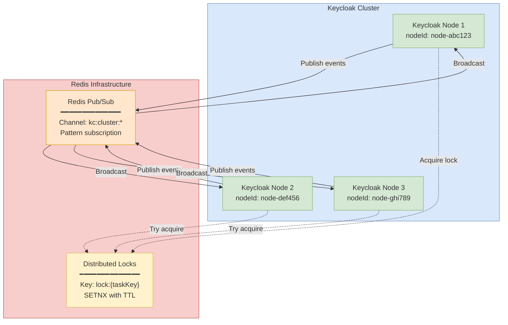
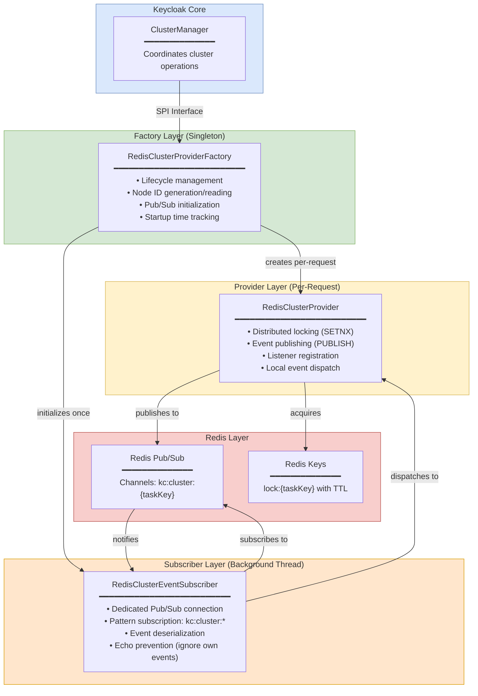
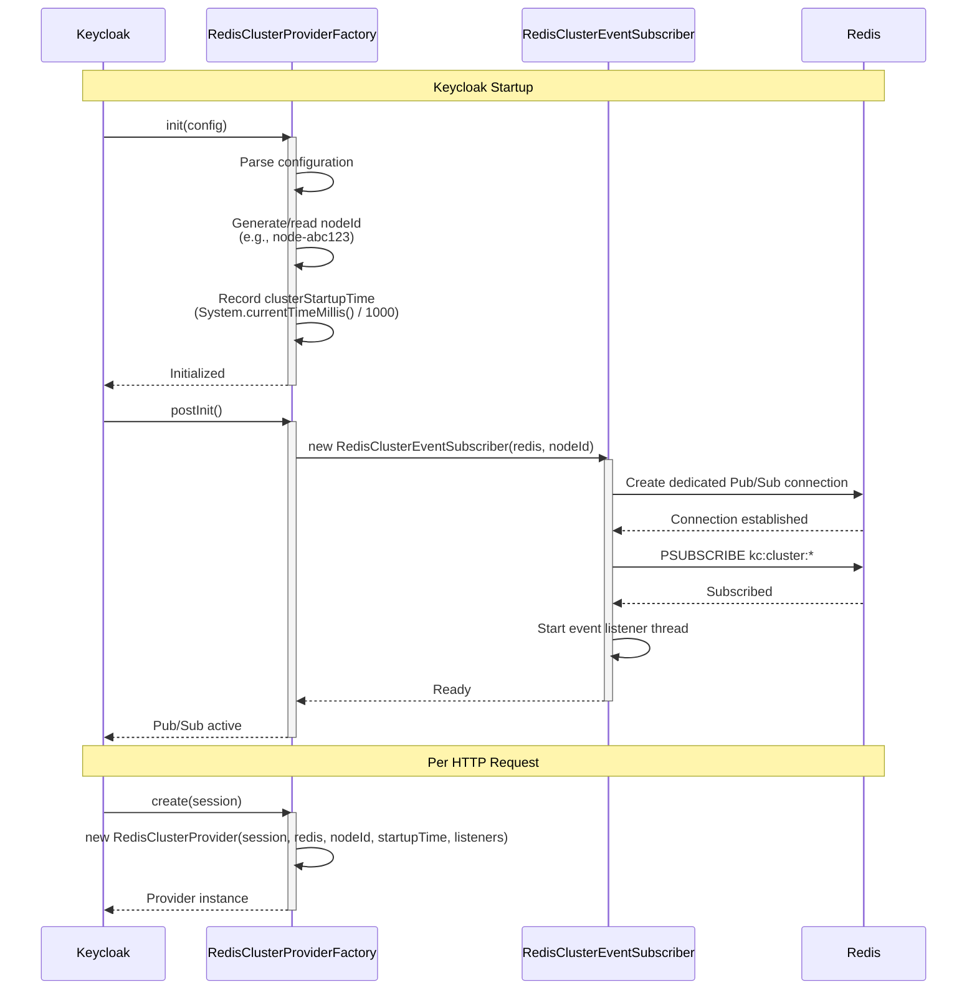
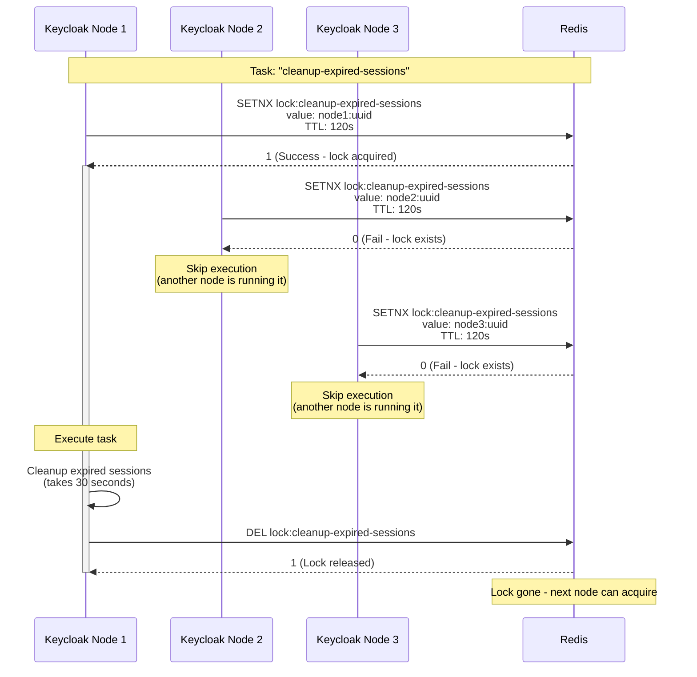
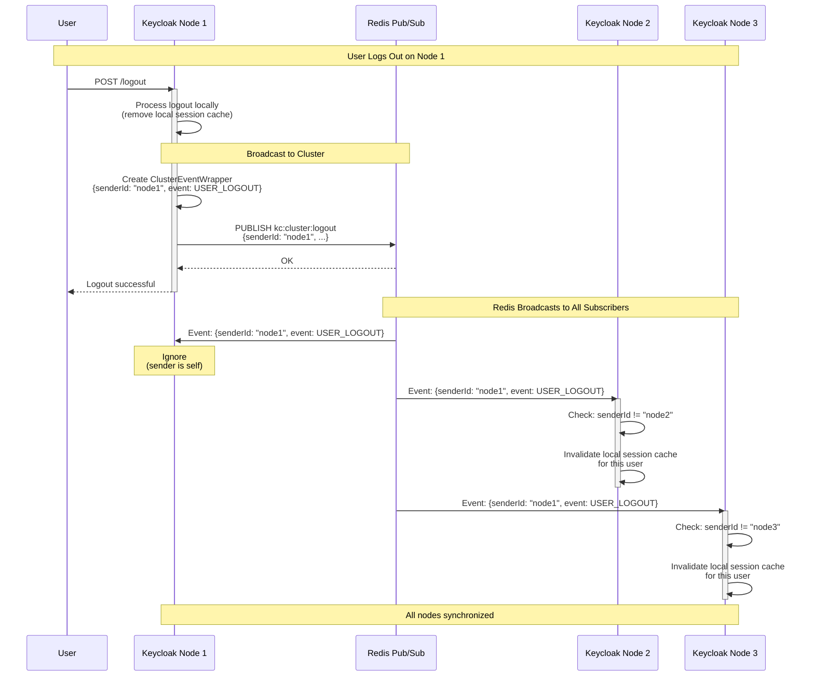

<!--
Copyright 2026 Capital One Financial Corporation and/or its affiliates
and other contributors as indicated by the @author tags.

Licensed under the Apache License, Version 2.0 (the "License");
you may not use this file except in compliance with the License.
You may obtain a copy of the License at

http://www.apache.org/licenses/LICENSE-2.0

Unless required by applicable law or agreed to in writing, software
distributed under the License is distributed on an "AS IS" BASIS,
WITHOUT WARRANTIES OR CONDITIONS OF ANY KIND, either express or implied.
See the License for the specific language governing permissions and
limitations under the License.
-->

# Redis Cluster Provider

The `org.keycloak.models.redis.cluster` package provides Redis-based distributed coordination for Keycloak multi-node deployments. It implements Keycloak's `ClusterProvider` SPI, enabling cluster event distribution, distributed locking, and task coordination across multiple Keycloak instances using Redis Pub/Sub and atomic operations.

## Table of Contents

1. [Overview](#overview)
2. [Architecture](#architecture)
3. [Core Functionality](#core-functionality)
4. [Configuration](#configuration)
5. [Multi-Node Setup](#multi-node-setup)
6. [Production Considerations](#production-considerations)
7. [API Reference](#api-reference)

---

## Overview

### Purpose

The Redis Cluster Provider enables multi-node Keycloak deployments to:
- **Distribute events** across all cluster nodes (user logout, session invalidation, cache clearing)
- **Coordinate tasks** with distributed locks ensuring only one node executes at a time
- **Track cluster state** with synchronized startup time for token validation

### Why Redis for Clustering?

Compared to Keycloak's default Infinispan/JGroups clustering:

| Feature | Infinispan/JGroups | Redis Cluster Provider |
|---------|-------------------|------------------------|
| **Configuration** | Complex (UDP/TCP, DNS_PING, network policies) | Simple (Redis connection string) |
| **Cloud Native** | Limited (requires multicast or complex discovery) | Excellent (works with managed Redis) |
| **Network Requirements** | UDP/multicast or TCP mesh | Standard TCP to Redis |
| **Managed Service** | No | Yes (ElastiCache, Azure Cache, GCP Memorystore) |
| **Operational Complexity** | High | Low |
| **Event Delivery** | Reliable multicast | Pub/Sub (at-most-once) |

### Key Components

| Class | Purpose | Line Reference |
|-------|---------|----------------|
| `RedisClusterProviderFactory` | Factory, lifecycle, Pub/Sub initialization | `RedisClusterProviderFactory.java:38-133` |
| `RedisClusterProvider` | Locking, event publishing, local dispatch | `RedisClusterProvider.java:40-160` |
| `RedisClusterEventSubscriber` | Pub/Sub listener, event deserialization | `RedisClusterEventSubscriber.java:35-194` |
| `ClusterEventWrapper` | Event serialization with sender metadata | `RedisClusterEventSubscriber.java:165-193` |

---

## Architecture

### High-Level Architecture



### Component Layer Diagram



---

## Core Functionality

### 1. Provider Lifecycle

#### Initialization Sequence



**Code References:**
- Factory initialization: `RedisClusterProviderFactory.java:71-115` (postInit), `117-127` (close)
- Provider creation: `RedisClusterProvider.java:40-52`

#### Shutdown Sequence

1. **Factory.close()**: Unsubscribe from Pub/Sub channels and close connection
2. **Provider.close()**: Clear local listeners map

### 2. Distributed Locking

**Purpose**: Ensures only one node executes a task at a time across the cluster.

**Implementation**: Uses Redis `SETNX` (Set if Not Exists) with TTL for atomic lock acquisition.

**Lock Key Pattern**: `lock:{taskKey}`



**Key Methods:**
- `executeIfNotExecuted(String taskKey, int taskTimeoutInSeconds, Callable<T> task)`
- `executeIfNotExecutedAsync(String taskKey, int taskTimeoutInSeconds, Callable task)`

**Example Code:**

```java
// Lock acquisition using Redis putIfAbsent (SETNX)
String lockKey = "lock:" + taskKey;
String lockValue = nodeId + ":" + UUID.randomUUID();

Object existing = redis.putIfAbsent(LOCK_CACHE, lockKey, lockValue,
                                    taskTimeoutInSeconds, TimeUnit.SECONDS);

if (existing == null) {
    // This node acquired the lock
    try {
        T result = task.call();
        return ExecutionResult.executed(result);
    } finally {
        redis.delete(LOCK_CACHE, lockKey);
    }
}
// Lock already held by another node - skip execution
return ExecutionResult.notExecuted();
```

**Code Reference:** `RedisClusterProvider.java:80-100`

### 3. Cluster Event Pub/Sub

**Purpose**: Propagates events (user logout, session invalidation, cache clearing) across all cluster nodes.

**Implementation**: Redis Pub/Sub with pattern subscription on channels `kc:cluster:*`

**Channel Pattern**: `kc:cluster:{taskKey}`

**Event Wrapper**: Events are serialized with sender node ID to prevent echo/self-processing.



**Key Methods:**
- `notify(String taskKey, ClusterEvent event, boolean ignoreSender, DCNotify dcNotify)`
- `registerListener(String taskKey, ClusterListener listener)`

**Event Publishing Code:**

```java
// Event publishing
String channel = "kc:cluster:" + taskKey;
ClusterEventWrapper wrapper = new ClusterEventWrapper(nodeId, event);
String serializedEvent = serializer.serializeToString(wrapper);
redis.publish(channel, serializedEvent);
```

**Code Reference:** `RedisClusterProvider.java:121-159`

**Event Receiving Code:**

```java
// Event receiving and dispatching
ClusterEventWrapper wrapper = serializer.deserialize(message, ClusterEventWrapper.class);

// Ignore events from same node (sender already handled it locally)
if (nodeId.equals(wrapper.getSenderId())) {
    return;
}

// Dispatch to registered listener
ClusterListener listener = listeners.get(taskKey);
listener.eventReceived(event);
```

---

## Configuration

### Enable Redis Cluster Provider

```bash
# Enable Redis cluster provider
--spi-cluster-provider=redis

# Set unique node ID for each instance (REQUIRED for multi-node)
--spi-cluster-default-nodeId=${NODE_NAME}

# Redis connection (shared across all providers)
--spi-connections-redis-default-connection-uri=redis://localhost:6379
```

### Environment Variables

```bash
# Node ID - MUST be unique per Keycloak instance
KC_SPI_CLUSTER_DEFAULT_NODE_ID=node-1

# Redis connection
KC_SPI_CONNECTIONS_REDIS_DEFAULT_CONNECTION_URI=redis://redis-cluster:6379
```

### Docker Compose Example

```yaml
version: '3.8'
services:
  keycloak-1:
    image: keycloak:26.0
    environment:
      - KC_SPI_CLUSTER_PROVIDER=redis
      - KC_SPI_CLUSTER_DEFAULT_NODE_ID=node-1
      - KC_SPI_CONNECTIONS_REDIS_DEFAULT_CONNECTION_URI=redis://redis:6379
    depends_on:
      - redis

  keycloak-2:
    image: keycloak:26.0
    environment:
      - KC_SPI_CLUSTER_PROVIDER=redis
      - KC_SPI_CLUSTER_DEFAULT_NODE_ID=node-2  # Different node ID!
      - KC_SPI_CONNECTIONS_REDIS_DEFAULT_CONNECTION_URI=redis://redis:6379
    depends_on:
      - redis

  redis:
    image: redis:7
    ports:
      - "6379:6379"
```

---

## Multi-Node Setup

### Requirements

1. **Unique Node IDs**: Each Keycloak instance MUST have a unique `nodeId`
2. **Shared Redis**: All nodes connect to the same Redis instance/cluster
3. **Network Connectivity**: Nodes can reach Redis (no firewall blocks)

### Verification

#### Check Pub/Sub Connections

```bash
# See one Pub/Sub connection per Keycloak node
redis-cli CLIENT LIST TYPE pubsub

# Expected output:
# id=123 addr=10.0.1.10:12345 ... cmd=psubscribe
# id=124 addr=10.0.1.11:12346 ... cmd=psubscribe
# id=125 addr=10.0.1.12:12347 ... cmd=psubscribe
```

#### Monitor Cluster Events

```bash
# Live monitoring of cluster events
redis-cli PSUBSCRIBE "kc:cluster:*"

# You should see events when users log in/out, sessions expire, etc.
```

#### Check Keycloak Logs

```bash
# Look for successful initialization
grep "Multi-node cluster event distribution is now ACTIVE" keycloak.log

# Check for unique node IDs
grep "Redis Cluster Provider initialized with nodeId" keycloak.log
```

### Troubleshooting

| Issue | Symptom | Solution |
|-------|---------|----------|
| **Duplicate Node IDs** | Events echoing back, double-processing | Ensure each node has unique `KC_SPI_CLUSTER_DEFAULT_NODE_ID` |
| **No Pub/Sub connections** | Events not propagating | Check Redis connectivity, firewall rules |
| **Events not received** | Cache not invalidating across nodes | Verify `PSUBSCRIBE kc:cluster:*` is active on all nodes |
| **Lock contention** | Tasks running multiple times | Check lock TTL is appropriate for task duration |

---

## Production Considerations

### Limitations

1. **No Event Persistence**: Pub/Sub events are transient; nodes that are down miss events
2. **At-Most-Once Delivery**: No guaranteed delivery or replay capability
3. **No Event Ordering**: Events from different nodes may arrive out of order
4. **Single Redis Instance**: No automatic failover for standalone Redis
   - **Solution**: Use Redis Cluster or Sentinel for high availability

### Best Practices

#### 1. Use Redis Cluster or Sentinel

For production, avoid standalone Redis:

```bash
# Redis Cluster mode (recommended)
--spi-connections-redis-default-connection-uri=redis://redis-cluster:6379?cluster=true

# Redis Sentinel mode
--spi-connections-redis-default-connection-uri=redis-sentinel://sentinel:26379?masterId=mymaster
```

#### 2. Set Appropriate Lock TTLs

```java
// Lock TTL should exceed worst-case task duration
// Example: cleanup task takes 60s worst-case → set TTL to 120s
provider.executeIfNotExecuted("cleanup-task", 120, () -> {
    // Task implementation
});
```

#### 3. Monitor Pub/Sub Health

```bash
# Check for dropped connections
redis-cli CLIENT LIST TYPE pubsub | wc -l
# Should equal number of Keycloak nodes

# Check Pub/Sub channel activity
redis-cli PUBSUB NUMPAT
# Should be > 0 if nodes are subscribed
```

#### 4. Handle Network Partitions

- Redis provider will automatically reconnect on connection loss
- Events published during partition are lost (Pub/Sub limitation)
- Consider Redis Cluster with replicas for better resilience

### Future Enhancements (Possible)

- **Redis Streams** for persistent event history and replay
- **Reliable message delivery** with acknowledgments
- **Event ordering guarantees** per entity
- **Circuit breaker** for Redis connection failures

---

## API Reference

### Provider Methods

**Distributed Locking:**

```java
// Execute task if no other node is currently running it
<T> ExecutionResult<T> executeIfNotExecuted(
    String taskKey,
    int taskTimeoutInSeconds,
    Callable<T> task
)

// Async execution (returns immediately)
void executeIfNotExecutedAsync(
    String taskKey,
    int taskTimeoutInSeconds,
    Callable task
)
```

**Event Broadcasting:**

```java
// Notify all cluster nodes of an event
void notify(
    String taskKey,
    ClusterEvent event,
    boolean ignoreSender,  // If true, sender won't process event locally
    DCNotify dcNotify       // Cross-datacenter notification strategy
)
```

**Listener Registration:**

```java
// Register a listener for cluster events on a specific task key
void registerListener(String taskKey, ClusterListener listener)
```

**Cluster Metadata:**

```java
// Get the timestamp when this node started
int getClusterStartupTime()
```

### Factory Methods

```java
// Get the unique identifier for this Keycloak node
String getNodeId()

// Get the cluster startup timestamp (seconds since epoch)
int getClusterStartupTime()
```

---

## Source Code Reference

**Main Files:**
- `model/redis/src/main/java/org/keycloak/models/redis/cluster/RedisClusterProvider.java` - Provider implementation
- `model/redis/src/main/java/org/keycloak/models/redis/cluster/RedisClusterProviderFactory.java` - Factory and lifecycle
- `model/redis/src/main/java/org/keycloak/models/redis/cluster/RedisClusterEventSubscriber.java` - Pub/Sub listener
- `model/redis/src/main/java/org/keycloak/models/redis/cluster/ClusterEventWrapper.java` - Event serialization

**Test Coverage:**
- `model/redis/src/test/java/org/keycloak/models/redis/test/cluster/RedisClusterProviderTest.java` - Unit tests
- `model/redis/src/test/resources/features/cluster.feature` - ATDD scenarios (Cucumber/Gherkin)

---

## See Also

- [User Sessions Provider](user-sessions.md) - Session management and storage
- [Authentication Sessions Provider](authentication-sessions.md) - Login flow sessions
- [Architecture Overview](../architecture/overview.md) - Complete system architecture
- [High-Level Architecture Diagram](../architecture/architecture-high-level.md) - Visual system design
