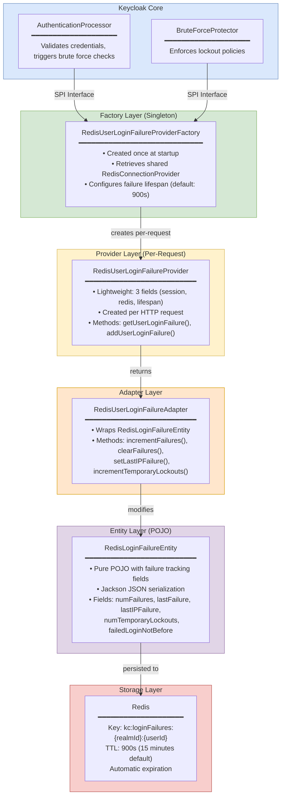
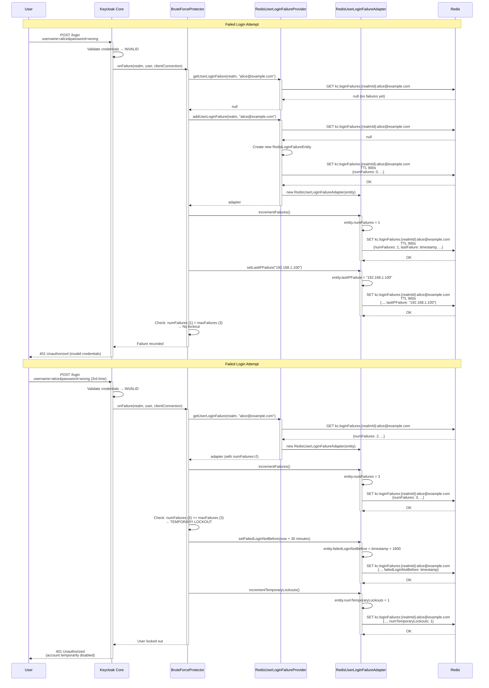
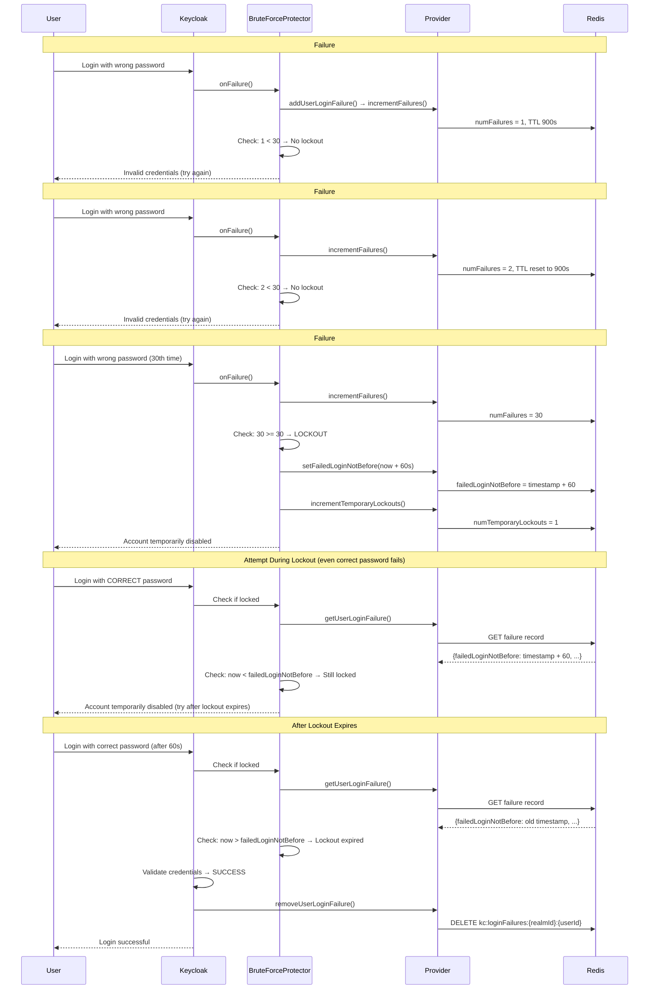

<!--
Copyright 2026 Capital One Financial Corporation and/or its affiliates
and other contributors as indicated by the @author tags.

Licensed under the Apache License, Version 2.0 (the "License");
you may not use this file except in compliance with the License.
You may obtain a copy of the License at

http://www.apache.org/licenses/LICENSE-2.0

Unless required by applicable law or agreed to in writing, software
distributed under the License is distributed on an "AS IS" BASIS,
WITHOUT WARRANTIES OR CONDITIONS OF ANY KIND, either express or implied.
See the License for the specific language governing permissions and
limitations under the License.
-->

# Redis User Login Failure Provider

The `RedisUserLoginFailureProvider` is the implementation of Keycloak's `UserLoginFailureProvider` interface for the Redis provider. It tracks failed login attempts and enables brute force protection by recording failure counts, timestamps, and IP addresses in Redis with automatic expiration.

## Table of Contents

1. [Overview](#overview)
2. [Architecture](#architecture)
3. [Core Operations](#core-operations)
4. [Brute Force Protection Flow](#brute-force-protection-flow)
5. [Critical Implementation Details](#critical-implementation-details)
6. [Performance Characteristics](#performance-characteristics)
7. [Production Considerations](#production-considerations)

---

## Overview

### Purpose

The User Login Failure Provider enables brute force protection by tracking failed login attempts:
- **Failure Counting** — Increment failure counter on each failed login
- **Temporary Lockouts** — Automatically lock accounts after N failed attempts
- **IP Tracking** — Record which IP addresses failed login attempts
- **Automatic Expiration** — Failed attempts expire after configured time (default: 15 minutes)
- **Cluster-Wide Protection** — Works consistently across multiple Keycloak nodes

### What is Brute Force Protection?

**Brute force attacks** involve attackers trying thousands of password combinations to gain unauthorized access. Keycloak's brute force protection mitigates this by:

1. **Counting Failed Attempts**: Each wrong password increments a counter
2. **Temporary Account Lockout**: After N failures, the account is locked for a duration
3. **Permanent Lockout**: After X temporary lockouts, the account can be permanently disabled
4. **IP-Based Blocking**: Track failures per IP address to block malicious sources

**Example Flow:**
```
1. User "alice@example.com" enters wrong password
   → Redis: numFailures = 1, lastFailure = timestamp, lastIP = 192.168.1.100

2. User enters wrong password again (2nd attempt)
   → Redis: numFailures = 2, lastFailure = timestamp, lastIP = 192.168.1.100

3. User enters wrong password again (3rd attempt)
   → Redis: numFailures = 3, lastFailure = timestamp, lastIP = 192.168.1.100
   → Keycloak: Max failures reached → TEMPORARY LOCKOUT (30 minutes)

4. User tries to login (even with correct password)
   → Keycloak: Account locked → Login denied

5. After 30 minutes, lockout expires
   → User can try again (failure count reset)
```

---

## Architecture

### Layer Diagram



### Component Interaction



---

## Core Operations

### 1. Get User Login Failure

**Purpose**: Retrieve existing failure record for a user

**Method Signature:**
```java
UserLoginFailureModel getUserLoginFailure(RealmModel realm, String userId)
```

**Implementation:**
```java
@Override
public UserLoginFailureModel getUserLoginFailure(RealmModel realm, String userId) {
    String key = RedisLoginFailureEntity.createKey(realm.getId(), userId);
    RedisLoginFailureEntity entity = redis.get(
            RedisConnectionProvider.CACHE_LOGIN_FAILURES,
            key,
            RedisLoginFailureEntity.class
    );

    if (entity == null) {
        return null;
    }

    return new RedisUserLoginFailureAdapter(session, realm, entity, redis, failureLifespan);
}
```

**Key Points:**
- Returns `null` if no failure record exists or expired
- Key format: `{realmId}:{userId}` (e.g., `master:alice@example.com`)
- Redis cache name: `loginFailures`
- Creates adapter wrapper for entity modification

**Use Cases:**
- Checking if user has previous failures before login
- BruteForceProtector querying failure count before allowing login

### 2. Add User Login Failure

**Purpose**: Create or retrieve failure record for a user (idempotent)

**Method Signature:**
```java
UserLoginFailureModel addUserLoginFailure(RealmModel realm, String userId)
```

**Implementation:**
```java
@Override
public UserLoginFailureModel addUserLoginFailure(RealmModel realm, String userId) {
    String key = RedisLoginFailureEntity.createKey(realm.getId(), userId);

    RedisLoginFailureEntity entity = redis.get(
            RedisConnectionProvider.CACHE_LOGIN_FAILURES,
            key,
            RedisLoginFailureEntity.class
    );

    if (entity == null) {
        entity = new RedisLoginFailureEntity(realm.getId(), userId);
        redis.put(RedisConnectionProvider.CACHE_LOGIN_FAILURES, key, entity, failureLifespan, TimeUnit.SECONDS);
    }

    return new RedisUserLoginFailureAdapter(session, realm, entity, redis, failureLifespan);
}
```

**Key Points:**
- **Idempotent**: Returns existing record if present, creates new if absent
- Sets TTL on creation (default: 900 seconds = 15 minutes)
- Initial entity has zero failures, will be incremented by caller
- Does NOT check-and-set (no optimistic locking) — failure tracking is best-effort

**Use Cases:**
- BruteForceProtector creating failure record on first failed login
- Ensuring failure record exists before incrementing counters

### 3. Remove User Login Failure

**Purpose**: Delete failure record (typically on successful login)

**Method Signature:**
```java
void removeUserLoginFailure(RealmModel realm, String userId)
```

**Implementation:**
```java
@Override
public void removeUserLoginFailure(RealmModel realm, String userId) {
    String key = RedisLoginFailureEntity.createKey(realm.getId(), userId);
    redis.delete(RedisConnectionProvider.CACHE_LOGIN_FAILURES, key);
}
```

**Key Points:**
- Immediate deletion from Redis
- Called by Keycloak core when user successfully logs in
- Resets brute force protection for the user

**Use Cases:**
- Successful login after previous failures
- Admin manually clearing failure record
- User clicking "forgot password" (optional, depends on policy)

### 4. Remove All User Login Failures

**Purpose**: Bulk delete all failure records in a realm

**Method Signature:**
```java
void removeAllUserLoginFailures(RealmModel realm)
```

**Implementation:**
```java
@Override
public void removeAllUserLoginFailures(RealmModel realm) {
    // Would need to scan all keys - for now, let them expire
    logger.debugf("removeAllUserLoginFailures called for realm %s - entries will expire via TTL", realm.getId());
}
```

**Key Points:**
- **No-op implementation** — relies on TTL-based expiration
- Full Redis key scan would be expensive (O(N) where N = all keys)
- Failure records expire automatically after 15 minutes (default)

**Why No-Op?**
- Scanning all Redis keys with pattern `kc:loginFailures:*` is slow
- TTL-based expiration handles cleanup automatically
- Rare use case (admin typically wouldn't bulk-clear failures)

**Alternative Implementation (if needed):**
```java
// Expensive O(N) scan - not recommended for production
Set<String> keys = redis.scan("kc:loginFailures:" + realm.getId() + ":*");
for (String key : keys) {
    redis.delete(RedisConnectionProvider.CACHE_LOGIN_FAILURES, key);
}
```

---

## Brute Force Protection Flow

### Configuration

**Realm Settings → Security Defenses → Brute Force Detection:**

| Setting | Default | Description |
|---------|---------|-------------|
| **Permanent Lockout** | Disabled | Permanently disable user after max lockouts |
| **Max Login Failures** | 30 | Number of failures before temporary lockout |
| **Wait Increment** | 60 seconds | Time added per failure to wait duration |
| **Quick Login Check** | 1000 ms | Minimum time between login attempts |
| **Minimum Quick Login Wait** | 60 seconds | Lockout time for too-fast login attempts |
| **Max Wait** | 900 seconds (15 min) | Maximum lockout duration |
| **Failure Reset Time** | 43200 seconds (12 hours) | Time after which failures expire |

### Flow Diagram: Progressive Lockout



### Progressive Wait Time

Keycloak increases lockout duration with each temporary lockout:

**Wait Time Formula:**
```
waitTime = min(
    waitIncrement * numTemporaryLockouts,
    maxWait
)
```

**Example:**
- Wait Increment = 60 seconds
- Max Wait = 900 seconds (15 minutes)

| Lockout # | Failures | Wait Time | Calculation |
|-----------|----------|-----------|-------------|
| 1st | 30 | 60s | min(60 × 1, 900) = 60s |
| 2nd | 60 | 120s | min(60 × 2, 900) = 120s |
| 3rd | 90 | 180s | min(60 × 3, 900) = 180s |
| ... | ... | ... | ... |
| 15th | 450 | 900s | min(60 × 15, 900) = 900s (capped) |

**Result:** Repeat offenders face progressively longer lockouts (exponential backoff)

---

## Critical Implementation Details

### 1. Adapter Pattern for Modification Tracking

**Design**: The `RedisUserLoginFailureAdapter` wraps the entity and persists on every modification

**Implementation:**
```java
private static class RedisUserLoginFailureAdapter implements UserLoginFailureModel {
    private final RedisLoginFailureEntity entity;
    private final RedisConnectionProvider redis;
    private final long lifespan;

    @Override
    public void incrementFailures() {
        entity.setNumFailures(entity.getNumFailures() + 1);
        save();  // Immediate persistence to Redis
    }

    @Override
    public void setLastIPFailure(String ip) {
        entity.setLastIPFailure(ip);
        save();  // Immediate persistence to Redis
    }

    private void save() {
        String key = RedisLoginFailureEntity.createKey(entity.getRealmId(), entity.getUserId());
        redis.put(RedisConnectionProvider.CACHE_LOGIN_FAILURES, key, entity, lifespan, TimeUnit.SECONDS);
    }
}
```

**Key Points:**
- **Eager Write Pattern**: Every setter immediately writes to Redis (unlike user sessions which use deferred write)
- **Why Eager?** Failure tracking is critical for security — must persist immediately
- **TTL Reset**: Every write resets the TTL to full lifespan (15 minutes)

**Trade-off:**
- ✅ Pro: Guaranteed consistency (no data loss if Keycloak crashes)
- ⚠️ Con: More Redis writes (but login failures are infrequent compared to session reads)

### 2. TTL-Based Expiration

**Implementation**: Every Redis write sets a TTL on the failure record

**Benefits:**
- Failed attempts automatically expire after configured time (default: 15 minutes)
- No background cleanup jobs needed
- Memory efficient (Redis removes expired keys)
- Aligns with "Failure Reset Time" realm setting

**TTL Behavior:**
```bash
# Initial failure
redis-cli SETEX kc:loginFailures:master:alice@example.com 900 "{...}"
redis-cli TTL kc:loginFailures:master:alice@example.com
# Output: 900

# After 5 minutes, user fails again
redis-cli SETEX kc:loginFailures:master:alice@example.com 900 "{numFailures: 2, ...}"
redis-cli TTL kc:loginFailures:master:alice@example.com
# Output: 900 (TTL reset to full 15 minutes)

# After 15 minutes of inactivity
redis-cli GET kc:loginFailures:master:alice@example.com
# Output: (nil) — key expired, failures reset
```

**Configuration:**
```bash
# Configure failure lifespan (seconds)
--spi-user-login-failure-redis-failureLifespan=900

# Environment variable
export KC_SPI_USER_LOGIN_FAILURE_REDIS_FAILURE_LIFESPAN=1800  # 30 minutes
```

### 3. Entity Structure

**POJO Design:**
```java
public class RedisLoginFailureEntity {
    private String realmId;
    private String userId;               // Email or username
    private int failedLoginNotBefore;    // Timestamp when lockout expires
    private int numFailures;             // Count of failed attempts
    private int numTemporaryLockouts;    // Count of times user was locked out
    private long lastFailure;            // Timestamp of last failed attempt
    private String lastIPFailure;        // IP address of last failed attempt

    public void clearFailures() {
        this.numFailures = 0;
        this.lastFailure = 0;
        this.lastIPFailure = null;
    }

    public static String createKey(String realmId, String userId) {
        return realmId + ":" + userId;
    }
}
```

**Key Points:**
- Pure POJO with no Keycloak dependencies
- Jackson serialization for JSON format
- Composite key: `{realmId}:{userId}`

**Example Serialized Entity:**
```json
{
  "realmId": "master",
  "userId": "alice@example.com",
  "failedLoginNotBefore": 1678901234,
  "numFailures": 3,
  "numTemporaryLockouts": 1,
  "lastFailure": 1678900000,
  "lastIPFailure": "192.168.1.100"
}
```

### 4. No Optimistic Locking

**Design Decision**: Failure tracking does NOT use optimistic locking (unlike sessions)

**Why?**
- Failure tracking is **best-effort** security, not transactional correctness
- Race conditions are acceptable (e.g., 2 concurrent failures → counter may be 31 instead of 32)
- Simplifies implementation (no version checking)
- Redis write performance is more important than exact counters

**Example Race Condition (Acceptable):**
```
Thread 1: GET failure record → numFailures = 29
Thread 2: GET failure record → numFailures = 29
Thread 1: SET numFailures = 30
Thread 2: SET numFailures = 30  ← Overwrites Thread 1

Result: Counter is 30 (should be 31), but this is acceptable
User still gets locked out at 30 failures (threshold met)
```

**When Exact Counters Matter:**
- If you need **exact** failure counts, implement optimistic locking using `replaceWithVersion()`
- Trade-off: Higher latency (need to retry on version mismatch)

### 5. IP-Based Tracking

**Implementation**: The `lastIPFailure` field records the IP address of the last failed attempt

**Use Cases:**
1. **Suspicious Activity Detection**: Multiple failures from different IPs
2. **Forensic Analysis**: Which IP attempted brute force attack
3. **Future Enhancement**: Per-IP rate limiting (not yet implemented)

**Example:**
```java
// BruteForceProtector calls this on each failure
adapter.setLastIPFailure(clientConnection.getRemoteAddr());

// Redis stores
{
  "lastIPFailure": "192.168.1.100"
}
```

**Future Enhancement (Not Implemented):**
```java
// Per-IP failure tracking (in addition to per-user)
String ipKey = RedisLoginFailureEntity.createKey(realm.getId(), "ip:" + ipAddress);
// Store separate failure record for IP-based rate limiting
```
---

## Production Considerations

### Pros

✅ **Automatic Cleanup**: TTL-based expiration, no background jobs needed
✅ **Cluster-Wide Protection**: Works seamlessly across multiple Keycloak nodes
✅ **Simple Monitoring**: Use Redis CLI to inspect failure records
✅ **High Performance**: <2ms latency for all operations
✅ **IP Tracking**: Records source IP for forensic analysis
✅ **Progressive Lockouts**: Exponential backoff discourages repeat attacks

### Cons

⚠️ **Redis Dependency**: Requires Redis availability for brute force protection
⚠️ **Best-Effort Counters**: No optimistic locking (race conditions possible, but acceptable)
⚠️ **No IP-Based Rate Limiting**: Tracks IP but doesn't enforce per-IP limits (yet)
⚠️ **No Bulk Delete**: `removeAllUserLoginFailures()` is a no-op (relies on TTL expiration)
⚠️ **TTL Reset on Every Write**: Persistent attackers reset the expiration timer

### Best Practices

#### 1. Monitor Brute Force Attacks

```bash
# Count active failure records
redis-cli --scan --pattern "kc:loginFailures:*" | wc -l

# View specific user's failure record (human-readable JSON)
redis-cli GET "kc:loginFailures:master:alice@example.com" | jq .

# Check TTL (time until record expires)
redis-cli TTL "kc:loginFailures:master:alice@example.com"

# Monitor failure recording rate
redis-cli --stat | grep instantaneous_ops_per_sec
```

**Alert on:**
- Sudden spike in failure records (indicates attack)
- High failure count for single user (credential stuffing)
- Failures from many different IPs (distributed attack)

#### 2. Tune Brute Force Settings

```bash
# Realm Settings → Security Defenses → Brute Force Detection

# Recommended for high-security environments:
Max Login Failures: 5          # Lower threshold
Wait Increment: 300 seconds    # 5 minutes per lockout
Max Wait: 3600 seconds         # 1 hour max lockout
Failure Reset Time: 900 seconds # 15 minutes

# Recommended for user-friendly environments:
Max Login Failures: 10
Wait Increment: 60 seconds
Max Wait: 900 seconds
Failure Reset Time: 1800 seconds # 30 minutes
```

#### 3. Configure Failure Lifespan

```bash
# Match "Failure Reset Time" realm setting
--spi-user-login-failure-redis-failureLifespan=900

# Longer lifespan for persistent tracking
--spi-user-login-failure-redis-failureLifespan=3600  # 1 hour

# Shorter lifespan for quick reset
--spi-user-login-failure-redis-failureLifespan=300  # 5 minutes
```

**Trade-off:**
- **Longer TTL**: Better attack tracking, but users wait longer for reset
- **Shorter TTL**: User-friendly, but attackers can retry sooner

#### 4. Handle Legitimate Lockouts

**User Experience:**
- Show clear error message: "Account temporarily disabled due to too many failed login attempts. Try again in X minutes."
- Provide "Forgot Password" link (bypass brute force protection)
- Admin can manually clear failures: User Detail → Sessions → Clear Login Failures

**Admin Intervention:**
```bash
# Manually clear user's failure record
redis-cli DEL "kc:loginFailures:master:alice@example.com"

# Or via Keycloak Admin API
DELETE /admin/realms/{realm}/users/{userId}/reset-password
```

#### 5. Monitor Redis Memory Usage

```bash
# Check memory usage
redis-cli INFO memory

# Set memory limit with eviction policy
redis-cli CONFIG SET maxmemory 2gb
redis-cli CONFIG SET maxmemory-policy volatile-lru

# Verify no failures accidentally evicted (should only expire by TTL)
redis-cli INFO stats | grep evicted_keys
# Should be 0 if TTL cleanup is working correctly
```

#### 6. Test Brute Force Protection

```bash
# Chaos engineering test: simulate brute force attack
for i in {1..35}; do
    curl -X POST https://keycloak.example.com/login \
        -d "username=alice@example.com&password=wrong$i" \
        -w "\nAttempt $i: %{http_code}\n"
    sleep 1
done

# Expected results:
# Attempts 1-30: 401 Unauthorized (invalid credentials)
# Attempts 31+: 401 Unauthorized (account temporarily disabled)
```

**Verify:**
```bash
redis-cli GET "kc:loginFailures:master:alice@example.com" | jq .
# Should show: numFailures=30+, failedLoginNotBefore set, numTemporaryLockouts=1+
```

### Performance Tuning

**High Throughput Configuration:**
```bash
# Increase Redis connection pool for high login volume
--spi-connections-redis-default-connection-pool-size=50

# Reduce socket timeout for faster failure detection
--spi-connections-redis-default-socket-timeout=3000

# Enable TCP keep-alive
--spi-connections-redis-default-tcp-keepalive=true
```

**Redis Server Optimization:**
```ini
# redis.conf
maxmemory 2gb
maxmemory-policy volatile-lru  # Evict expired failures first

# Disable persistence for ephemeral failure records (optional, risky)
save ""
appendonly no

# Increase max clients for high concurrency
maxclients 10000
```

### Reliability Checklist

- [ ] Redis is clustered for HA (Redis Cluster or Sentinel)
- [ ] Network latency to Redis < 5ms (same region/VPC)
- [ ] Failure lifespan configured per security requirements (900s default)
- [ ] Brute force settings tuned (maxFailures, waitIncrement, maxWait)
- [ ] Monitoring alerts for spike in failure records (indicates attack)
- [ ] Load testing with realistic failure rates
- [ ] User-facing error messages tested for lockout scenarios
- [ ] Admin documented on manually clearing failures

---

## Source Code Reference

**Main Files:**
- `model/redis/src/main/java/org/keycloak/models/redis/loginFailure/RedisUserLoginFailureProvider.java` — Provider implementation
- `model/redis/src/main/java/org/keycloak/models/redis/loginFailure/RedisUserLoginFailureProviderFactory.java` — Factory
- `model/redis/src/main/java/org/keycloak/models/redis/entities/RedisLoginFailureEntity.java` — Entity (POJO)

**Test Coverage:**
- `model/redis/src/test/java/org/keycloak/models/redis/test/loginFailure/RedisUserLoginFailureProviderTest.java` — Unit tests
- `model/redis/src/test/resources/features/login-failures.feature` — ATDD scenarios (Cucumber/Gherkin)

---

## See Also

- [Single-Use Object Provider](singleuse.md) — Authorization codes and action tokens
- [User Sessions Provider](user-sessions.md) — User and client session management
- [Cluster Provider](cluster.md) — Multi-node coordination and Pub/Sub
- [Architecture Overview](../architecture/overview.md) — Complete system architecture
