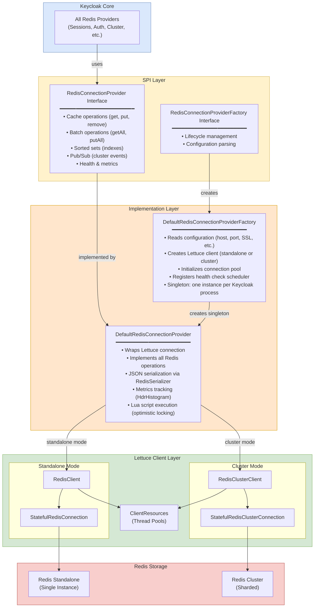
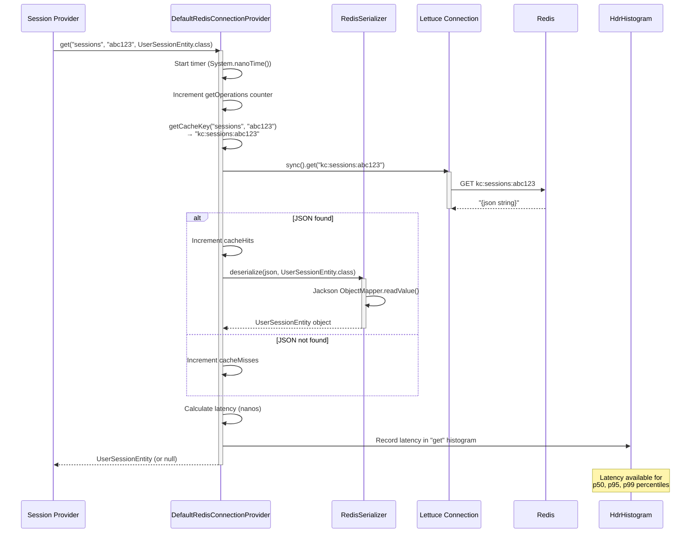
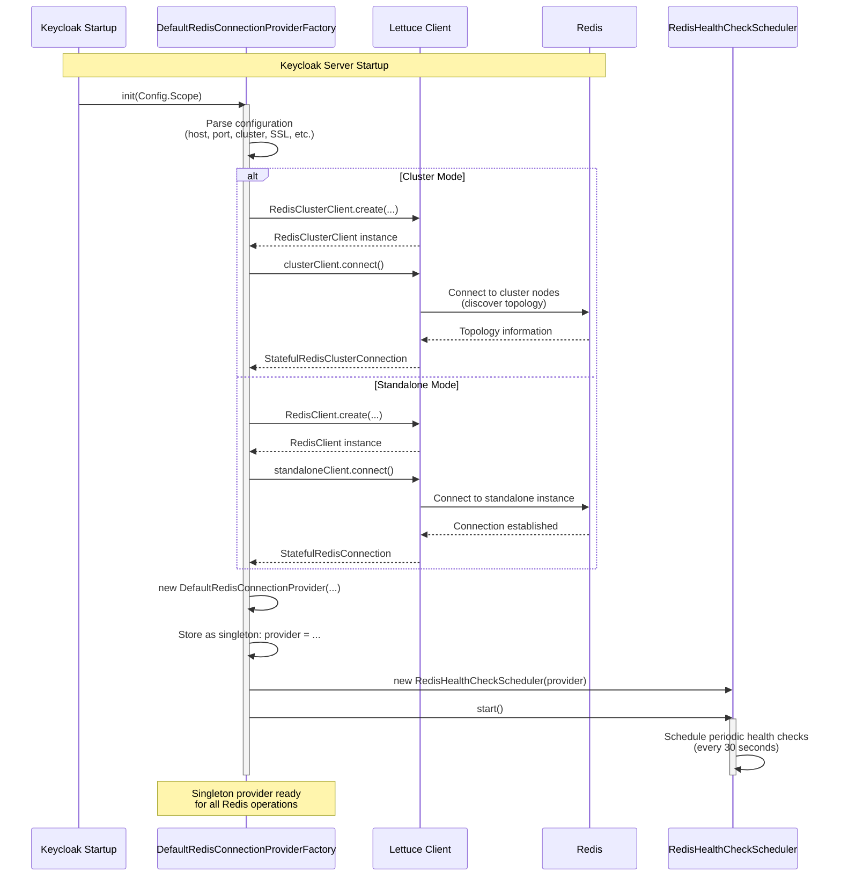
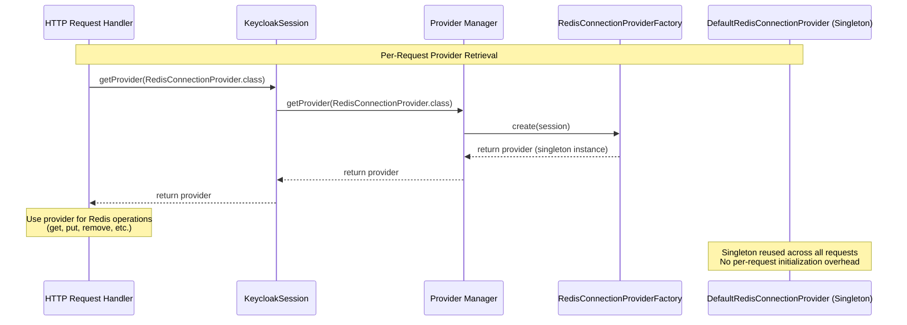
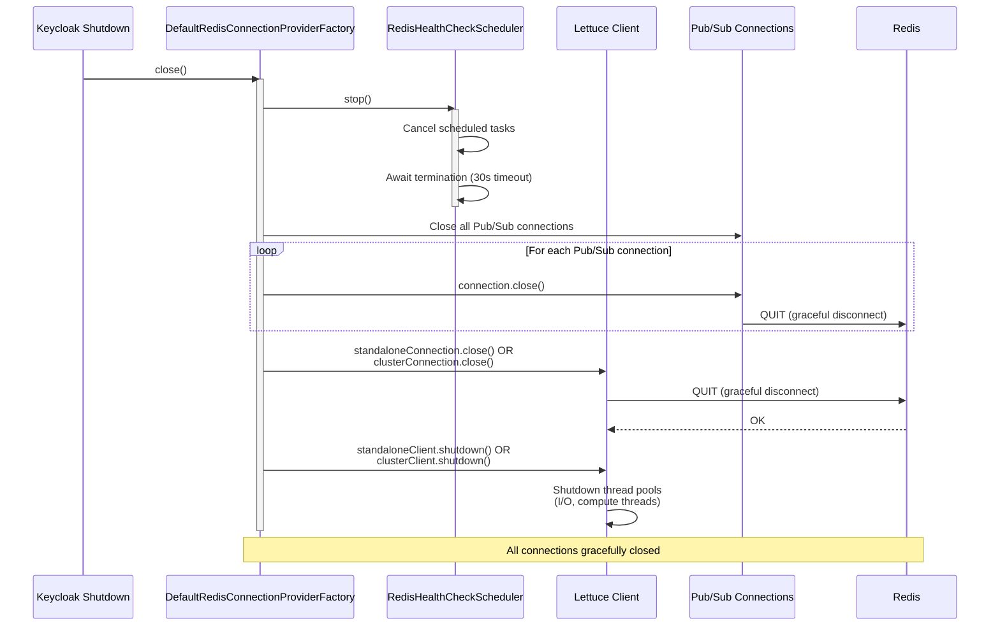
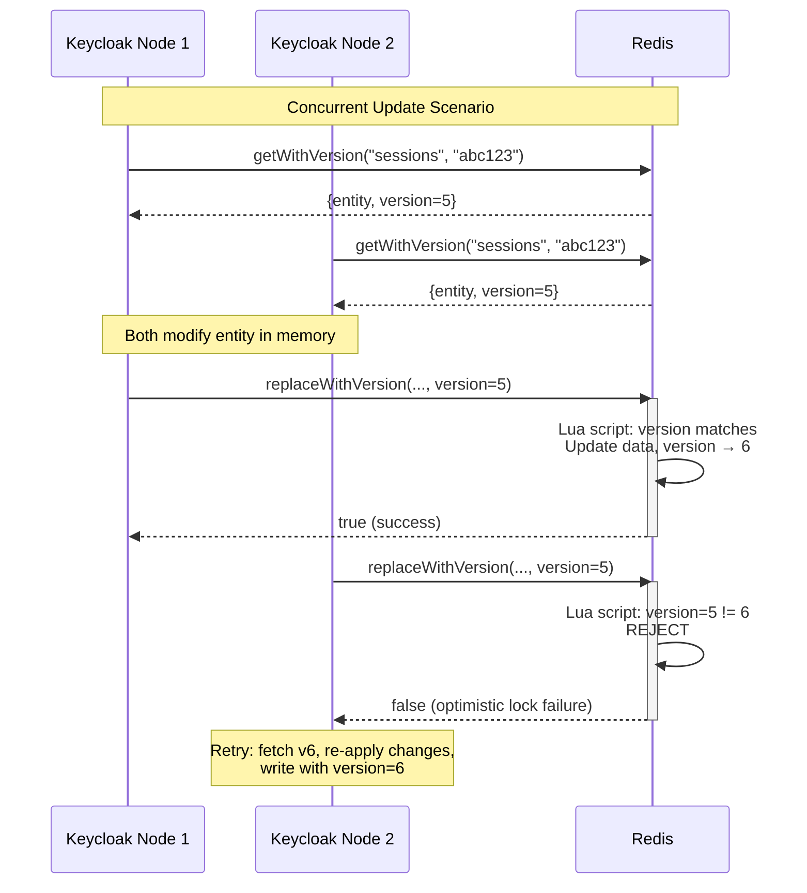
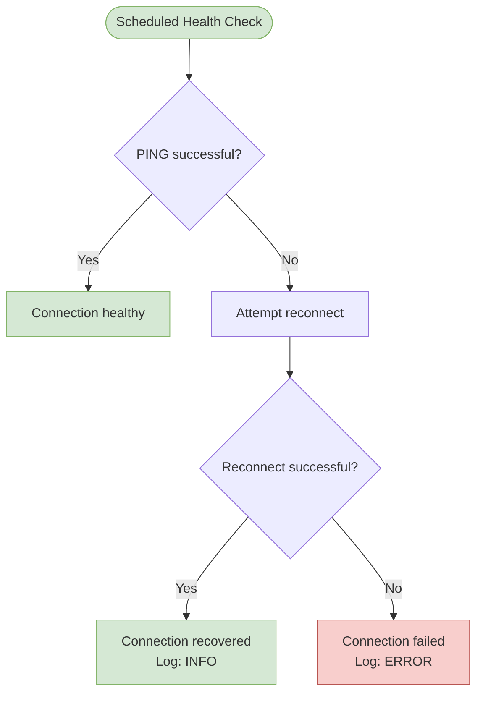

<!--
Copyright 2026 Capital One Financial Corporation and/or its affiliates
and other contributors as indicated by the @author tags.

Licensed under the Apache License, Version 2.0 (the "License");
you may not use this file except in compliance with the License.
You may obtain a copy of the License at

http://www.apache.org/licenses/LICENSE-2.0

Unless required by applicable law or agreed to in writing, software
distributed under the License is distributed on an "AS IS" BASIS,
WITHOUT WARRANTIES OR CONDITIONS OF ANY KIND, either express or implied.
See the License for the specific language governing permissions and
limitations under the License.
-->

# Redis Connection Layer

> **⚠️ EXPERIMENTAL FEATURE:** This provider requires the `redis-storage` feature flag to be enabled. See the [main README](../../README.md#enabling-the-feature) for details.

The Redis Connection Layer is the foundational infrastructure that enables all Keycloak Redis providers to communicate with Redis. It abstracts Redis operations to support both standalone and cluster modes, handles connection pooling, provides optimistic locking, and tracks comprehensive metrics.

## Table of Contents

1. [Overview](#overview)
2. [Architecture](#architecture)
3. [Core Components](#core-components)
4. [Connection Lifecycle](#connection-lifecycle)
5. [Operation Patterns](#operation-patterns)
6. [Critical Implementation Details](#critical-implementation-details)
7. [Performance Characteristics](#performance-characteristics)
8. [Production Considerations](#production-considerations)

---

## Overview

### Purpose

The Redis Connection Layer serves as the single point of integration between Keycloak and Redis, providing:

- **Unified API** — Single interface for both standalone and cluster Redis deployments
- **Connection Management** — Lettuce-based connection pooling with automatic reconnection
- **Optimistic Locking** — Version-based concurrency control using Lua scripts
- **Batch Operations** — Efficient bulk GET/PUT/DELETE operations
- **Pub/Sub Support** — Dedicated connections for cluster event distribution
- **Health Monitoring** — Connection health checks and automatic recovery
- **Comprehensive Metrics** — Latency histograms, cache hit rates, operation counters

### What is the Redis Connection Layer?

The Redis Connection Layer is a **singleton shared infrastructure** used by all Keycloak Redis providers:

```
User Session Provider    ─┐
Client Session Provider  ─┤
Auth Session Provider    ─┼──→ RedisConnectionProvider (Singleton)
Single-Use Provider      ─┤      ├─ Standalone: RedisClient + StatefulRedisConnection
Login Failure Provider   ─┤      └─ Cluster: RedisClusterClient + StatefulRedisClusterConnection
Cluster Provider         ─┘
```

**Key Characteristics:**
- **Singleton Pattern**: One instance shared across all providers and requests
- **Thread-Safe**: All operations are safe for concurrent use
- **Dual-Mode**: Supports both standalone Redis and Redis Cluster seamlessly
- **Transparent**: Providers use same API regardless of Redis deployment mode

---

## Architecture

### Component Hierarchy



### Operation Flow: GET with Metrics



---

## Core Components

### 1. RedisConnectionProvider Interface

The primary interface used by all Redis providers:

```java
public interface RedisConnectionProvider extends Provider {
    // Cache name constants
    String USER_SESSION_CACHE_NAME = "sessions";
    String OFFLINE_USER_SESSION_CACHE_NAME = "offlineSessions";
    String CLIENT_SESSION_CACHE_NAME = "clientSessions";
    String AUTHENTICATION_SESSIONS_CACHE_NAME = "authenticationSessions";
    String LOGIN_FAILURE_CACHE_NAME = "loginFailures";
    String SINGLE_USE_OBJECT_CACHE_NAME = "actionTokens";
    String WORK_CACHE_NAME = "work";

    // Basic operations
    <V> V get(String cacheName, String key, Class<V> type);
    <V> void put(String cacheName, String key, V value, long lifespan, TimeUnit unit);
    <V> V remove(String cacheName, String key, Class<V> type);
    boolean delete(String cacheName, String key);

    // Optimistic locking
    <V> VersionedValue<V> getWithVersion(String cacheName, String key, Class<V> type);
    <V> boolean replaceWithVersion(String cacheName, String key, V value, long version, long lifespan, TimeUnit unit);

    // Batch operations
    <V> Map<String, V> getAll(String cacheName, List<String> keys, Class<V> type);
    <V> void putAll(String cacheName, Map<String, V> entries, long lifespan, TimeUnit unit);
    long deleteAll(String cacheName, List<String> keys);

    // Sorted sets (for indexing)
    boolean addToSortedSet(String cacheName, String setKey, String member, double score, long lifespan, TimeUnit unit);
    boolean removeFromSortedSet(String cacheName, String setKey, String member);
    List<String> getSortedSetMembers(String cacheName, String setKey);

    // Pub/Sub
    void publish(String channel, String message);
    Object createPubSubConnection();

    // Health & Metrics
    boolean isHealthy();
    boolean ping();
    boolean reconnect();
    Map<String, Long> getMetrics();
    Map<String, Object> getEnhancedMetrics();
}
```

**Design Rationale:**
- **Async variants**: All key operations have `*Async()` variants returning `CompletionStage<T>` for non-blocking I/O
- **Type safety**: Generic `<V>` parameter ensures compile-time type checking
- **Cache abstraction**: `cacheName` parameter enables multiple logical caches on one Redis instance
- **Unified API**: Same interface works for standalone and cluster modes

### 2. DefaultRedisConnectionProvider Implementation

The concrete implementation wrapping Lettuce:

```java
public class DefaultRedisConnectionProvider implements RedisConnectionProvider {
    // Dual-mode support
    private final RedisClient standaloneClient;
    private final RedisClusterClient clusterClient;
    private final StatefulRedisConnection<String, String> standaloneConnection;
    private final StatefulRedisClusterConnection<String, String> clusterConnection;

    // Core infrastructure
    private final RedisSerializer serializer;
    private final String keyPrefix;  // Default: "kc:"
    private final boolean clusterMode;

    // Metrics
    private final AtomicLong getOperations;
    private final AtomicLong putOperations;
    private final AtomicLong cacheHits;
    private final AtomicLong cacheMisses;
    private final ConcurrentHashMap<String, Recorder> latencyRecorders;  // HdrHistogram

    // Health
    private volatile boolean healthy;
    private volatile long lastHealthCheck;

    // Lua scripts for atomicity
    private static final String CAS_SCRIPT = "...";  // Compare-and-set with version
    private static final String BULK_DELETE_SCRIPT = "...";  // Chunked bulk deletes
}
```

**Key Implementation Details:**
- **Null checking**: `Objects.requireNonNull()` on all constructors
- **Mode detection**: `clusterMode` boolean determines which Lettuce client to use
- **Lazy initialization**: Lettuce connections created on first use
- **Pub/Sub isolation**: Separate connection list (`CopyOnWriteArrayList`) for Pub/Sub to avoid blocking main connection

### 3. DefaultRedisConnectionProviderFactory

Factory responsible for creating and managing the singleton connection provider:

```java
public class DefaultRedisConnectionProviderFactory
    implements RedisConnectionProviderFactory, ServerInfoAwareProviderFactory {

    private RedisConnectionProvider provider;  // Singleton instance
    private RedisClient standaloneClient;
    private RedisClusterClient clusterClient;
    private RedisHealthCheckScheduler healthCheckScheduler;

    @Override
    public void init(Config.Scope config) {
        // Parse configuration
        String host = config.get("host", "localhost");
        int port = config.getInt("port", 6379);
        boolean cluster = config.getBoolean("cluster", false);
        // ... parse all 20+ config options

        // Create Lettuce client
        if (cluster) {
            clusterClient = RedisClusterClient.create(...);
            clusterConnection = clusterClient.connect();
            provider = new DefaultRedisConnectionProvider(clusterClient, clusterConnection, ...);
        } else {
            standaloneClient = RedisClient.create(...);
            standaloneConnection = standaloneClient.connect();
            provider = new DefaultRedisConnectionProvider(standaloneClient, standaloneConnection, ...);
        }

        // Start health check scheduler
        healthCheckScheduler = new RedisHealthCheckScheduler(provider);
        healthCheckScheduler.start();
    }

    @Override
    public RedisConnectionProvider create(KeycloakSession session) {
        return provider;  // Return singleton instance
    }
}
```

**Configuration Options:**

| Parameter | Default | Description |
|-----------|---------|-------------|
| `host` | `localhost` | Redis server hostname |
| `port` | `6379` | Redis server port |
| `password` | - | Authentication password |
| `database` | `0` | Database number (standalone only) |
| `ssl` | `false` | Enable TLS encryption |
| `sslVerifyPeer` | `true` | Verify SSL certificates |
| `cluster` | `false` | Enable Redis Cluster mode |
| `keyPrefix` | `kc:` | Prefix for all Redis keys |
| `connectionTimeout` | `10000` | Connection timeout (ms) |
| `socketTimeout` | `10000` | Socket timeout (ms) |
| `ioThreads` | `4` | Lettuce I/O thread pool size |
| `computeThreads` | `4` | Computation thread pool size |
| `healthCheckInterval` | `30000` | Health check interval (ms) |
| `autoReconnect` | `true` | Automatic reconnection |
| `clusterTopologyRefresh` | `true` | Refresh cluster topology |
| `clusterRefreshInterval` | `300` | Topology refresh interval (sec) |

### 4. RedisSerializer

Handles JSON serialization/deserialization using Jackson:

```java
public class RedisSerializer {
    private static final RedisSerializer INSTANCE = new RedisSerializer();
    private final ObjectMapper mapper;

    private RedisSerializer() {
        this.mapper = new ObjectMapper();
        mapper.registerModule(new JavaTimeModule());  // Java 8 date/time support
        mapper.disable(SerializationFeature.WRITE_DATES_AS_TIMESTAMPS);
        mapper.setSerializationInclusion(JsonInclude.Include.NON_NULL);
    }

    public <T> String serialize(T obj) throws RedisConnectionException {
        try {
            return mapper.writeValueAsString(obj);
        } catch (JsonProcessingException e) {
            throw new RedisConnectionException("Serialization failed", e);
        }
    }

    public <T> T deserialize(String json, Class<T> type) throws RedisConnectionException {
        try {
            return mapper.readValue(json, type);
        } catch (JsonProcessingException e) {
            throw new RedisConnectionException("Deserialization failed", e);
        }
    }
}
```

**Serialization Features:**
- **Singleton pattern**: One ObjectMapper instance shared across all operations
- **ISO 8601 dates**: Human-readable timestamp format
- **Null exclusion**: `NON_NULL` policy reduces Redis memory usage
- **Module support**: JavaTimeModule for `Instant`, `LocalDateTime`, etc.

### 5. RedisHealthCheckScheduler

Background scheduler for periodic health checks:

```java
public class RedisHealthCheckScheduler {
    private final RedisConnectionProvider provider;
    private final ScheduledExecutorService scheduler;
    private final long intervalMs;

    public void start() {
        scheduler.scheduleAtFixedRate(() -> {
            if (!provider.ping()) {
                logger.warn("Redis connection unhealthy, attempting reconnect");
                if (provider.reconnect()) {
                    logger.info("Redis reconnection successful");
                } else {
                    logger.error("Redis reconnection failed");
                }
            }
        }, intervalMs, intervalMs, TimeUnit.MILLISECONDS);
    }
}
```

**Health Check Strategy:**
- **Periodic ping**: PING command every 30 seconds (configurable)
- **Automatic reconnection**: Attempts reconnect on ping failure
- **Background thread**: Does not block main request processing
- **Logging**: All health events logged for operational visibility

---

## Connection Lifecycle

### Initialization Flow



**Initialization Steps:**
1. **Configuration parsing** (init method)
2. **Client creation** (Lettuce RedisClient or RedisClusterClient)
3. **Connection establishment** (connect method)
4. **Provider instantiation** (DefaultRedisConnectionProvider constructor)
5. **Health check scheduler start** (background thread)

### Request-Time Usage (Provider Retrieval)



**Key Points:**
- **Singleton reuse**: Same `DefaultRedisConnectionProvider` instance returned for every request
- **Thread-safe**: Lettuce connections are thread-safe (multiplexing)
- **No cleanup**: Provider not closed at end of request (lives for entire Keycloak process)
- **Lightweight**: Retrieval is just a reference return (~O(1))

### Shutdown Flow



**Shutdown Sequence:**
1. **Stop health check scheduler**
2. **Close all Pub/Sub connections**
3. **Close main Redis connection**
4. **Shutdown Lettuce client** (releases thread pools)

---

## Operation Patterns

### Pattern 1: Simple GET/PUT

```java
// Provider code
UserSessionEntity entity = redis.get(
    RedisConnectionProvider.USER_SESSION_CACHE_NAME,
    sessionId,
    UserSessionEntity.class
);

redis.put(
    RedisConnectionProvider.USER_SESSION_CACHE_NAME,
    sessionId,
    entity,
    1800,  // 30 minutes
    TimeUnit.SECONDS
);
```

**Redis Commands:**
```
GET kc:sessions:abc123
PSETEX kc:sessions:abc123 1800000 '{"id":"abc123","userId":"user1",...}'
```

**Characteristics:**
- **Latency**: ~1ms p95
- **Use case**: Simple session retrieval/storage
- **Atomic**: Each operation is a single Redis command

### Pattern 2: Optimistic Locking (Replace with Version)

```java
// Provider code
VersionedValue<UserSessionEntity> versioned = redis.getWithVersion(
    RedisConnectionProvider.USER_SESSION_CACHE_NAME,
    sessionId,
    UserSessionEntity.class
);

UserSessionEntity entity = versioned.value();
entity.setLastSessionRefresh(System.currentTimeMillis());

boolean success = redis.replaceWithVersion(
    RedisConnectionProvider.USER_SESSION_CACHE_NAME,
    sessionId,
    entity,
    versioned.version(),  // Expected version
    1800,
    TimeUnit.SECONDS
);

if (!success) {
    throw new OptimisticLockException("Session was modified by another node");
}
```

**Redis Commands (Lua Script):**
```lua
-- Atomic compare-and-set
local current_version = redis.call('GET', 'kc:sessions:abc123:version')
if current_version == '5' or current_version == false then
    redis.call('PSETEX', 'kc:sessions:abc123', 1800000, '{json}')
    redis.call('SET', 'kc:sessions:abc123:version', 6)
    redis.call('PEXPIRE', 'kc:sessions:abc123:version', 1800000)
    return 1
else
    return 0
end
```

**Flow Diagram:**



**Benefits:**
- **Prevents lost updates**: Detects concurrent modifications
- **No distributed locks**: Lua script provides atomicity
- **Automatic retry**: Keycloak transaction system retries on failure

### Pattern 3: Batch Operations

```java
// Batch GET
List<String> sessionIds = List.of("id1", "id2", "id3");
Map<String, UserSessionEntity> sessions = redis.getAll(
    RedisConnectionProvider.USER_SESSION_CACHE_NAME,
    sessionIds,
    UserSessionEntity.class
);

// Batch PUT
Map<String, UserSessionEntity> updates = new HashMap<>();
updates.put("id1", entity1);
updates.put("id2", entity2);
redis.putAll(
    RedisConnectionProvider.USER_SESSION_CACHE_NAME,
    updates,
    1800,
    TimeUnit.SECONDS
);
```

**Redis Commands:**
```
MGET kc:sessions:id1 kc:sessions:id2 kc:sessions:id3
# Returns array: [json1, json2, json3]

# For MSET, Lettuce uses pipelining:
PSETEX kc:sessions:id1 1800000 '...'
PSETEX kc:sessions:id2 1800000 '...'
# Sent in single network round-trip
```

**Performance Benefit:**
- **Without batching**: 3 operations × 1.5ms = 4.5ms total
- **With batching**: 1 operation × 2ms = 2ms total (50% faster)

### Pattern 4: Sorted Set Operations (Session Indexing)

```java
// Add session to realm index
redis.addToSortedSet(
    RedisConnectionProvider.USER_SESSION_CACHE_NAME,
    "realm:master",  // Index key
    "session-abc123",  // Member
    System.currentTimeMillis(),  // Score (for TTL-based cleanup)
    1800,
    TimeUnit.SECONDS
);

// Get all sessions for realm
List<String> sessionIds = redis.getSortedSetMembers(
    RedisConnectionProvider.USER_SESSION_CACHE_NAME,
    "realm:master"
);
```

**Redis Commands:**
```
ZADD kc:sessions:realm:master 1709654321000 "session-abc123"
EXPIRE kc:sessions:realm:master 1800

ZRANGE kc:sessions:realm:master 0 -1
# Returns: ["session-abc123", "session-def456", ...]
```

**Use Case:**
- **Session queries**: "Get all sessions for realm X"
- **O(1) lookups**: Fast membership checks via sorted sets
- **Score-based operations**: Remove sessions older than timestamp

### Pattern 5: Pub/Sub (Cluster Events)

```java
// Create dedicated Pub/Sub connection
StatefulRedisPubSubConnection<String, String> pubSubConn =
    (StatefulRedisPubSubConnection) redis.createPubSubConnection();

// Subscribe to cluster events channel
pubSubConn.addListener(new RedisPubSubListener() {
    @Override
    public void message(String channel, String message) {
        // Handle cluster event (e.g., session invalidation)
        processClusterEvent(message);
    }
});

pubSubConn.sync().subscribe("kc:cluster:events");

// Publish event from another node
redis.publish("kc:cluster:events", "{\"type\":\"SESSION_REMOVED\",\"id\":\"abc123\"}");
```

**Redis Commands:**
```
SUBSCRIBE kc:cluster:events
# Connection enters Pub/Sub mode, blocks until message

PUBLISH kc:cluster:events '{"type":"SESSION_REMOVED","id":"abc123"}'
# Returns number of subscribers that received message
```

**Key Points:**
- **Dedicated connection**: Pub/Sub blocks connection, so separate from main operations
- **Pattern matching**: Can subscribe to `kc:cluster:*` for all cluster events
- **Fire-and-forget**: PUBLISH returns immediately, subscribers handle async

---

## Critical Implementation Details

### 1. Dual-Mode Architecture (Standalone vs Cluster)

The connection provider transparently handles both Redis deployment modes:

**Standalone Mode:**
```java
RedisClient client = RedisClient.create(RedisURI.create(host, port));
StatefulRedisConnection<String, String> connection = client.connect();
```

**Cluster Mode:**
```java
RedisClusterClient client = RedisClusterClient.create(
    RedisURI.Builder.redis(host, port).build()
);
StatefulRedisClusterConnection<String, String> connection = client.connect();
```

**Operational Differences:**

| Feature | Standalone | Cluster |
|---------|-----------|---------|
| **Deployment** | Single Redis instance | Multiple shards |
| **Key distribution** | N/A | Hash slot based (CRC16) |
| **Sorted sets** | Native support | Requires hash tags `{key}` |
| **Pub/Sub** | Single channel | Per-shard (must use `PUBLISH` on all nodes) |
| **Topology refresh** | N/A | Automatic (periodic + adaptive) |
| **Failover** | Manual | Automatic (via cluster protocol) |

**Hash Tag Example (Cluster Mode):**
```java
// Without hash tag: keys can be on different shards (sorted set fails)
redis.addToSortedSet("sessions", "realm:master", "session-123", ...);  // ERROR

// With hash tag: all keys route to same shard
redis.addToSortedSet("sessions", "{realm:master}:index", "session-123", ...);  // OK
```

### 2. Optimistic Locking Implementation

**Why Optimistic Locking?**
- Multi-node Keycloak deployments can have concurrent updates to same session
- Without locking, "last write wins" → lost updates
- Optimistic locking detects conflicts and triggers retry

**Lua Script Breakdown:**
```lua
-- Script receives:
-- KEYS[1] = data key (e.g., kc:sessions:abc123)
-- KEYS[2] = version key (e.g., kc:sessions:abc123:version)
-- ARGV[1] = expected version (e.g., "5")
-- ARGV[2] = new data (JSON string)
-- ARGV[3] = TTL in milliseconds (e.g., "1800000")

local current_version = redis.call('GET', KEYS[2])

if current_version == ARGV[1] or current_version == false then
    -- Version matches or key doesn't exist: proceed with update
    redis.call('PSETEX', KEYS[1], ARGV[3], ARGV[2])
    redis.call('SET', KEYS[2], tonumber(ARGV[1]) + 1)
    redis.call('PEXPIRE', KEYS[2], ARGV[3])
    return 1  -- Success
else
    -- Version mismatch: reject update
    return 0  -- Failure
end
```

**Why Lua?**
- **Atomicity**: Entire script executes as single Redis command (no interleaving)
- **Performance**: Script uploaded once, executed by SHA hash (no re-parsing)
- **Cluster-safe**: Works identically in standalone and cluster modes

### 3. Metrics and Observability

**HdrHistogram for Latency Tracking:**

```java
// Operation latency tracking
private final ConcurrentHashMap<String, Recorder> latencyRecorders = new ConcurrentHashMap<>();

private void recordLatency(String operation, long nanos) {
    latencyRecorders
        .computeIfAbsent(operation, op -> new Recorder(2))  // 2 significant digits
        .recordValue(TimeUnit.NANOSECONDS.toMicros(nanos));
}

public Map<String, Object> getEnhancedMetrics() {
    Map<String, Object> metrics = new HashMap<>();

    latencyRecorders.forEach((operation, recorder) -> {
        Histogram histogram = recorder.getIntervalHistogram();
        metrics.put("latency." + operation + ".p50", histogram.getValueAtPercentile(50.0));
        metrics.put("latency." + operation + ".p95", histogram.getValueAtPercentile(95.0));
        metrics.put("latency." + operation + ".p99", histogram.getValueAtPercentile(99.0));
    });

    return metrics;
}
```

**Available Metrics:**

| Metric | Type | Description |
|--------|------|-------------|
| `getOperations` | Counter | Total GET operations |
| `putOperations` | Counter | Total PUT operations |
| `deleteOperations` | Counter | Total DELETE operations |
| `cacheHits` | Counter | GET operations that found data |
| `cacheMisses` | Counter | GET operations that returned null |
| `errorCount` | Counter | Failed operations (exceptions) |
| `latency.get.p50` | Microseconds | 50th percentile GET latency |
| `latency.get.p95` | Microseconds | 95th percentile GET latency |
| `latency.get.p99` | Microseconds | 99th percentile GET latency |
| `latency.put.p50` | Microseconds | 50th percentile PUT latency |
| `cache.hitRate` | Percentage | `cacheHits / (cacheHits + cacheMisses)` |

**Why HdrHistogram?**
- **Low overhead**: ~2% CPU cost for recording
- **Accurate percentiles**: Better than simple averages
- **Bounded memory**: Fixed size regardless of operation count

### 4. Connection Health and Reconnection

**Health Check Flow:**



**Reconnection Strategy:**

```java
@Override
public boolean reconnect() {
    try {
        // Close existing connection
        if (clusterMode) {
            clusterConnection.close();
            clusterConnection = clusterClient.connect();
        } else {
            standaloneConnection.close();
            standaloneConnection = standaloneClient.connect();
        }

        // Verify new connection
        if (ping()) {
            healthy = true;
            lastHealthCheck = System.currentTimeMillis();
            return true;
        }
    } catch (Exception e) {
        logger.error("Reconnection failed", e);
        healthy = false;
    }
    return false;
}
```

**Lettuce Auto-Reconnect:**
- Lettuce has built-in reconnection logic
- If `autoReconnect=true`, Lettuce automatically retries failed commands
- Our health check scheduler provides additional layer for monitoring

---

## Production Considerations

### Configuration Best Practices

**High-Availability Setup:**

```bash
# Use Redis Cluster for production
--spi-connections-redis-default-cluster=true
--spi-connections-redis-default-host=redis-cluster.example.com
--spi-connections-redis-default-port=6379

# Enable SSL/TLS
--spi-connections-redis-default-ssl=true
--spi-connections-redis-default-sslVerifyPeer=true

# Tune thread pools for high load
--spi-connections-redis-default-ioThreads=16
--spi-connections-redis-default-computeThreads=16

# Reduce socket timeout for faster failure detection
--spi-connections-redis-default-socketTimeout=3000

# Enable cluster topology refresh
--spi-connections-redis-default-clusterTopologyRefresh=true
--spi-connections-redis-default-clusterAdaptiveRefresh=true
```

**Development Setup:**

```bash
# Use standalone Redis
--spi-connections-redis-default-host=localhost
--spi-connections-redis-default-port=6379
--spi-connections-redis-default-cluster=false

# Disable SSL for local testing
--spi-connections-redis-default-ssl=false
```

### Monitoring and Alerting

**Essential Metrics to Track:**

```bash
# Cache performance
cache.hitRate < 80%  # Alert if hit rate drops
cacheHits + cacheMisses > 10000/sec  # High load indicator

# Latency SLO
latency.get.p95 > 5ms  # Alert on degraded performance
latency.put.p95 > 10ms

# Error rate
errorCount / (getOperations + putOperations) > 0.01  # Alert if error rate > 1%

# Connection health
isHealthy == false  # Critical alert
```

**Grafana Dashboard Queries (Prometheus):**

```promql
# Cache hit rate
rate(redis_cache_hits_total[5m]) / (rate(redis_cache_hits_total[5m]) + rate(redis_cache_misses_total[5m]))

# p95 GET latency
histogram_quantile(0.95, rate(redis_get_latency_bucket[5m]))

# Operations per second
rate(redis_get_operations_total[1m])
```

### Troubleshooting Guide

**Issue 1: High Latency (p95 > 10ms)**

**Diagnose:**
```bash
# Check Redis latency from Keycloak nodes
redis-cli --latency -h redis.example.com

# Check network latency
ping redis.example.com

# Review Redis slow log
redis-cli SLOWLOG GET 10
```

**Fix:**
- **Network**: Ensure Keycloak and Redis in same VPC/region
- **Thread starvation**: Increase `ioThreads` and `computeThreads`
- **Redis CPU**: Scale Redis cluster (more shards)
- **Serialization**: Reduce entity size (remove unnecessary fields)

**Issue 2: Low Cache Hit Rate (< 70%)**

**Diagnose:**
```bash
# Check TTL of keys
redis-cli TTL kc:sessions:{sessionId}

# Verify keys exist
redis-cli --scan --pattern "kc:sessions:*" | wc -l
```

**Fix:**
- **TTL too short**: Increase session lifespan in Keycloak settings
- **Eviction policy**: Ensure `maxmemory-policy volatile-lru` in Redis
- **Memory pressure**: Scale Redis memory or add more shards

**Issue 3: Connection Failures**

**Diagnose:**
```bash
# Check Keycloak logs
tail -f keycloak.log | grep "Redis connection"

# Verify Redis is accessible
nc -zv redis.example.com 6379

# Check SSL certificate (if enabled)
openssl s_client -connect redis.example.com:6379 -showcerts
```

**Fix:**
- **Firewall**: Verify security group allows Keycloak → Redis (port 6379)
- **SSL**: Verify certificate validity and `sslVerifyPeer` setting
- **Credentials**: Ensure `password` parameter matches Redis AUTH

### Capacity Planning

**Session Storage Calculation:**

```
Sessions per second: 100
Average session size: 2KB
Session TTL: 1800s (30 min)

Peak concurrent sessions = 100 TPS × 1800s = 180,000 sessions
Peak Redis memory = 180,000 × 2KB = 360MB

Recommendation: 1GB Redis memory (2.7x buffer)
```

**Network Bandwidth Calculation:**

```
Operations per second: 1000
Average payload: 2KB
Overhead (protocol + serialization): 20%

Bandwidth = 1000 ops/sec × 2KB × 1.2 = 2.4 MB/sec = 19.2 Mbps

Recommendation: 100 Mbps network link (5x buffer)
```

### Production Checklist

- [ ] Redis cluster deployed with replication (≥3 nodes)
- [ ] SSL/TLS enabled with valid certificates
- [ ] Authentication configured (Redis AUTH)
- [ ] Network latency < 5ms (same region/VPC)
- [ ] Monitoring dashboard configured (Grafana + Prometheus)
- [ ] Alerting rules defined (latency, error rate, health)
- [ ] Memory capacity planned with 2x buffer
- [ ] Connection pool tuned (`ioThreads`, `computeThreads`)
- [ ] Health check scheduler enabled
- [ ] Backup and restore procedures documented
- [ ] Disaster recovery tested (Redis failover)

---

## Source Code Reference

**Main Files:**
- `src/main/java/org/keycloak/models/redis/RedisConnectionProvider.java` — Interface
- `src/main/java/org/keycloak/models/redis/DefaultRedisConnectionProvider.java` — Implementation
- `src/main/java/org/keycloak/models/redis/DefaultRedisConnectionProviderFactory.java` — Factory
- `src/main/java/org/keycloak/models/redis/RedisSerializer.java` — JSON serialization
- `src/main/java/org/keycloak/models/redis/RedisHealthCheckScheduler.java` — Health monitoring
- `src/main/java/org/keycloak/models/redis/DefaultRedisClientFactory.java` — Lettuce client creation
- `src/main/java/org/keycloak/models/redis/RedisConnectionException.java` — Exception class

**Test Coverage:**
- `src/test/java/org/keycloak/models/redis/test/DefaultRedisConnectionProviderTest.java`
- `src/test/java/org/keycloak/models/redis/test/DefaultRedisConnectionProviderFactoryTest.java`
- `src/test/java/org/keycloak/models/redis/test/BatchOperationsTest.java`
- `src/test/java/org/keycloak/models/redis/test/HealthCheckAndMetricsTest.java`

---

## See Also

- [User Sessions Provider](user-sessions.md) — Primary consumer of Redis connection layer
- [Cluster Provider](cluster.md) — Uses Pub/Sub connections for event distribution
- [Architecture Overview](../architecture/overview.md) — System-wide design decisions
- [Single-Use Object Provider](singleuse.md) — Atomic operations usage example
