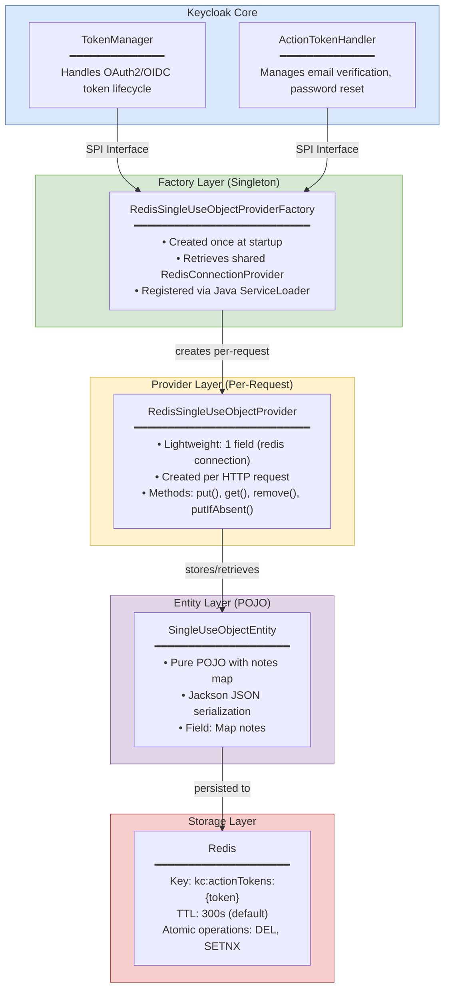
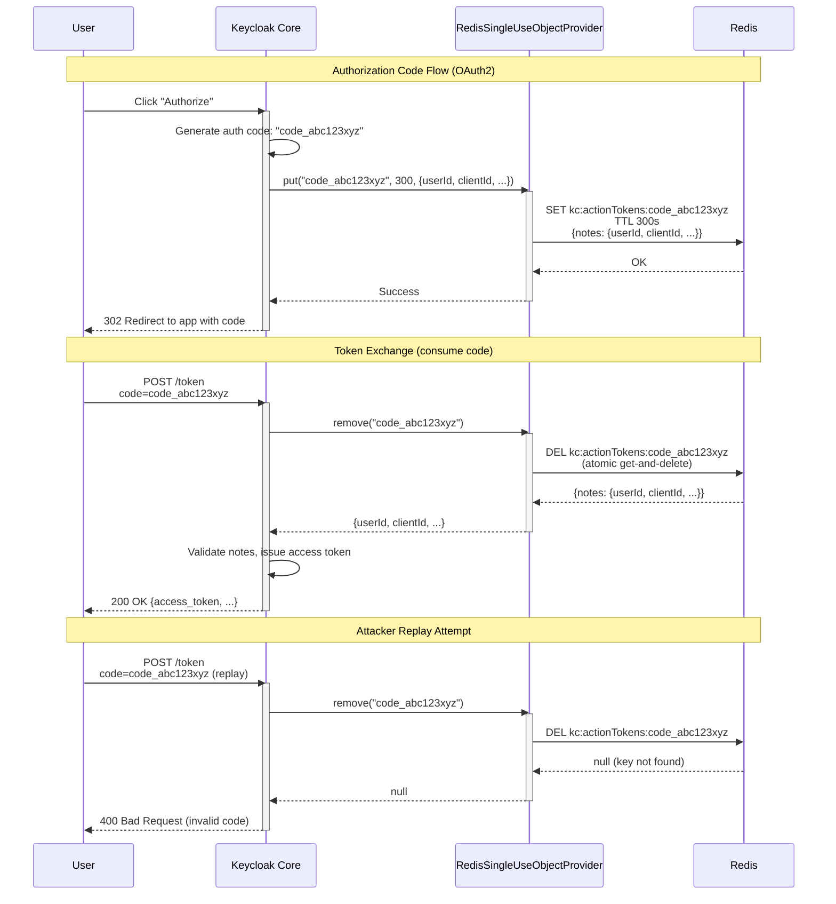
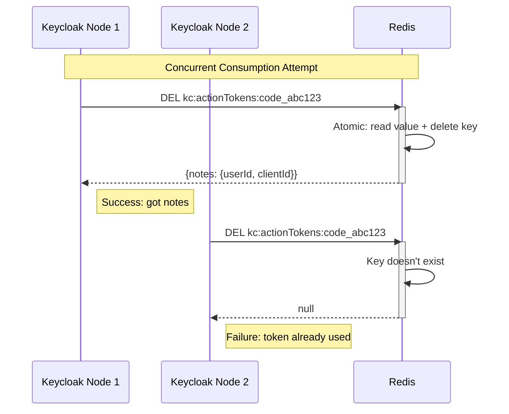
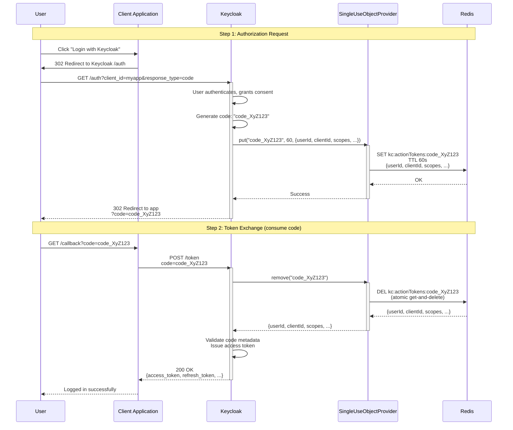
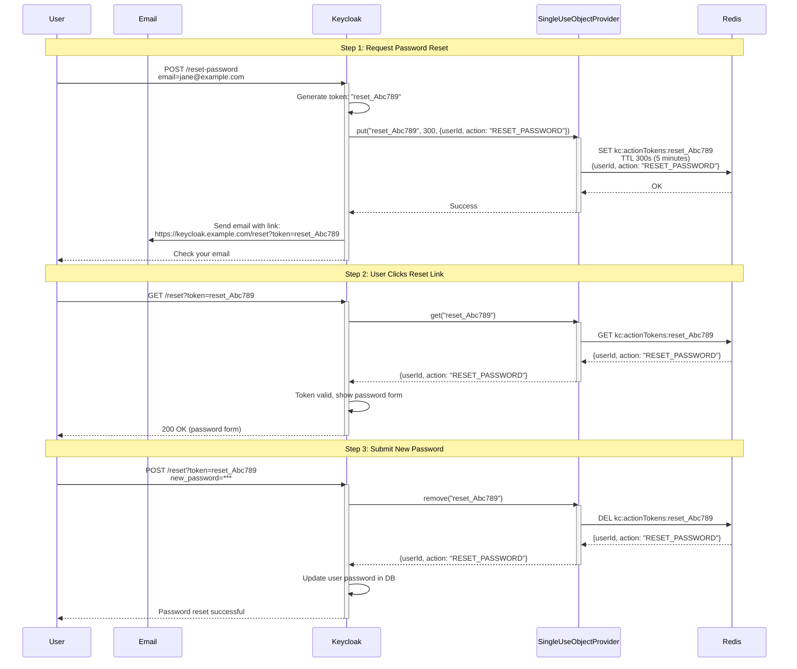
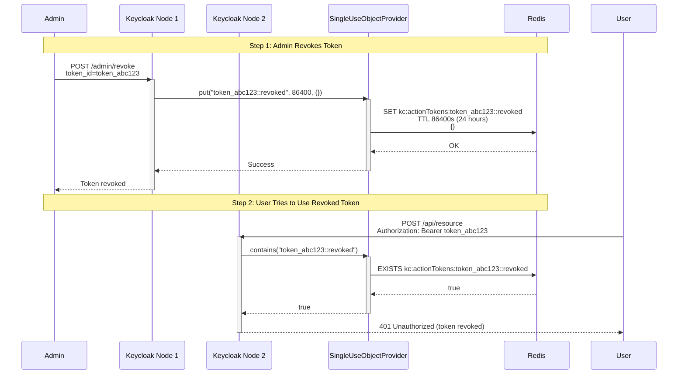

<!--
Copyright 2026 Capital One Financial Corporation and/or its affiliates
and other contributors as indicated by the @author tags.

Licensed under the Apache License, Version 2.0 (the "License");
you may not use this file except in compliance with the License.
You may obtain a copy of the License at

http://www.apache.org/licenses/LICENSE-2.0

Unless required by applicable law or agreed to in writing, software
distributed under the License is distributed on an "AS IS" BASIS,
WITHOUT WARRANTIES OR CONDITIONS OF ANY KIND, either express or implied.
See the License for the specific language governing permissions and
limitations under the License.
-->

# Redis Single-Use Object Provider

The `RedisSingleUseObjectProvider` is the implementation of Keycloak's `SingleUseObjectProvider` interface for the Redis provider. It manages authorization codes, action tokens, and other single-use objects that must be consumed exactly once, providing atomic operations and automatic expiration via Redis.

## Table of Contents

1. [Overview](#overview)
2. [Architecture](#architecture)
3. [Core Operations](#core-operations)
4. [Use Cases](#use-cases)
5. [Critical Implementation Details](#critical-implementation-details)
6. [Performance Characteristics](#performance-characteristics)
7. [Production Considerations](#production-considerations)

---

## Overview

### Purpose

The Single-Use Object Provider enables secure, atomic handling of objects that must be consumed exactly once:
- **Authorization Codes** — OAuth2/OIDC authorization codes (single-use requirement)
- **Action Tokens** — Email verification, password reset links (time-limited, one-time use)
- **Token Revocation** — Revoked token tracking (prevent reuse)
- **CSRF Tokens** — One-time security tokens
- **Device Flow Codes** — Smart TV/IoT device authorization

### What is a Single-Use Object?

A **single-use object** is a token or code that can be consumed exactly once and has a limited lifetime. This is critical for security — reusing the same authorization code or action token would allow replay attacks.

**Key Characteristics:**
- **One-Time Use**: First consumption removes the object (atomic operation)
- **Time-Limited**: Automatic expiration via Redis TTL
- **Atomic Operations**: Redis ensures no race conditions on concurrent access
- **Cluster-Wide**: Works consistently across multiple Keycloak nodes

**Example Flow:**
```
1. User requests password reset
   → Keycloak generates action token "abc123xyz"
   → Stored in Redis: kc:actionTokens:abc123xyz (TTL: 5 minutes)

2. User clicks reset link
   → Keycloak calls remove("abc123xyz")
   → Redis atomically returns and deletes the token
   → Password reset allowed

3. Attacker tries same link
   → Keycloak calls remove("abc123xyz")
   → Redis returns null (token already removed)
   → Password reset denied
```

---

## Architecture

### Layer Diagram



### Component Interaction



---

## Core Operations

### 1. Put Operation

**Purpose**: Store a single-use object with automatic expiration

**Method Signature:**
```java
void put(String key, long lifespanSeconds, Map<String, String> notes)
```

**Implementation:**
```java
@Override
public void put(String key, long lifespanSeconds, Map<String, String> notes) {
    Objects.requireNonNull(key, "key cannot be null");

    if (key.endsWith(REVOKED_KEY)) {
        // Token revocation - store with empty notes
        SingleUseObjectEntity entity = new SingleUseObjectEntity(Collections.emptyMap());
        redis.put(RedisConnectionProvider.SINGLE_USE_OBJECT_CACHE_NAME, key, entity, lifespanSeconds, TimeUnit.SECONDS);
        logger.debugf("Token revoked: %s", key);
        return;
    }

    SingleUseObjectEntity entity = new SingleUseObjectEntity(notes);
    redis.put(RedisConnectionProvider.SINGLE_USE_OBJECT_CACHE_NAME, key, entity, lifespanSeconds, TimeUnit.SECONDS);

    if (logger.isDebugEnabled()) {
        logger.debugf("Stored single-use object: %s with lifespan %d seconds", key, lifespanSeconds);
    }
}
```

**Key Points:**
- Creates new key with TTL (automatically expires)
- Overwrites if key already exists
- Special handling for revoked tokens (empty notes)
- Redis cache name: `actionTokens`

**Use Cases:**
- Creating OAuth2 authorization codes
- Generating password reset tokens
- Issuing email verification links

### 2. Get Operation

**Purpose**: Retrieve a single-use object without consuming it

**Method Signature:**
```java
Map<String, String> get(String key)
```

**Implementation:**
```java
@Override
public Map<String, String> get(String key) {
    Objects.requireNonNull(key, "key cannot be null");

    SingleUseObjectEntity entity = redis.get(
            RedisConnectionProvider.SINGLE_USE_OBJECT_CACHE_NAME,
            key,
            SingleUseObjectEntity.class
    );

    return entity != null ? entity.getNotes() : null;
}
```

**Key Points:**
- Non-destructive read (object remains in Redis)
- Returns null if key doesn't exist or expired
- Useful for validation before consumption

**Use Cases:**
- Checking if action token exists before showing password reset page
- Validating authorization code format before token exchange

### 3. Remove Operation (Atomic Consumption)

**Purpose**: Consume a single-use object atomically (get-and-delete)

**Method Signature:**
```java
Map<String, String> remove(String key)
```

**Implementation:**
```java
@Override
public Map<String, String> remove(String key) {
    Objects.requireNonNull(key, "key cannot be null");

    // Atomic get-and-delete to ensure single-use semantics
    // This is critical for authorization codes - they must only be used once
    SingleUseObjectEntity entity = redis.remove(
            RedisConnectionProvider.SINGLE_USE_OBJECT_CACHE_NAME,
            key,
            SingleUseObjectEntity.class
    );

    if (entity != null) {
        if (logger.isDebugEnabled()) {
            logger.debugf("Removed single-use object: %s", key);
        }
        return entity.getNotes();
    }

    return null;
}
```

**Critical Implementation Detail:**

The `redis.remove()` operation is **atomic** — it returns the value and deletes the key in a single Redis command (DEL returns the deleted value). This prevents race conditions:



**Use Cases:**
- Exchanging authorization code for access token
- Consuming password reset token
- One-time email verification

### 4. Replace Operation

**Purpose**: Update an existing single-use object (with optimistic locking)

**Method Signature:**
```java
boolean replace(String key, Map<String, String> notes)
```

**Implementation:**
```java
@Override
public boolean replace(String key, Map<String, String> notes) {
    Objects.requireNonNull(key, "key cannot be null");

    // Check if key exists first
    RedisConnectionProvider.VersionedValue<SingleUseObjectEntity> existing = redis.getWithVersion(
            RedisConnectionProvider.SINGLE_USE_OBJECT_CACHE_NAME,
            key,
            SingleUseObjectEntity.class
    );

    if (existing == null || !existing.hasValue()) {
        return false;
    }

    // Replace with version check for optimistic locking
    SingleUseObjectEntity newEntity = new SingleUseObjectEntity(notes);
    boolean replaced = redis.replaceWithVersion(
            RedisConnectionProvider.SINGLE_USE_OBJECT_CACHE_NAME,
            key,
            newEntity,
            existing.version(),
            // Keep same TTL - we can't easily get remaining TTL in Redis without extra call
            // Using a reasonable default; in production, consider using PTTL command
            300,
            TimeUnit.SECONDS
    );

    if (replaced && logger.isDebugEnabled()) {
        logger.debugf("Replaced single-use object: %s", key);
    }

    return replaced;
}
```

**Key Points:**
- Returns `false` if key doesn't exist
- Uses optimistic locking (version check)
- Resets TTL to default (limitation: can't preserve original TTL without extra Redis call)

**Use Cases:**
- Updating authorization code metadata before consumption
- Rarely used (most single-use objects are immutable)

### 5. PutIfAbsent Operation (Conditional Creation)

**Purpose**: Create object only if it doesn't already exist (atomic check-and-set)

**Method Signature:**
```java
boolean putIfAbsent(String key, long lifespanInSeconds)
```

**Implementation:**
```java
@Override
public boolean putIfAbsent(String key, long lifespanInSeconds) {
    Objects.requireNonNull(key, "key cannot be null");

    // Atomic conditional put - critical for ensuring uniqueness
    SingleUseObjectEntity entity = new SingleUseObjectEntity(null);
    SingleUseObjectEntity previous = redis.putIfAbsent(
            RedisConnectionProvider.SINGLE_USE_OBJECT_CACHE_NAME,
            key,
            entity,
            lifespanInSeconds,
            TimeUnit.SECONDS
    );

    boolean wasAbsent = previous == null;

    if (wasAbsent && logger.isDebugEnabled()) {
        logger.debugf("Created single-use object (if absent): %s", key);
    }

    return wasAbsent;
}
```

**Key Points:**
- Returns `true` if object was created (key didn't exist)
- Returns `false` if key already exists
- Uses Redis SETNX (SET if Not eXists) for atomicity
- No notes stored (just existence check)

**Use Cases:**
- Distributed locking (ensure only one node creates a token)
- Preventing duplicate authorization code generation
- CSRF token deduplication

### 6. Contains Operation

**Purpose**: Check if a single-use object exists without retrieving it

**Method Signature:**
```java
boolean contains(String key)
```

**Implementation:**
```java
@Override
public boolean contains(String key) {
    Objects.requireNonNull(key, "key cannot be null");
    return redis.containsKey(RedisConnectionProvider.SINGLE_USE_OBJECT_CACHE_NAME, key);
}
```

**Key Points:**
- Returns `true` if key exists in Redis
- Returns `false` if key doesn't exist or expired
- More efficient than `get()` if you don't need the value

**Use Cases:**
- Quick validation checks
- Monitoring token usage

---

## Use Cases

### Use Case 1: OAuth2 Authorization Code Flow

**Scenario**: User authorizes an application, Keycloak issues an authorization code



**Key Points:**
- Authorization code stored for 60 seconds (OIDC spec recommends short lifespan)
- Code contains metadata: userId, clientId, requested scopes, redirect_uri, PKCE verifier
- Atomic remove ensures code can only be used once (critical for security)
- If code reused → remove returns null → token exchange fails

### Use Case 2: Password Reset Action Token

**Scenario**: User forgets password, receives reset email



**Key Points:**
- Token valid for 5 minutes (configurable)
- `get()` checks validity without consuming (allows showing form)
- `remove()` consumes token when password updated
- Attacker reusing link after 5 minutes → Redis returns null (expired)

### Use Case 3: Token Revocation Tracking

**Scenario**: Admin revokes a refresh token cluster-wide



**Key Points:**
- Revoked tokens stored for 24 hours (longer than token max lifetime)
- Suffix `::revoked` distinguishes from regular tokens
- Empty notes map (just existence check needed)
- Works across all cluster nodes (shared Redis)

---

## Critical Implementation Details

### 1. Atomic Remove Operation

**⚠️ CRITICAL**: The `remove()` method MUST be atomic to prevent double-consumption

**Implementation:**
```java
// Redis DEL command returns the deleted value atomically
SingleUseObjectEntity entity = redis.remove(
    RedisConnectionProvider.SINGLE_USE_OBJECT_CACHE_NAME,
    key,
    SingleUseObjectEntity.class
);
```

**Why Critical:**
- OAuth2 spec requires authorization codes be single-use
- Replay attacks possible if concurrent requests can both consume same code
- Redis DEL is atomic — only one thread/node gets the value

**Attack Scenario Prevented:**
```
Thread 1: remove("code_abc") → returns notes → issues token ✓
Thread 2: remove("code_abc") → returns null → denies request ✓

Without atomicity:
Thread 1: get("code_abc") → returns notes
Thread 2: get("code_abc") → returns notes (BOTH succeed - BAD!)
Thread 1: delete("code_abc")
Thread 2: delete("code_abc")
Result: Attacker can use code twice and get 2 tokens
```

### 2. TTL-Based Expiration

**Implementation**: Every `put()` and `putIfAbsent()` sets a TTL on the Redis key

**Benefits:**
- No background cleanup needed (Redis handles expiration)
- Expired tokens automatically inaccessible
- Memory efficient (expired keys removed by Redis)

**TTL Defaults:**
| Object Type | Default TTL | Configurable? |
|-------------|-------------|---------------|
| Authorization Code | 60 seconds | Via OAuth2 settings |
| Action Token | 300 seconds (5 min) | Via realm settings |
| Revoked Token | 86400 seconds (24 hours) | Fixed |

**Redis TTL Behavior:**
```bash
# After put() with TTL 300s
redis-cli TTL "kc:actionTokens:code_abc123"
# Output: 300

# After 150 seconds
redis-cli TTL "kc:actionTokens:code_abc123"
# Output: 150

# After 301 seconds
redis-cli TTL "kc:actionTokens:code_abc123"
# Output: -2 (key doesn't exist, expired)
```

### 3. Optimistic Locking in Replace

**Purpose**: Prevent concurrent updates from overwriting each other

**Implementation:**
```java
// Get current version
RedisConnectionProvider.VersionedValue<SingleUseObjectEntity> existing = redis.getWithVersion(
    RedisConnectionProvider.SINGLE_USE_OBJECT_CACHE_NAME,
    key,
    SingleUseObjectEntity.class
);

// Replace only if version matches
boolean replaced = redis.replaceWithVersion(
    RedisConnectionProvider.SINGLE_USE_OBJECT_CACHE_NAME,
    key,
    newEntity,
    existing.version(),  // Expected version
    300,
    TimeUnit.SECONDS
);
```

**How It Works:**
1. Read entity with version number (e.g., version=5)
2. Attempt replace with expected version=5
3. Redis checks: current version still 5?
   - Yes → Update to version=6, return `true`
   - No → Another thread already updated, return `false`

**Use Case:**
- Rarely needed for single-use objects (they're immutable)
- Useful if updating token metadata before consumption

### 4. PutIfAbsent for Uniqueness

**Purpose**: Ensure only one node creates a token (distributed coordination)

**Implementation:**
```java
// Redis SETNX (SET if Not eXists) - atomic operation
SingleUseObjectEntity previous = redis.putIfAbsent(
    RedisConnectionProvider.SINGLE_USE_OBJECT_CACHE_NAME,
    key,
    entity,
    lifespanInSeconds,
    TimeUnit.SECONDS
);

boolean wasAbsent = previous == null;  // true if we created it
```

**Example Scenario:**
```
Two nodes generate same authorization code "code_collision123" simultaneously:

Node 1: putIfAbsent("code_collision123", 60) → returns true (created)
Node 2: putIfAbsent("code_collision123", 60) → returns false (already exists)

Result: Only Node 1 issues the code, Node 2 regenerates a different code
```

### 5. Entity Structure

**POJO Design:**
```java
public static class SingleUseObjectEntity {
    private Map<String, String> notes;

    // Required for deserialization
    public SingleUseObjectEntity() {
    }

    public SingleUseObjectEntity(Map<String, String> notes) {
        this.notes = notes;
    }

    public Map<String, String> getNotes() {
        return notes;
    }

    public void setNotes(Map<String, String> notes) {
        this.notes = notes;
    }
}
```

**Key Points:**
- Pure POJO with no Keycloak dependencies
- Jackson serialization for JSON format
- Notes map stores arbitrary key-value metadata

**Example Serialized Entity:**
```json
{
  "notes": {
    "userId": "user-abc123",
    "clientId": "my-app",
    "redirectUri": "https://app.example.com/callback",
    "scope": "openid profile email",
    "codeChallenge": "E9Melhoa2OwvFrEMTJguCHaoeK1t8URWbuGJSstw-cM",
    "codeChallengeMethod": "S256"
  }
}
```

---

## Production Considerations

### Pros

✅ **Atomic Operations**: Redis DEL guarantees single-use semantics
✅ **Automatic Cleanup**: TTL-based expiration, no background jobs needed
✅ **Cluster-Wide Consistency**: Works seamlessly across multiple Keycloak nodes
✅ **Simple Monitoring**: Use Redis CLI to inspect active tokens
✅ **Replay Attack Prevention**: Atomic remove prevents code reuse

### Cons

⚠️ **Redis Dependency**: Requires Redis availability for OAuth2 flows
⚠️ **TTL Limitation**: `replace()` resets TTL (can't preserve original expiration)
⚠️ **No Persistence**: Redis downtime = loss of active codes/tokens
⚠️ **Memory Bound**: High authorization rate can consume memory (mitigated by TTL)

### Best Practices

#### 1. Monitor Active Tokens

```bash
# Count active action tokens
redis-cli --scan --pattern "kc:actionTokens:*" | wc -l

# View specific token (human-readable JSON)
redis-cli GET "kc:actionTokens:code_abc123" | jq .

# Check TTL
redis-cli TTL "kc:actionTokens:code_abc123"

# Monitor token creation rate
redis-cli --stat | grep instantaneous_ops_per_sec
```

#### 2. Tune TTL for Security and UX

```bash
# Short TTL for authorization codes (OAuth2 spec recommends ≤10 minutes)
# Keycloak default: 60 seconds
# Configure via: Realm Settings → Tokens → OAuth 2.0 Authorization Code Lifespan

# Longer TTL for action tokens (password reset, email verification)
# Keycloak default: 300 seconds (5 minutes)
# Configure via: Realm Settings → Tokens → Action Token Lifespan

# Example: Increase password reset token to 15 minutes
--spi-user-sessions-redis-session-lifespan=900
```

**Security Consideration**: Shorter TTL = smaller window for replay attacks

#### 3. Handle Expired Tokens Gracefully

```java
// Check before showing UI
Map<String, String> notes = provider.get(token);
if (notes == null) {
    // Token expired or invalid
    return "Token expired. Please request a new one.";
}

// Show password reset form
```

**User Experience**: Show friendly error messages for expired action tokens

#### 4. Test Concurrent Consumption

```bash
# Chaos engineering test: concurrent code consumption
# Run 10 parallel requests with same auth code
for i in {1..10}; do
    curl -X POST https://keycloak.example.com/token \
        -d "code=code_abc123&client_id=myapp&..." &
done
wait

# Expected result: exactly 1 success, 9 failures
# Verify Redis logs show only 1 DEL succeeded
```

#### 5. Monitor Redis Memory Usage

```bash
# Check memory usage
redis-cli INFO memory

# Set memory limit with eviction policy
redis-cli CONFIG SET maxmemory 2gb
redis-cli CONFIG SET maxmemory-policy volatile-lru

# Verify no tokens accidentally evicted (should only expire by TTL)
redis-cli INFO stats | grep evicted_keys
# Should be 0 if TTL cleanup is working correctly
```

#### 6. Validate Token Revocation

```bash
# After revoking a token, verify it's blocked
redis-cli EXISTS "kc:actionTokens:token_abc123::revoked"
# Output: 1 (exists = revoked)

# After 24 hours, verify revocation expired (token already expired anyway)
redis-cli EXISTS "kc:actionTokens:token_abc123::revoked"
# Output: 0 (doesn't exist = revocation cleaned up)
```

### Performance Tuning

**High Throughput Configuration:**
```bash
# Increase Redis connection pool for high authorization code volume
--spi-connections-redis-default-connection-pool-size=50

# Reduce socket timeout for faster failure detection
--spi-connections-redis-default-socket-timeout=3000

# Enable TCP keep-alive
--spi-connections-redis-default-tcp-keepalive=true
```

**Redis Server Optimization:**
```ini
# redis.conf
maxmemory 2gb
maxmemory-policy volatile-lru  # Evict expired tokens first

# Disable persistence for ephemeral tokens (optional, risky)
save ""
appendonly no

# Increase max clients for high concurrency
maxclients 10000
```

### Reliability Checklist

- [ ] Redis is clustered for HA (Redis Cluster or Sentinel)
- [ ] Network latency to Redis < 5ms (same region/VPC)
- [ ] TTLs configured per security requirements (60s for auth codes, 300s for action tokens)
- [ ] Monitoring alerts for Redis connection failures
- [ ] Load testing with realistic token creation/consumption patterns
- [ ] Chaos engineering: concurrent consumption tested
- [ ] Expired token handling tested in UI flows
- [ ] Token revocation tested across all cluster nodes

---

## Source Code Reference

**Main Files:**
- `model/redis/src/main/java/org/keycloak/models/redis/singleuse/RedisSingleUseObjectProvider.java` — Provider implementation
- `model/redis/src/main/java/org/keycloak/models/redis/singleuse/RedisSingleUseObjectProviderFactory.java` — Factory
- `model/redis/src/main/java/org/keycloak/models/redis/singleuse/RedisSingleUseObjectProvider.SingleUseObjectEntity.java` — Entity (inner class)

**Test Coverage:**
- `model/redis/src/test/java/org/keycloak/models/redis/test/singleuse/RedisSingleUseObjectProviderTest.java` — Unit tests
- `model/redis/src/test/resources/features/single-use-objects.feature` — ATDD scenarios (Cucumber/Gherkin)

---

## See Also

- [User Sessions Provider](user-sessions.md) — User and client session management
- [Authentication Sessions Provider](authentication-sessions.md) — Login flow sessions
- [Cluster Provider](cluster.md) — Multi-node coordination and Pub/Sub
- [Architecture Overview](../architecture/overview.md) — Complete system architecture
