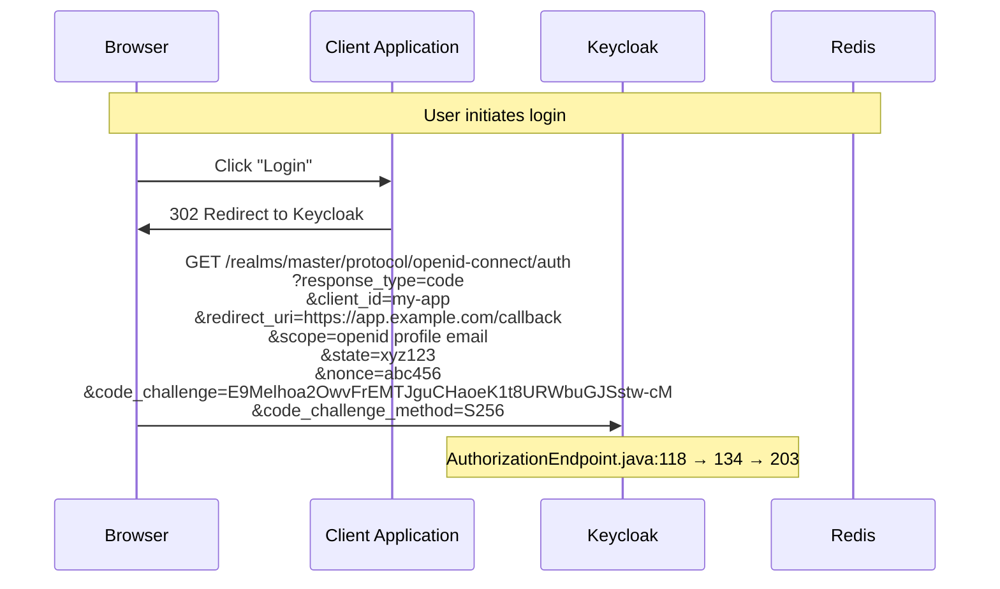
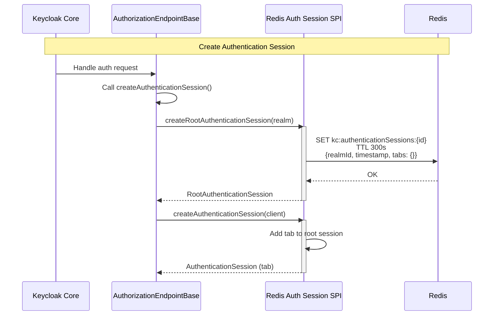
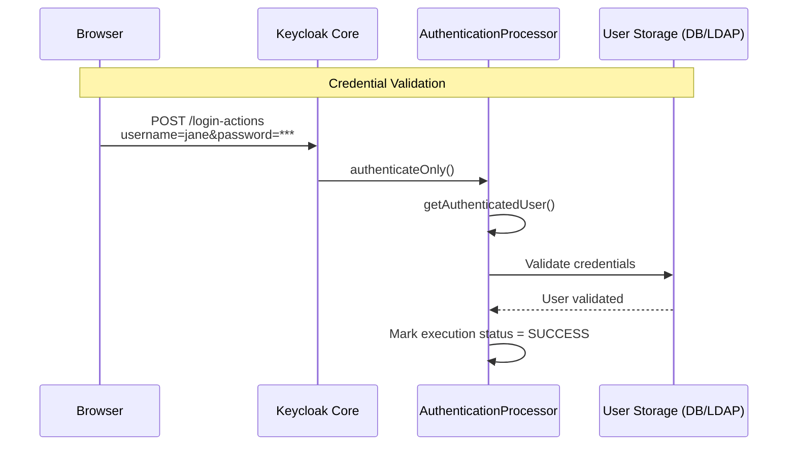
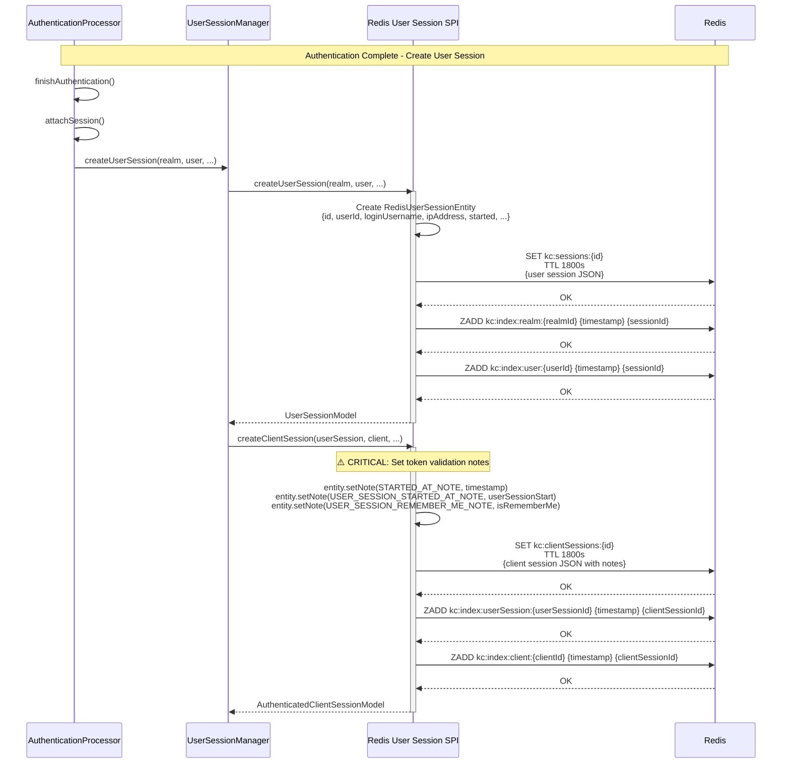
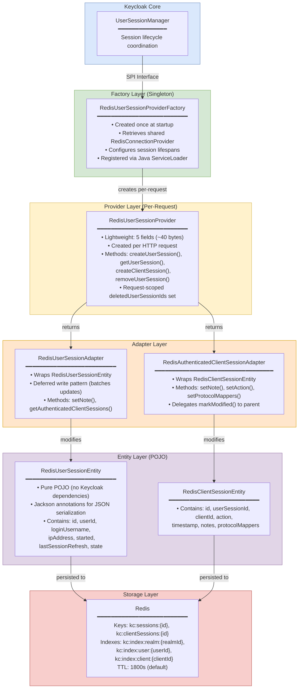
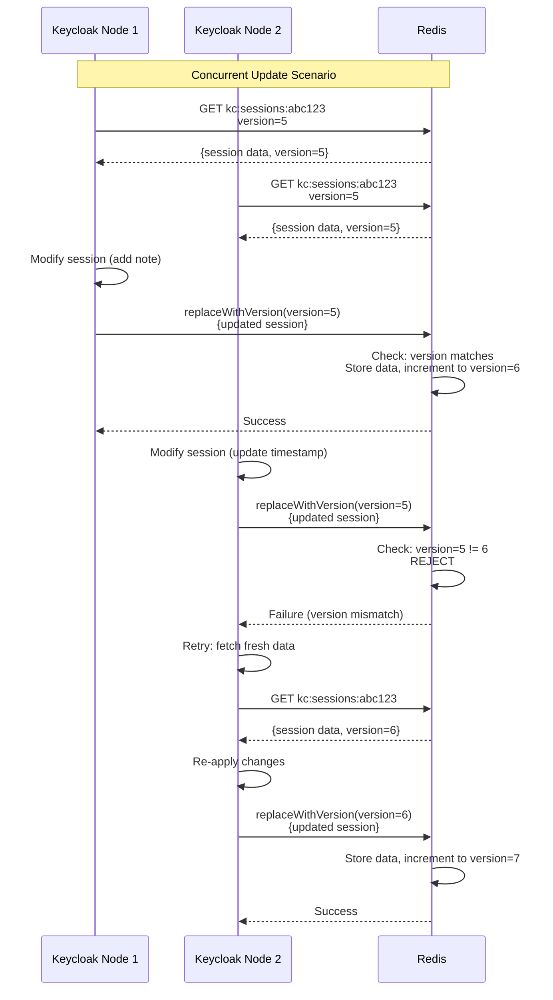

<!--
Copyright 2026 Capital One Financial Corporation and/or its affiliates
and other contributors as indicated by the @author tags.

Licensed under the Apache License, Version 2.0 (the "License");
you may not use this file except in compliance with the License.
You may obtain a copy of the License at

http://www.apache.org/licenses/LICENSE-2.0

Unless required by applicable law or agreed to in writing, software
distributed under the License is distributed on an "AS IS" BASIS,
WITHOUT WARRANTIES OR CONDITIONS OF ANY KIND, either express or implied.
See the License for the specific language governing permissions and
limitations under the License.
-->

# Redis User Session Provider

The `RedisUserSessionProvider` is the core session management component for the Keycloak Redis provider. It stores and manages user authentication sessions and client application sessions in Redis instead of Keycloak's default storage (JPA or Infinispan).

## Table of Contents

1. [Overview](#overview)
2. [Background: Session Creation Flow](#background-session-creation-flow)
3. [Architecture](#architecture)
4. [Core Components](#core-components)
5. [Public API Methods](#public-api-methods)
6. [Critical Implementation Details](#critical-implementation-details)
7. [Performance Characteristics](#performance-characteristics)
8. [Configuration](#configuration)
9. [API Reference](#api-reference)

---

## Overview

### Purpose

The Redis User Session Provider manages authenticated sessions across the entire Keycloak cluster, enabling:
- **User Session Management** — Track authenticated users and their login state
- **Client Session Management** — Track which applications each user is accessing
- **Session Indexing** — Fast lookups by user, realm, or client (O(1) complexity)
- **Offline Sessions** — Support for remember-me and offline refresh tokens
- **Cluster Coordination** — Share sessions across multiple Keycloak nodes seamlessly

### What is a User Session?

A **user session** represents a logged-in user after successful authentication. It differs fundamentally from an authentication session:

| Aspect | Authentication Session | User Session |
|--------|------------------------|--------------|
| **Purpose** | Tracks flow *during authentication* | Represents a logged-in user *after authentication* |
| **Lifespan** | Seconds to minutes | Hours to days |
| **Created when** | User navigates to login page | Login flow completes successfully |
| **Destroyed when** | Login succeeds or abandoned (TTL expiry) | User logs out, admin revokes, or idle/max timeout reached |
| **Contains** | OAuth parameters (`state`, `nonce`), execution progress | User identity, realm roles, active client connections |

### User Session vs. Client Session

- **User Session**: Represents a single user's authenticated identity in Keycloak
  - Example: "Jane Doe logged in from 192.168.1.42 at 2:30 PM"
  - One user session can have multiple client sessions under it

- **Client Session**: Links a user session to a specific application
  - Example: "Jane Doe is currently using the 'my-app' application"
  - Contains application-specific data: OAuth tokens, protocol mappers, client scopes
  - Multiple client sessions can exist per user session (user accessing multiple apps)

---

## Background: Session Creation Flow

Understanding how Keycloak creates sessions helps clarify when the Redis provider gets invoked. The complete flow involves 4 phases:

### Phase 1: Authentication Request

The user's browser initiates an OAuth2/OIDC authorization flow:



**Key Classes:**
- `AuthorizationEndpoint.java:118` — Entry point for OAuth2/OIDC auth requests
- Parses OAuth parameters (`state`, `nonce`, PKCE `code_challenge`)
- Routes to appropriate authentication flow

### Phase 2: Authentication Session Creation

Keycloak creates a temporary authentication session to track the login flow:



**Key Points:**
- Authentication sessions are short-lived (5 minutes default)
- Store OAuth parameters (`state`, `nonce`, PKCE challenge)
- Track authenticator execution progress
- See [Authentication Sessions Provider](authentication-sessions.md) for details

### Phase 3: User Credential Validation

The user submits credentials, and Keycloak validates them:



**Key Classes:**
- `AuthenticationProcessor.java:1115` — Runs authenticator flow
- Checks user exists via `UserProvider`
- Validates password/MFA credentials
- Updates authentication session with execution statuses

### Phase 4: User Session Creation

Once authentication completes, Keycloak calls the Redis provider to create a user session:



**Key Points:**
- User session created with unique ID and metadata (user, IP, timestamp)
- Client session created and linked to user session
- **Critical notes** set for token validation (see [Critical Notes](#2-critical-notes-for-token-validation))
- Indexes created for fast lookups (realm, user, client)
- TTL set automatically (default: 30 minutes for online sessions)

**File References:**
- `AuthenticationProcessor.java:142` — Entry point: `finishAuthentication()`
- `AuthenticationProcessor.java:1219` — Calls `attachSession()`
- `UserSessionManager.java` — Calls `UserSessionProvider.createUserSession()`
- `RedisUserSessionProvider.java:156-196` — Creates user session in Redis
- `RedisUserSessionProvider.java:92-135` — Creates client session in Redis

---

## Architecture

### Layer Diagram



**Key Points:**
- **Provider** is lightweight per-request wrapper (~40 bytes): `session`, `redis`, `sessionLifespanSeconds`, `offlineSessionLifespanSeconds`, `deletedUserSessionIds`
- **Redis connection** is a singleton shared across all providers
- **SPI registration**: `META-INF/services/org.keycloak.models.UserSessionProviderFactory` → Java `ServiceLoader` discovers it at startup
- **Entities** are pure POJOs with Jackson annotations — testable without Keycloak runtime

### Data Model

**Redis Key Structure:**
```
kc:sessions:{sessionId}                      # User session data (JSON)
kc:sessions:{sessionId}:version              # Optimistic locking version

kc:clientSessions:{clientSessionId}          # Client session data (JSON)
kc:clientSessions:{clientSessionId}:version  # Optimistic locking version

kc:offlineSessions:{sessionId}               # Offline user session (remember-me)
kc:offlineClientSessions:{clientSessionId}   # Offline client session

# Indexes (sorted sets for O(1) lookups)
kc:index:realm:{realmId}                     # All sessions in realm
kc:index:user:{userId}                       # All sessions for user
kc:index:client:{clientId}                   # All client sessions for client
kc:index:userSession:{userSessionId}         # All client sessions under user session
```

**User Session Entity:**
```json
{
  "id": "5e2f8a3d-1234-5678-9abc-def012345678",
  "realmId": "master",
  "userId": "user-8a3b4c5d",
  "loginUsername": "jane.doe",
  "ipAddress": "192.168.1.42",
  "started": 1709654325,
  "lastSessionRefresh": 1709654325,
  "state": "LOGGED_IN",
  "offline": false,
  "rememberMe": false,
  "notes": {}
}
```

**Client Session Entity:**
```json
{
  "id": "c1a2b3c4-5678-9abc-def0-123456789012",
  "userSessionId": "5e2f8a3d-1234-5678-9abc-def012345678",
  "clientId": "my-app",
  "realmId": "master",
  "timestamp": 1709654325,
  "action": "AUTHENTICATE",
  "notes": {
    "started_at": "1709654325",
    "user_session_started_at": "1709654325"
  },
  "protocolMappers": ["mapper1", "mapper2"],
  "clientScopes": ["openid", "profile", "email"],
  "authenticatedSince": 1709654325
}
```

---

## Core Components

### 1. Instance Fields

```java
private final KeycloakSession session;              // Per-request context
private final RedisConnectionProvider redis;        // Redis operations wrapper
private final int sessionLifespanSeconds;           // Default TTL for online sessions
private final int offlineSessionLifespanSeconds;    // Default TTL for offline sessions
private final Set<String> deletedUserSessionIds;    // Request-scoped deletion tracking
```

**Key Design Points:**
- Provider instance is **request-scoped** (created per HTTP request)
- `deletedUserSessionIds` automatically cleared after request completes
- Configured lifespans used as fallback if realm doesn't specify

### 2. Index Key Prefixes

```java
private static final String REALM_INDEX_PREFIX = "realm:";         // realm:{realmId}
private static final String CLIENT_INDEX_PREFIX = "client:";       // client:{clientId}
private static final String USER_INDEX_PREFIX = "user:";           // user:{userId}
private static final String USER_SESSION_INDEX_PREFIX = "userSession:"; // userSession:{sessionId}
```

**Purpose:** Sorted set indexes for O(1) lookups instead of O(N) scans.

---

## Public API Methods

### Session Creation

| Method | Lines | Purpose | Returns |
|--------|-------|---------|---------|
| `createUserSession()` | 156-196 | Create new user session on login | `UserSessionModel` |
| `createClientSession()` | 92-135 | Create client session when app accessed | `AuthenticatedClientSessionModel` |
| `createOfflineUserSession()` | 514-539 | Create offline session for remember-me | `UserSessionModel` |
| `createOfflineClientSession()` | 552-590 | Create offline client session | `AuthenticatedClientSessionModel` |

**Common Pattern:**
1. Create entity (POJO with session data)
2. Store with `replaceWithVersion()` using `version=0` (create-only)
3. Add to sorted set indexes
4. Return adapter wrapping entity

### Session Retrieval

| Method | Lines | Purpose | Complexity |
|--------|-------|---------|------------|
| `getUserSession()` | 199-227 | Get single user session by ID | O(1) |
| `getClientSession()` | 138-153 | Get single client session | O(1) |
| `getUserSessionsStream()` | 230-252 | Get all sessions for a user | O(1) via index |
| `getUserSessionsStream(realm, client)` | 255-274 | Get sessions using a client | O(N) filtered |
| `getOfflineUserSession()` | 542-544 | Get offline session by ID | O(1) |
| `getOfflineUserSessionsStream()` | 593-614 | Get offline sessions for user | O(1) via index |

**Performance Optimization:**
- Uses **user index** (`user:{userId}`) for O(1) lookup
- Falls back to realm-wide scan only if index doesn't exist
- Batch operations via `getAll()` for loading multiple sessions

### Session Statistics

| Method | Lines | Purpose | Use Case |
|--------|-------|---------|----------|
| `getActiveClientSessionStats()` | 318-363 | Count sessions per client | Admin console dashboard |
| `getActiveUserSessions()` | 312-315 | Count sessions for a client | Client detail page |
| `getOfflineSessionsCount()` | 622-625 | Count offline sessions | Offline token management |

**Implementation:**
- Uses **realm index** to fetch all client sessions: O(M) where M = sessions in realm
- Uses **batch** `getAll()` instead of N+1 queries: 50-100x faster
- Cleans up stale index entries automatically

### Session Deletion

| Method | Lines | Purpose | Cascade Behavior |
|--------|-------|---------|------------------|
| `removeUserSession()` | 366-431 | Delete user session | Deletes all client sessions |
| `removeUserSessions(realm, user)` | 434-441 | Delete all sessions for user | Online + offline |
| `removeUserSessions(realm)` | 454-470 | Delete all sessions in realm | All sessions + indexes |
| `removeOfflineUserSession()` | 547-549 | Delete offline session | Same as regular delete |

**Deletion Process:**
1. Mark session as deleted (`deletedUserSessionIds.add()`)
2. Fetch session entity to get metadata
3. Delete user session data
4. Query `userSession:{sessionId}` index to find client sessions
5. Remove client sessions from all indexes (realm, client)
6. Remove user session from all indexes (realm, user)
7. Delete all client session data

### Lifecycle Hooks

| Method | Lines | Purpose | Trigger |
|--------|-------|---------|---------|
| `onRealmRemoved()` | 500-504 | Cleanup on realm deletion | Admin deletes realm |
| `onClientRemoved()` | 507-511 | Cleanup on client deletion | Admin deletes client |
| `removeAllExpired()` | 444-446 | Cleanup expired sessions | No-op (Redis TTL handles it) |
| `removeExpired()` | 449-451 | Cleanup expired for realm | No-op (Redis TTL handles it) |

**Design Note:** Expiration is automatic via Redis TTL, no periodic cleanup needed.

---

## Critical Implementation Details

### 1. Write Pattern Distinction: Creation vs Updates

**Session Creation (Optimistic Locking - IMMEDIATE)**

Uses CAS Lua script with version check (version=0 = "create only"):

```java
// File: RedisUserSessionProvider.java, Lines 173-176
boolean success = redis.replaceWithVersion(cacheName, key, entity, 0, lifespan, TimeUnit.SECONDS);
if(!success){
        throw new

RuntimeException("Session already exists");
}
```

**Lua Script Execution:**

```lua
-- CAS_SCRIPT (DefaultRedisConnectionProvider.java:84-92)
local current_version = redis.call('GET', KEYS[2])  -- Check version key
if current_version == ARGV[1] or current_version == false then
  redis.call('PSETEX', KEYS[1], ARGV[3], ARGV[2])   -- Write data with TTL
  redis.call('SET', KEYS[2], tonumber(ARGV[1]) + 1) -- Increment version
  redis.call('PEXPIRE', KEYS[2], ARGV[3])           -- Set version TTL
  return 1  -- Success
else
  return 0  -- Version mismatch (session already exists)
end
```

**Redis Operations on Creation:**

- User Session: 1 CAS script (creates data + version keys) + 2 ZADD (realm/user indexes) = **3 operations**
- Client Session: 1 CAS script (creates data + version keys) + 3 ZADD (realm/client/userSession indexes) = **4
  operations**
- **Total for login (1 user + 1 client):** 7 Redis operations, **9 keys/members created**

**Session Updates (Deferred Write - TRANSACTION COMMIT)**

Uses plain `redis.put()` (PSETEX) without version checking:

```java
// File: RedisUserSessionAdapter.java, Lines 208-211
public void setNote(String name, String value) {
    entity.setNote(name, value);  // In-memory only
    markModified();               // Register for deferred write
}

// Lines 250-266 - Transaction callback registered
private void markModified() {
    if (!modified) {
        modified = true;
        session.getTransactionManager().enlist(
                new AbstractRedisPersistenceTransaction(...){
            protected void persist () {
                RedisUserSessionAdapter.this.persist();
            }
        });
    }
}

// Line 290 - Actual write at transaction commit
redis.

put(cacheName, entity.getId(),entity,lifespan,TimeUnit.SECONDS);
```

**Redis Operation on Update:**

```
PSETEX kc:sessions:{sessionId} 1800000 {json-with-all-changes}
```

**Common Update Use Cases:**

- Storing OAuth2 tokens: `setNote("ACCESS_TOKEN", hash)`, `setNote("REFRESH_TOKEN", hash)`, `setNote("ID_TOKEN", hash)`
- Updating session refresh: `setLastSessionRefresh(timestamp)`
- Protocol-specific data: `setNote("saml_nameid_format", "persistent")`

**Benefit:**

- 10 `setNote()` calls = 1 Redis write (not 10 writes)
- Reduced network round trips
- Lower Redis CPU usage

**Trade-off:**

- No version checking on updates (last-write-wins on conflicts)
- Session updates are rare and typically single-node (user's active session)
- Performance benefit > risk of lost updates

### 2. Redis Operations: Create vs Delete

**Session Creation (1 User + 1 Client Session)**

| Operation                        | Keys/Members Created | Redis Commands                                 |
|----------------------------------|----------------------|------------------------------------------------|
| User session data + version      | 2 keys               | CAS Lua script (GET + PSETEX + SET + PEXPIRE)  |
| User session realm index         | 1 sorted set member  | ZADD kc:sessions:realm:{realmId}               |
| User session user index          | 1 sorted set member  | ZADD kc:sessions:user:{userId}                 |
| Client session data + version    | 2 keys               | CAS Lua script (GET + PSETEX + SET + PEXPIRE)  |
| Client session realm index       | 1 sorted set member  | ZADD kc:clientSessions:realm:{realmId}         |
| Client session client index      | 1 sorted set member  | ZADD kc:clientSessions:client:{clientId}       |
| Client session userSession index | 1 sorted set member  | ZADD kc:clientSessions:userSession:{sessionId} |

**Total:** 9 keys/members created, 7 Redis operations

**Session Deletion (1 User + 1 Client Session)**

| Operation                        | Keys/Members Deleted | Redis Commands                                   |
|----------------------------------|----------------------|--------------------------------------------------|
| Fetch user session metadata      | -                    | GET kc:sessions:{sessionId}                      |
| Delete user session data         | 1 key                | DEL kc:sessions:{sessionId}                      |
| Query client sessions            | -                    | ZRANGE kc:clientSessions:userSession:{sessionId} |
| Fetch client session metadata    | -                    | GET kc:clientSessions:{sessionId}:{clientId}     |
| Remove from realm index (client) | 1 sorted set member  | ZREM kc:clientSessions:realm:{realmId}           |
| Remove from client index         | 1 sorted set member  | ZREM kc:clientSessions:client:{clientId}         |
| Remove from realm index (user)   | 1 sorted set member  | ZREM kc:sessions:realm:{realmId}                 |
| Remove from user index           | 1 sorted set member  | ZREM kc:sessions:user:{userId}                   |
| Delete userSession index         | 1 sorted set         | DEL kc:clientSessions:userSession:{sessionId}    |
| Delete client session data       | 1 key                | DEL kc:clientSessions:{sessionId}:{clientId}     |

**Total:** 7 keys/members explicitly deleted, 11 Redis operations

**Version Keys (2 keys):**

- ⚠️ **NOT explicitly deleted** — cleaned up by Redis TTL expiration
- `kc:sessions:{sessionId}:_ver`
- `kc:clientSessions:{sessionId}:{clientId}:_ver`

**Why version keys aren't deleted:**

- Small size (~60 bytes each)
- Same TTL as session data
- Automatic cleanup via Redis TTL
- Avoids 2 extra DEL operations

**Memory Impact:**

- If sessions expire naturally via TTL (no logout): **Zero orphaned version keys**
- If explicit logout before TTL: Version keys linger until TTL expires
- Typical scenario (10h TTL, no logouts): **No memory impact**

### 3. Optimistic Locking with Version Numbers (Creation Only)

**File Location:** Lines 115, 173, 522, 570

```java
// Create with version 0 (must not exist)
boolean success = redis.replaceWithVersion(cacheName, key, entity, 0, lifespan, TimeUnit.SECONDS);
if (!success) {
    throw new RuntimeException("Session already exists");
}
```

**How It Works:**
- `version=0` means "create only if key doesn't exist"
- Redis increments version on each update
- Adapter tracks `expectedVersion` and uses it for updates
- Update fails if version doesn't match → retry with fresh data

**Example:**


**Benefit:** Prevents lost updates in multi-node deployments without distributed locks.

### 4. Critical Notes for Token Validation

**File Location:** Lines 99-109, 558-564

```java
// ⚠️ CRITICAL: Required for token refresh validation
entity.setNote(AuthenticatedClientSessionModel.STARTED_AT_NOTE,
               String.valueOf(entity.getTimestamp()));
entity.setNote(AuthenticatedClientSessionModel.USER_SESSION_STARTED_AT_NOTE,
               String.valueOf(userSession.getStarted()));

if (userSession.isRememberMe()) {
    entity.setNote(AuthenticatedClientSessionModel.USER_SESSION_REMEMBER_ME_NOTE, "true");
}
```

**Why Critical:**
- Keycloak validates tokens using `clientSession.getStarted()`
- These notes **MUST** be set at client session creation
- Missing notes → token validation fails → users logged out unexpectedly

**Example Token Validation Flow:**
```java
// TokenManager.java (Keycloak core)
int clientSessionStarted = Integer.parseInt(
    clientSession.getNote(AuthenticatedClientSessionModel.STARTED_AT_NOTE)
);

if (clientSessionStarted < userSession.getStarted()) {
    // Token issued before user session started → REJECT
    throw new OAuthErrorException("Token expired");
}
```

### 5. Index Maintenance

**Purpose:** Enable O(1) lookups instead of O(N) scans

**Index Types:**

1. **Realm Index** — `kc:index:realm:{realmId}`
   - Contains: All client session IDs in the realm
   - Used for: Admin dashboard statistics, realm-wide operations

2. **User Index** — `kc:index:user:{userId}`
   - Contains: All user session IDs for the user
   - Used for: Listing all sessions for a user, logout all devices

3. **Client Index** — `kc:index:client:{clientId}`
   - Contains: All client session IDs for the client
   - Used for: Client statistics, finding sessions using a specific app

4. **User Session Index** — `kc:index:userSession:{userSessionId}`
   - Contains: All client session IDs under the user session
   - Used for: Cascade deletion (remove user session → find all client sessions)

**Index Structure (Redis Sorted Set):**
```bash
# Sorted by timestamp (allows range queries, cleanup)
redis-cli ZRANGE kc:index:user:{userId} 0 -1 WITHSCORES

# Example output:
"5e2f8a3d-1234-5678-9abc-def012345678" "1709654325"  # session ID, timestamp
"a1b2c3d4-5678-9abc-def0-123456789012" "1709654400"
```

**Automatic Cleanup:**
- Stale index entries detected during queries
- Provider silently removes entries pointing to non-existent sessions
- No background cleanup job needed

---

## Configuration

### Enable Redis User Session Provider

```bash
# Enable Redis user session provider
--spi-user-sessions-provider=redis

# Configure session timeout (seconds, default: 1800)
--spi-user-sessions-redis-session-lifespan=1800

# Configure offline session timeout (seconds, default: 2592000 = 30 days)
--spi-user-sessions-redis-offline-session-lifespan=2592000

# Redis connection (shared across all providers)
--spi-connections-redis-default-connection-uri=redis://localhost:6379
```

### TTL Management

- **Default TTL (online)**: 30 minutes (1800 seconds)
- **Default TTL (offline)**: 30 days (2592000 seconds)
- **Automatic cleanup**: Redis expires keys when TTL reaches zero
- **Extended on activity**: Each write resets the TTL to the configured lifespan
- **No background cleanup**: Unlike Infinispan, Redis handles expiration natively

### Environment Variables

```bash
# Override default lifespans via environment variables
KC_SPI_USER_SESSIONS_REDIS_SESSION_LIFESPAN=3600
KC_SPI_USER_SESSIONS_REDIS_OFFLINE_SESSION_LIFESPAN=5184000

# Connection URI can also be set via environment
KC_SPI_CONNECTIONS_REDIS_DEFAULT_CONNECTION_URI=redis://redis-cluster:6379
```

---

## API Reference

### Provider Methods

**Create Sessions:**
```java
// Create online user session
UserSessionModel createUserSession(
    String id,                    // Optional ID (null = auto-generate)
    RealmModel realm,
    UserModel user,
    String loginUsername,
    String ipAddress,
    String authMethod,
    boolean rememberMe,
    String brokerSessionId,
    String brokerUserId
)

// Create client session
AuthenticatedClientSessionModel createClientSession(
    String id,                    // Optional ID (null = auto-generate)
    RealmModel realm,
    ClientModel client,
    UserSessionModel userSession
)

// Create offline sessions (similar signatures)
UserSessionModel createOfflineUserSession(UserSessionModel userSession)
AuthenticatedClientSessionModel createOfflineClientSession(
    AuthenticatedClientSessionModel clientSession,
    UserSessionModel offlineUserSession
)
```

**Retrieve Sessions:**
```java
// Get single session by ID
UserSessionModel getUserSession(RealmModel realm, String id)
AuthenticatedClientSessionModel getClientSession(
    UserSessionModel userSession,
    ClientModel client,
    String clientSessionId,
    boolean offline
)

// Get all sessions for a user
Stream<UserSessionModel> getUserSessionsStream(RealmModel realm, UserModel user)

// Get all sessions using a specific client
Stream<UserSessionModel> getUserSessionsStream(RealmModel realm, ClientModel client)

// Offline session variants
UserSessionModel getOfflineUserSession(RealmModel realm, String userSessionId)
Stream<UserSessionModel> getOfflineUserSessionsStream(RealmModel realm, UserModel user)
```

**Session Statistics:**
```java
// Count sessions per client
Map<String, Long> getActiveClientSessionStats(RealmModel realm, boolean offline)

// Count sessions for a specific client
long getActiveUserSessions(RealmModel realm, ClientModel client)

// Count offline sessions
long getOfflineSessionsCount(RealmModel realm, ClientModel client)
```

**Delete Sessions:**
```java
// Delete single session (cascades to client sessions)
void removeUserSession(RealmModel realm, UserSessionModel session)

// Delete all sessions for a user
void removeUserSessions(RealmModel realm, UserModel user)

// Delete all sessions in a realm
void removeUserSessions(RealmModel realm)

// Offline session deletion
void removeOfflineUserSession(RealmModel realm, UserSessionModel userSession)
```

**Lifecycle Hooks:**
```java
// Cleanup when realm is deleted
void onRealmRemoved(RealmModel realm)

// Cleanup when client is deleted
void onClientRemoved(RealmModel realm, ClientModel client)

// Expiration (no-ops in Redis - TTL handles it)
void removeAllExpired()
void removeExpired(RealmModel realm)
```

---

## Source Code Reference

**Main Files:**
- `model/redis/src/main/java/org/keycloak/models/redis/session/RedisUserSessionProvider.java` — Provider implementation
- `model/redis/src/main/java/org/keycloak/models/redis/session/RedisUserSessionProviderFactory.java` — Factory
- `model/redis/src/main/java/org/keycloak/models/redis/session/RedisUserSessionAdapter.java` — User session adapter
- `model/redis/src/main/java/org/keycloak/models/redis/session/RedisAuthenticatedClientSessionAdapter.java` — Client session adapter
- `model/redis/src/main/java/org/keycloak/models/redis/entities/RedisUserSessionEntity.java` — User session entity (POJO)
- `model/redis/src/main/java/org/keycloak/models/redis/entities/RedisClientSessionEntity.java` — Client session entity (POJO)

**Test Coverage:**
- `model/redis/src/test/java/org/keycloak/models/redis/test/session/RedisUserSessionProviderTest.java` — Unit tests
- `model/redis/src/test/resources/features/user-sessions.feature` — ATDD scenarios (Cucumber/Gherkin)

---

## See Also

- [Authentication Sessions Provider](authentication-sessions.md) — Short-lived login flow sessions
- [Cluster Provider](cluster.md) — Multi-node coordination and Pub/Sub
- [Architecture Overview](../architecture/overview.md) — Complete system architecture
- [Session Creation Flow Diagram](../architecture/data-flow-session-creation.md) — Visual sequence diagram
