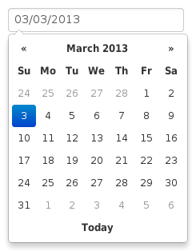
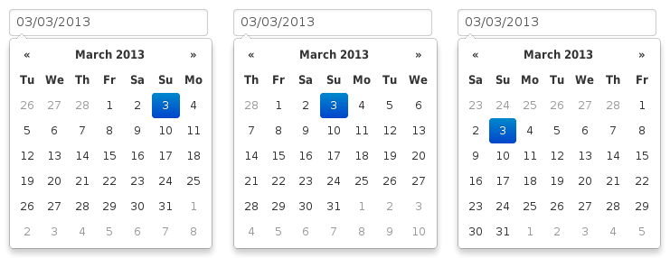

Options
=======

All options that take a "Date" can handle a ``Date`` object; a String formatted according to the given ``format``; or a timedelta relative to today, eg "-1d", "+6m +1y", etc, where valid units are "d" (day), "w" (week), "m" (month), and "y" (year).

Most options can be provided via data-attributes.  An option can be converted to a data-attribute by taking its name, replacing each uppercase letter with its lowercase equivalent preceded by a dash, and prepending "data-date-" to the result.  For example, ``startDate`` would be ``data-date-start-date``, ``format`` would be ``data-date-format``, and ``daysOfWeekDisabled`` would be ``data-date-days-of-week-disabled``.

autoclose
---------

Boolean.  Default: false

Whether or not to close the datepicker immediately when a date is selected.

beforeShowDay
-------------

Function(Date).  Default: $.noop

A function that takes a date as a parameter and returns one of the following values:

 * undefined to have no effect
 * A Boolean, indicating whether or not this date is selectable
 * A String representing additional CSS classes to apply to the date's cell
 * An object with the following properties:

   * ``enabled``: same as the Boolean value above
   * ``classes``: same as the String value above
   * ``tooltip``: a tooltip to apply to this date, via the ``title`` HTML attribute

beforeShowMonth
---------------

Function(Date).  Default: $.noop

A function that takes a date as a parameter and returns a boolean indicating whether or not this month is selectable

calendarWeeks
-------------

Boolean. Default: false

Whether or not to show week numbers to the left of week rows.

.. figure:: _static/screenshots/option_calendarweeks.png
    :align: center

clearBtn
--------

Boolean.  Default: false

If true, displays a "Clear" button at the bottom of the datepicker to clear the input value. If "autoclose" is also set to true, this button will also close the datepicker.

.. figure:: _static/screenshots/option_clearbtn.png
    :align: center

toggleActive
------------

Boolean. Default: false

If true, selecting the currently active date in the datepicker will unset the respective date. This option is always true when the multidate option is being used.

container
---------

String.  Default: "body"

Appends the date picker popup to a specific element; eg: container: '#picker-container' (will default to "body")

.. _daysofweekdisabled:

daysOfWeekDisabled
------------------

String, Array.  Default: '', []

Days of the week that should be disabled. Values are 0 (Sunday) to 6 (Saturday). Multiple values should be comma-separated. Example: disable weekends: ``'0,6'`` or ``[0,6]``.

.. figure:: _static/screenshots/option_daysofweekdisabled.png
    :align: center

.. _datesdisabled:

datesDisabled
-------------

String, Array.  Default: []

Array of date strings or a single date string formatted in the given date format

.. _defaultviewdate:

defaultViewDate
---------------

Object with keys ``year``, ``month``, and ``day``. Default: today

Date to view when initially opening the calendar. The internal value of the date remains today as default, but when the datepicker is first opened the calendar will open to ``defaultViewDate`` rather than today. If this option is not used, "today" remains the default view date. If the given object is missing any of the required keys, their defaults are:

 * ``year``: the current year
 * ``month``: 1
 * ``day``: 1

.. _enddate:

endDate
-------

Date.  Default: End of time

The latest date that may be selected; all later dates will be disabled.

.. figure:: _static/screenshots/option_enddate.png
    :align: center

forceParse
----------

Boolean.  Default: true

Whether or not to force parsing of the input value when the picker is closed.  That is, when an invalid date is left in the input field by the user, the picker will forcibly parse that value, and set the input's value to the new, valid date, conforming to the given `format`.

format
------

String.  Default: "mm/dd/yyyy"

The date format, combination of d, dd, D, DD, m, mm, M, MM, yy, yyyy.

* d, dd: Numeric date, no leading zero and leading zero, respectively.  Eg, 5, 05.
* D, DD: Abbreviated and full weekday names, respectively.  Eg, Mon, Monday.
* m, mm: Numeric month, no leading zero and leading zero, respectively.  Eg, 7, 07.
* M, MM: Abbreviated and full month names, respectively.  Eg, Jan, January
* yy, yyyy: 2- and 4-digit years, respectively.  Eg, 12, 2012.

inputs
------

Array.  Default: None

A list of inputs to be used in a range picker, which will be attached to the selected element.  Allows for explicitly creating a range picker on a non-standard element.

.. code-block:: html

    

       <input type="text" class="actual_range">
       <input type="text" class="actual_range">
    

    $('#event_period').datepicker({
          inputs: $('.actual_range').toArray()
    });

keyboardNavigation
------------------

Boolean.  Default: true

Whether or not to allow date navigation by arrow keys.

language
--------

String.  Default: "en"

The IETF code (eg  "en" for English, "pt-BR" for Brazilian Portuguese) of the language to use for month and day names.  These will also be used as the input's value (and subsequently sent to the server in the case of form submissions).  If a full code (eg "de-DE") is supplied the picker will first check for an "de-DE" language and if not found will fallback and check for a "de" language.  If an unknown language code is given, English will be used.  See :doc:`i18n`.

.. figure:: _static/screenshots/option_language.png
    :align: center

minViewMode
-----------

Number, String.  Default: 0, "days"

Set a limit for the view mode.  Accepts: "days" or 0, "months" or 1, and "years" or 2.
Gives the ability to pick only a month or an year.  The day is set to the 1st for "months", and the month is set to January for "years".

multidate
---------

Boolean, Number.  Default: false

Enable multidate picking.  Each date in month view acts as a toggle button, keeping track of which dates the user has selected in order.  If a number is given, the picker will limit how many dates can be selected to that number, dropping the oldest dates from the list when the number is exceeded.  ``true`` equates to no limit.  The input's value (if present) is set to a string generated by joining the dates, formatted, with ``multidateSeparator``.

For selecting 2 dates as a range please see :ref:`daterange`

.. figure:: _static/screenshots/option_multidate.png
    :align: center

multidateSeparator
------------------

String.  Default: ","

The string that will appear between dates when generating the input's value.  When parsing the input's value for a multidate picker, this will also be used to split the incoming string to separate multiple formatted dates; as such, it is highly recommended that you not use a string that could be a substring of a formatted date (eg, using '-' to separate dates when your format is 'yyyy-mm-dd').

orientation
-----------

String.  Default: "auto"

A space-separated string consisting of one or two of "left" or "right", "top" or "bottom", and "auto" (may be omitted); for example, "top left", "bottom" (horizontal orientation will default to "auto"), "right" (vertical orientation will default to "auto"), "auto top".  Allows for fixed placement of the picker popup.

"orientation" refers to the location of the picker popup's "anchor"; you can also think of it as the location of the trigger element (input, component, etc) relative to the picker.

"auto" triggers "smart orientation" of the picker.  Horizontal orientation will default to "left" and left offset will be tweaked to keep the picker inside the browser viewport; vertical orientation will simply choose "top" or "bottom", whichever will show more of the picker in the viewport.

.. _startdate:

startDate
---------

Date.  Default: Beginning of time

The earliest date that may be selected; all earlier dates will be disabled.

.. figure:: _static/screenshots/option_startdate.png
    :align: center

startView
---------

Number, String.  Default: 0, "month"

The view that the datepicker should show when it is opened.  Accepts values of 0 or "month" for month view (the default), 1 or "year" for the 12-month overview, and 2 or "decade" for the 10-year overview.  Useful for date-of-birth datepickers.

todayBtn
--------

Boolean, "linked".  Default: false

If true or "linked", displays a "Today" button at the bottom of the datepicker to select the current date.  If true, the "Today" button will only move the current date into view; if "linked", the current date will also be selected.

todayHighlight
--------------

Boolean.  Default: false

If true, highlights the current date.

.. figure:: _static/screenshots/option_todayhighlight.png
    :align: center

weekStart
---------

Integer.  Default: 0

Day of the week start. 0 (Sunday) to 6 (Saturday)

showOnFocus
-----------

Boolean.  Default: true

If false, the datepicker will be prevented from showing when the input field associated with it receives focus.

disableTouchKeyboard
--------------------

Boolean.  Default: false

If true, no keyboard will show on mobile devices

enableOnReadonly
----------------

Boolean. Default: true

If false the datepicker will not show on a readonly datepicker field.
