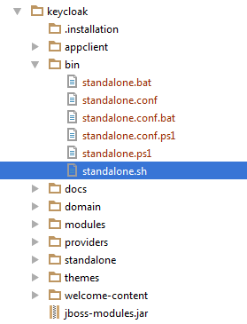

=== Standalone Mode

Standalone mode is only useful when you want to run one, and only one {{book.project.name}} server instance.  Standalone
instances contain all the configuration files they need locally.  What this basically means is that any configuration done
must be done on the config files contained in the installed distribution on the machine the {{book.project.name}} is going to run on
{{book.project.name}} standalone mode is available pre-configured out of the box.  It turns off clustering entirely
and turns any distributed caches into local-only ones.

==== Standalone Boot Script

When running the server in standalone mode, there is a specific script you need to run to boot the server depending on your
operating system.  These scripts live in the _bin/_ directory of the server distribution.

.Standalone Boot Scripts

image:../../rhsso-images/standalone-boot-files.png[]




