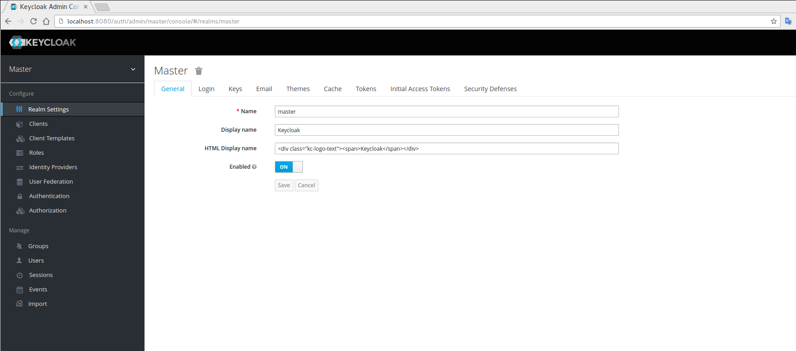

== Getting Started

The purpose of this guide is to get you up and running as quickly as possible so that you can play with and test drive various authorization features that {{book.project.name}} has. It will help
you to understand the basic steps to enable fine-grained authorization to an application and how to interact with the Authorization Services provided by {{book.project.name}}.

[NOTE]
This guide assume that you are able to install and boot a {{book.project.name}} Server. For more information, please follow the intrusctions https://keycloak.gitbooks.io/getting-started-tutorials/content/[here].

All the guides are based on the *{{book.project.name}} Demo Distribution*. Please download it before going further with any guide.

Make sure you have a {{book.project.name}} instance up and running on http://localhost:8080/auth[http://localhost:8080/auth]. If everything is OK, you should be able to login to the
_Administration Console_ and get a page like that:

Source code for all examples can be obtained from *${KEYCLOAK_DEMO_SERVER_DIR}/examples/authz/*.