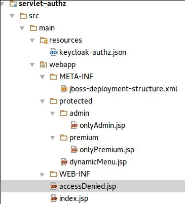

== Securing a Servlet Application

This guide will show you how to:

* Create a realm with the necessary configuration to enable fine-grained authorization to a servlet application
* Create a resource server and the resources that must be protected
* Create permissions, authorization policies and how to apply them to your protected resources
* Configure the {{book.project.name}} Authorization Enforcer Filter to your servlet application

The application we are using in this guide is one of the examples provided by the {{book.project.name}} Demo Distribution. You can find all the source code
under *examples/authz/servlet-authz/*.

[NOTE]
Before going further, make sure you followed all the instructions in the link:../getting-started/getting-started.html[Getting Started] guide.

=== About the Servlet Application

The application we are about to create is a very simple. In a nutshell, it implements the following security requirements:

* An _Administration Area_ that only administrators can access
* An _User Premium Area_ that only users with a premium plan can access
* A dynamic menu that is generated accordingly with the permissions issued by a {{book.project.name}} Server to an authenticated user



=== Creating the Servlet Authz Realm

For this guide, we are going to create a *servlet-authz* realm. Just import the following JSON file to create the new realm:

```json
{
  "realm": "servlet-authz",
  "enabled": true,
  "privateKey": "MIICXAIBAAKBgQCrVrCuTtArbgaZzL1hvh0xtL5mc7o0NqPVnYXkLvgcwiC3BjLGw1tGEGoJaXDuSaRllobm53JBhjx33UNv+5z/UMG4kytBWxheNVKnL6GgqlNabMaFfPLPCF8kAgKnsi79NMo+n6KnSY8YeUmec/p2vjO2NjsSAVcWEQMVhJ31LwIDAQABAoGAfmO8gVhyBxdqlxmIuglbz8bcjQbhXJLR2EoS8ngTXmN1bo2L90M0mUKSdc7qF10LgETBzqL8jYlQIbt+e6TH8fcEpKCjUlyq0Mf/vVbfZSNaVycY13nTzo27iPyWQHK5NLuJzn1xvxxrUeXI6A2WFpGEBLbHjwpx5WQG9A+2scECQQDvdn9NE75HPTVPxBqsEd2z10TKkl9CZxu10Qby3iQQmWLEJ9LNmy3acvKrE3gMiYNWb6xHPKiIqOR1as7L24aTAkEAtyvQOlCvr5kAjVqrEKXalj0Tzewjweuxc0pskvArTI2Oo070h65GpoIKLc9jf+UA69cRtquwP93aZKtW06U8dQJAF2Y44ks/mK5+eyDqik3koCI08qaC8HYq2wVl7G2QkJ6sbAaILtcvD92ToOvyGyeE0flvmDZxMYlvaZnaQ0lcSQJBAKZU6umJi3/xeEbkJqMfeLclD27XGEFoPeNrmdx0q10Azp4NfJAY+Z8KRyQCR2BEG+oNitBOZ+YXF9KCpH3cdmECQHEigJhYg+ykOvr1aiZUMFT72HU0jnmQe2FVekuG+LJUt2Tm7GtMjTFoGpf0JwrVuZN39fOYAlo+nTixgeW7X8Y=",
  "publicKey": "MIGfMA0GCSqGSIb3DQEBAQUAA4GNADCBiQKBgQCrVrCuTtArbgaZzL1hvh0xtL5mc7o0NqPVnYXkLvgcwiC3BjLGw1tGEGoJaXDuSaRllobm53JBhjx33UNv+5z/UMG4kytBWxheNVKnL6GgqlNabMaFfPLPCF8kAgKnsi79NMo+n6KnSY8YeUmec/p2vjO2NjsSAVcWEQMVhJ31LwIDAQAB",
  "requiredCredentials": [
    "password"
  ],
  "users": [
    {
      "username": "alice",
      "enabled": true,
      "credentials": [
        {
          "type": "password",
          "value": "alice"
        }
      ],
      "realmRoles": [
        "user"
      ],
      "clientRoles": {
        "servlet-authz-app": [
          "uma_authorization",
          "kc_entitlement"
        ]
      }
    },
    {
      "username": "jdoe",
      "enabled": true,
      "credentials": [
        {
          "type": "password",
          "value": "jdoe"
        }
      ],
      "realmRoles": [
        "user",
        "user_premium"
      ],
      "clientRoles": {
        "servlet-authz-app": [
          "uma_authorization",
          "kc_entitlement"
        ]
      }
    },
    {
      "username": "admin",
      "enabled": true,
      "credentials": [
        {
          "type": "password",
          "value": "admin"
        }
      ],
      "realmRoles": [
        "user",
        "admin"
      ],
      "clientRoles": {
        "realm-management": [
          "realm-admin"
        ],
        "servlet-authz-app": [
          "uma_authorization",
          "kc_entitlement"
        ]
      }
    },
    {
      "username": "service-account-servlet-authz-app",
      "enabled": true,
      "serviceAccountClientId": "servlet-authz-app",
      "realmRoles": [
        "uma_protection"
      ]
    }
  ],
  "roles": {
    "realm": [
      {
        "name": "user",
        "description": "User privileges"
      },
      {
        "name": "admin",
        "description": "Administrator privileges"
      },
      {
        "name": "user_premium",
        "description": "User Premium privileges"
      },
      {
        "name": "uma_protection",
        "description": "Allows access to the Protection API"
      }
    ]
  },
  "clients": [
    {
      "clientId": "servlet-authz-app",
      "enabled": true,
      "publicClient": false,
      "baseUrl": "/servlet-authz-app",
      "adminUrl": "/servlet-authz-app",
      "bearerOnly": false,
      "serviceAccountsEnabled": true,
      "redirectUris": [
        "/servlet-authz-app/*"
      ],
      "secret": "secret"
    }
  ]
}
```
=== Creating a Resource Server and Protecting Resources

Now that we have the *servlet-authz* realm properly configured, we need to enable the *servlet-authz-app* as a resource server. For that, click on the *Authorization* in the left menu bar.

image:../../images/gs-keycloak-authz-page.png[alt="Keycloak Authorization Page"]

To create a resource server you can click on the *Create* button.

image:../../images/gs-keycloak-authz-create-rs-page.png[alt="Create Resource Server"]

From that page you can create a resource server by manually filling that form or you can just import a JSON file with the configuration you want. For this guide, we'll just import a JSON file as follows:

```json
{
  "clientId": "servlet-authz-app",
  "allowRemoteResourceManagement": true,
  "allowEntitlements": true,
  "policyEnforcementMode": "ENFORCING",
  "resources": [
    {
      "name": "Admin Resource",
      "uri": "/protected/admin/*",
      "type": "http://servlet-authz/protected/admin",
      "scopes": [
        {
          "name": "urn:servlet-authz:protected:admin:access"
        }
      ]
    },
    {
      "name": "Protected Resource",
      "uri": "/*",
      "type": "http://servlet-authz/protected/resource",
      "scopes": [
        {
          "name": "urn:servlet-authz:protected:resource:access"
        }
      ]
    },
    {
      "name": "Premium Resource",
      "uri": "/protected/premium/*",
      "type": "urn:servlet-authz:protected:resource",
      "scopes": [
        {
          "name": "urn:servlet-authz:protected:premium:access"
        }
      ]
    },
    {
      "name": "Main Page",
      "type": "urn:servlet-authz:protected:resource",
      "scopes": [
        {
          "name": "urn:servlet-authz:page:main:actionForAdmin"
        },
        {
          "name": "urn:servlet-authz:page:main:actionForUser"
        },
        {
          "name": "urn:servlet-authz:page:main:actionForPremiumUser"
        }
      ]
    }
  ],
  "policies": [
    {
      "name": "Any Admin Policy",
      "description": "Defines that adminsitrators can do something",
      "type": "role",
      "config": {
        "roles": "[\"admin\"]"
      }
    },
    {
      "name": "Any User Policy",
      "description": "Defines that any user can do something",
      "type": "role",
      "config": {
        "roles": "[\"user\"]"
      }
    },
    {
      "name": "Only Premium User Policy",
      "description": "Defines that only premium users can do something",
      "type": "role",
      "logic": "POSITIVE",
      "config": {
        "roles": "[\"user_premium\"]"
      }
    },
    {
      "name": "All Users Policy",
      "description": "Defines that all users can do something",
      "type": "aggregate",
      "decisionStrategy": "AFFIRMATIVE",
      "config": {
        "applyPolicies": "[\"Any User Policy\",\"Any Admin Policy\",\"Only Premium User Policy\"]"
      }
    },
    {
      "name": "Premium Resource Permission",
      "description": "A policy that defines access to premium resources",
      "type": "resource",
      "decisionStrategy": "UNANIMOUS",
      "config": {
        "resources": "[\"Premium Resource\"]",
        "applyPolicies": "[\"Only Premium User Policy\"]"
      }
    },
    {
      "name": "Administrative Resource Permission",
      "description": "A policy that defines access to administrative resources",
      "type": "resource",
      "decisionStrategy": "UNANIMOUS",
      "config": {
        "resources": "[\"Admin Resource\"]",
        "applyPolicies": "[\"Any Admin Policy\"]"
      }
    },
    {
      "name": "Protected Resource Permission",
      "description": "A policy that defines access to any protected resource",
      "type": "resource",
      "decisionStrategy": "AFFIRMATIVE",
      "config": {
        "resources": "[\"Protected Resource\"]",
        "applyPolicies": "[\"All Users Policy\"]"
      }
    },
    {
      "name": "Action 1 on Main Page Resource Permission",
      "description": "A policy that defines access to action 1 on the main page",
      "type": "scope",
      "decisionStrategy": "AFFIRMATIVE",
      "config": {
        "scopes": "[\"urn:servlet-authz:page:main:actionForAdmin\"]",
        "applyPolicies": "[\"Any Admin Policy\"]"
      }
    },
    {
      "name": "Action 2 on Main Page Resource Permission",
      "description": "A policy that defines access to action 2 on the main page",
      "type": "scope",
      "decisionStrategy": "AFFIRMATIVE",
      "config": {
        "scopes": "[\"urn:servlet-authz:page:main:actionForUser\"]",
        "applyPolicies": "[\"Any User Policy\"]"
      }
    },
    {
      "name": "Action 3 on Main Page Resource Permission",
      "description": "A policy that defines access to action 3 on the main page",
      "type": "scope",
      "decisionStrategy": "AFFIRMATIVE",
      "config": {
        "scopes": "[\"urn:servlet-authz:page:main:actionForPremiumUser\"]",
        "applyPolicies": "[\"Only Premium User Policy\"]"
      }
    }
  ]
}
```

[NOTE]
All this configuration can also be done using the {{book.project.name}} Administration Console. We are using the import tool just for demonstration purposes

=== A Quick Overview of the Permissions and Policies

The resource server configuration tells a lot about what we are really protecting. It is basically describing the security requirements we have discussed earlier.

Fist of all, we define four resources:

* Admin Resource
* Protected Resource
* Premium Resource
* Main Page

As the name implies, each of these resources are related with the requirements we previously discussed, representing the different areas or group of resources we want to protect.

As you may notice, each of these resources (except Main Page) defines an *uri* property. This property represents the path we want to protect and they map directly, or indirectly by using a pattern,
to the resources served by the application.

Let's take the _Protected Resource_ as an example:

```json
{
  "name": "Protected Resource",
  "uri": "/*",
  "type": "http://servlet-authz/protected/resource",
  "scopes": [
    {
      "name": "urn:servlet-authz:protected:resource:access"
    }
  ]
},
```
This resource represents all resources in the application, as you can see from the pattern used in the *uri* property. It also defines a single scope/action to indicate that users, if granted, can access this resource.

Now, let's see what are the permissions and authorization policies configured to this resource:

```json
...
{
      "name": "Protected Resource Permission",
      "description": "A policy that defines access to any protected resource",
      "type": "resource",
      "decisionStrategy": "AFFIRMATIVE",
      "config": {
        "resources": "[\"Protected Resource\"]",
        "applyPolicies": "[\"All Users Policy\"]"
      }
    },
...
```

The definition above is a permission that links the _Protected Resource_ with the policies we want to apply. In this case, we are applying a single _All Users Policy_.

Policies define the conditions to be meet in order to access something. In this case, the _All Users Policy_ is composed of two other policies, a special policy type called link:../policy/aggregated-policy.html[Aggregated Policies].

```json
...
{
  "name": "All Users Policy",
  "description": "Defines that all users can do something",
  "type": "aggregate",
  "decisionStrategy": "AFFIRMATIVE",
  "config": {
    "applyPolicies": "[\"Any User Policy\",\"Any Admin Policy\",\"Only Premium User Policy\"]"
  }
},
...
```

{{book.project.name}} provides a few built-in policy types (and their respective policy providers) implementing different access control mechanisms (RBAC, GBAC, Rule-based, Time-based, etc) that you can use to build your own policies and permissions.

Aggregated policies are very useful in order to group related policies together and make policy management less painful.

=== Configuring the Keycloak Enforcement Filter

Now that we have all the configuration for our resource server in place, we can configure the authorization enforcement filter to actually protected the resources.

Just like any other Servlet Filter, you just need to include the following configuration in your web application descriptor (WEB-INF/web.xml):

```xml
<filter>
    <filter-name>Keycloak Authorization Enforcer</filter-name>
    <filter-class>org.keycloak.authorization.policy.enforcer.servlet.KeycloakAdapterEnforcementFilter</filter-class>
</filter>

<filter-mapping>
    <filter-name>Keycloak Authorization Enforcer</filter-name>
    <url-pattern>/*</url-pattern>
</filter-mapping>
```
The *org.keycloak.authorization.policy.enforcer.servlet.KeycloakAdapterEnforcementFilter* is shipped with the {{book.project.name}} OIDC Adapters distribution. In order to make it available to
your application at runtime, you must create a *META-INF/jboss-deployment-structure.xml* at the application root directory. If you are using maven, this file can be placed under *src/main/webapp/META-INF/jboss-deployment-structure.xml*:

```xml
<jboss-deployment-structure>
    <deployment>
        <dependencies>
            <module name="org.keycloak.keycloak-authz-servlet-enforcer" services="import"/>
            <module name="org.jboss.resteasy.resteasy-jackson2-provider" services="import"/>
        </dependencies>
        <exclusions>
            <module name="org.jboss.resteasy.resteasy-jackson-provider"/>
        </exclusions>
    </deployment>
</jboss-deployment-structure>
```

For last, you need to create a *META-INF/keycloak-authz.json*. If you are using Maven, this file goes inside *src/main/resources*:

```json
{
  "client": {
    "configurationUrl": "http://localhost:8080/auth/realms/servlet-authz/authz/uma_configuration",
    "clientId": "servlet-authz-app",
    "clientSecret": "secret"
  },
  "enforcer": {}
}
```

=== Running and Using the Application

All the source code for this application is at *${KEYCLOAK_DEMO_SERVER_DIR}/examples/authz/servlet-authz/*.

There you can execute the following command to _deploy_ the application to the running server:

```bash
mvn clean package wildfly:deploy
```
That should be enough to get the application properly packaged and deployed to a _running_ {{book.project.name}} server.

If the application was properly deployed, you can try to access it at http://localhost:8080/auth[http://localhost:8080/servlet-authz-app] and use the following credentials to login into the application:

If everything is correct, you will be redirect to Keycloak login page. You can login to the application with the following credentials:

* username: alice / password: alice (regular user)
* username: jdoe / password: jdoe (premium user)
* username: admin / password: admin (administrator)

To _undeploy_ the application, please execute the following command:

```bash
mvn wildfly:undeploy
```