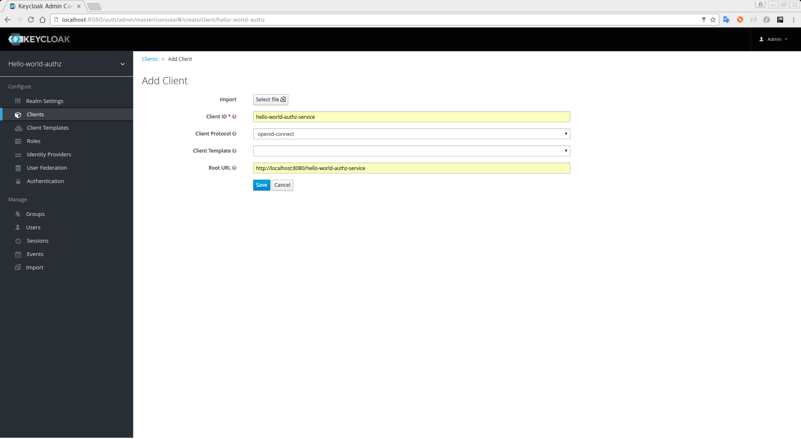
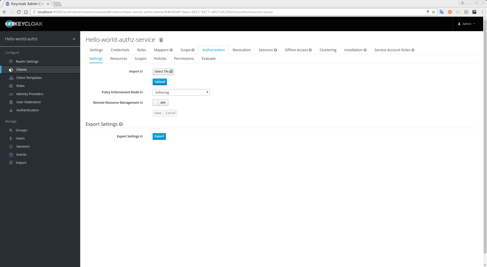

== Enabling Authorization Services

You can enable authorization services to any existing client application using the OpenID Connect Protocol. However, in this guide we are
going to create a new one from scratch.

Click on the `Clients` left menu item to start creating a new client application and fill in the fields as shown below:

.Create Client Application

Click on the `Save` button to create the client. This should bring you the `Client Details` page.

.Client Details
image:../../../images/getting-started/hello-world/enable-authz.png[alt="Client Details"]

In this page, click on the `Authorization Services Enabled` switch and turn it `ON`. After that click on the `Save` button.
When you do that, a new `Authorization` tab will show up. Click on this tab and you should see a page like that.

.Authorization Settings

When you enable authorization services to a client application, {{book.project.name}} defines some link:../../resource-server/default-config.html[Default Settings] to
your application.

For more details about authorization configuration, please take a look at link:../../resource-server/enable-authorization.html[Enabling Authorization Services].
