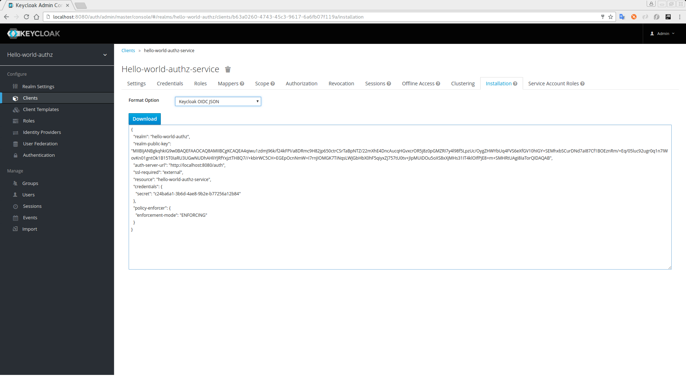
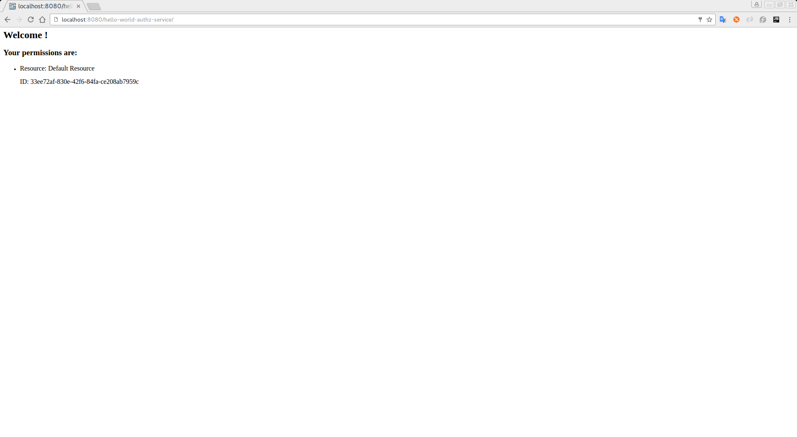

== Build, Deploy and Test

Now that the *hello-world-authz-service* is properly configured and authorization services are enabled, we can deploy it to
the server and see the results.

=== Generating the Adapter Configuration

First, let's obtain the adapter configuration from the {{book.project.name}} Administration Console. Click on the `Clients` left menu item. In the client listing,
click on the *hello-world-authz-service* client application. This you bring you the `Client Details` page.

.Client Details
image:../../../images/getting-started/hello-world/enable-authz.png[alt="Client Details"]

Click on the `Installation Tab`. In this tab select `Keycloak OIDC JSON` as the format option. This will bring you the adapter config using a JSON format.

.Adapter Configuration


Now, go to the *${KEYCLOAK_DEMO_SERVER_DIR}/examples/authz/hello-world-authz-service/src/main/webapp*. There you'll find a *keycloak.json* file. Replace its contents with the adapter configuration
you just obtained from the {{book.project.name}} Administration Console.

=== Build and Deploy the Application

For last, got to the *${KEYCLOAK_DEMO_SERVER_DIR}/examples/authz/hello-world-authz-service/* and execute the following command:

```bash
mvn clean package wildfly:deploy
```

=== Test the Application

If your application was successfully deployed you should be able to access it at http://localhost:8080/hello-world-authz-service[http://localhost:8080/hello-world-authz-service].

The first page you should see is the {{book.project.name}} Login Page.

.Login Page
image:../../../images/getting-started/hello-world/login-page.png[alt="Login Page"]

Try to login as *alice*. After the authentication you should see a page as follows:

.Hello World Authz Main Page


The link:../../resource-server/default-config.html[Default Settings] defined by {{book.project.name}} when you enable authorization services to a client application provides a simple
policy that only grants access to users belonging to the realm of the client.

You can start playing around by changing the default permissions and policies and check how your application will behave. Or even create new policies using the different
link:../../policy/overview.html[Policy Types] provided by {{book.project.name}}.