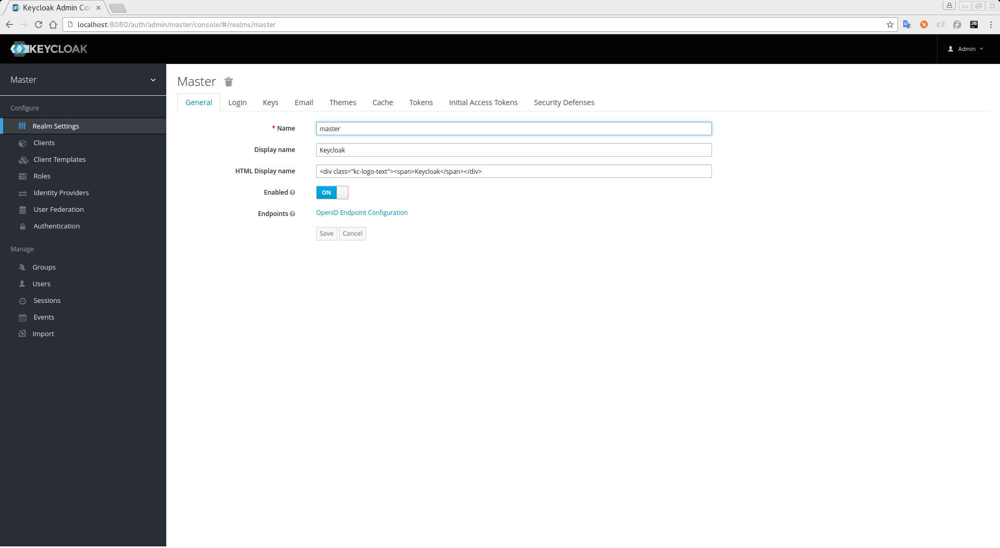

== Getting Started

All tutorials are based on the *{{book.project.name}} Demo Distribution*.

* *keycloak-demo-{{book.project.version}}.[zip|tar.gz]*

To unpack this file run the _unzip_ or _gunzip_ and _tar_ utilities. During this guide we'll reference the directory you have unpacked
the demo distribution as *${KEYCLOAK_DEMO_SERVER_DIR}*.

[NOTE]
This guide assumes that you are already familiar with {{book.project.name}} and that you are able to install and boot a {{book.project.name}} Server. For more information, please follow the intrusctions https://keycloak.gitbooks.io/getting-started-tutorials/content/[here].

Make sure you have a {{book.project.name}} instance up and running on http://localhost:8080/auth[http://localhost:8080/auth]. If everything is OK, you should be able to login to the
_Administration Console_ and get a page like that:

.{{book.project.name}} Administration Console

All source code for the getting started tutorials can be obtained from the demo distributions. The authorization related examples
are located at *${KEYCLOAK_DEMO_SERVER_DIR}/examples/authz*.