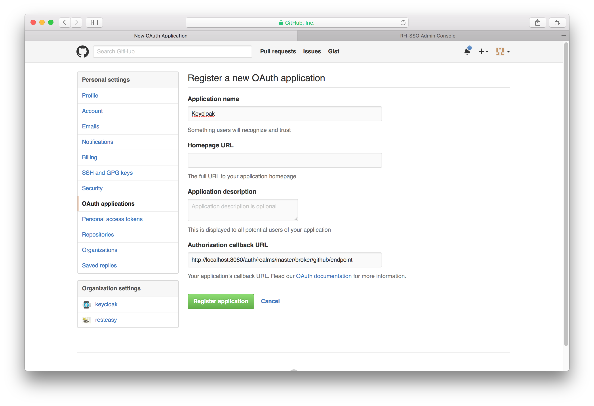

==== Github

There are a number of steps you have to complete to be able to login to Github.  First, go to the `Identity Providers` left menu item
and select `Github` from the `Add provider` drop down list.  This will bring you to the `Add identity provider` page.

.Add Identity Provider
image:../../../{{book.images}}/github-add-identity-provider.png[]

You can't click save yet, as you'll need to obtain a `Client ID` and `Client Secret` from Github.  One piece of data you'll need from this
page is the `Redirect URI`.  You'll have to provide that to Github when you register {{book.project.name}} as a client there, so
copy this URI to your clipboard.

To enable login with Github you first have to register an application project in
https://github.com/settings/applications[GitHub Application Settings].  Select the `Developer applications` tab.

NOTE: Github often changes the look and feel of application registration, so these directions might not always be up to date and the
      configuration steps might be slightly different.

.Add a New App
image:../../../images/github-developer-applications.png[]

Click the `Register a new application` button.

.Register App

You'll have to copy the `Redirect URI` from the {{book.project.name}} `Add Identity Provider` page and enter it into the
`Authorization callback URL` field on the Github `Register a new OAuth application` page.  Once you've completed this
page you will be brought to the application's management page.

.Github App Page
image:../../../images/github-app-page.png[]

You will need to obtain the client ID and secret from this page so you can enter them into the {{book.project.name}} `Add identity provider` page.
Go back to {{book.project.name}} and specify those items.
