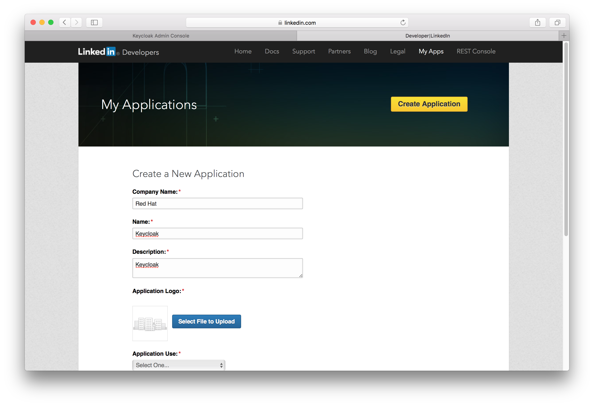

==== LinkedIn

There are a number of steps you have to complete to be able to login to LinkedIn.  First, go to the `Identity Providers` left menu item
and selected `LinkedIn` from the `Add provider` drop down list.  This will bring you to the `Add identity provider` page.

.Add Identity Provider
image:../../../{{book.images}}/linked-in-add-identity-provider.png[]

You can't click save yet, as you'll need to obtain a `Client ID` and `Client Secret` from LinkedIn.  One piece of data you'll need from this
page is the `Redirect URI`.  You'll have to provide that to LinkedIn when you register {{book.project.name}} as a client there, so
copy this URI to your clipboard.

To enable login with LinkedIn you first have to create an application in https://www.linkedin.com/secure/developer[LinkedIn Developer Network].

NOTE: LinkedIn often changes the look and feel of application registration, so these directions might not always be up to date and the
      configuration steps might be slightly different.

.Developer Network
image:../../../images/linked-in-developer-network.png[]

Click on the `Create Application` button.  This will bring you to the `Create a New Application` Page.

.Create App

Use any value for `Application Name`, `Website URL`, `Description`, `Developer Contact Email` and `Phone` you want.
Select `r_basicprofile` and `r_emailaddress` in the `Default Scope` section.
Click the `Add Application` button.  This will bring you to the new application's settings page.

.App Settings
image:../../../images/linked-in-app-settings.png[]

You'll have to copy the `Redirect URI` from the {{book.project.name}} `Add Identity Provider` page and enter it into the
`OAuth 2.0` `Authorized Redirect URLs` field on the LinkedIn app settings page.  Don't forget to click `Update` button after
you do this!

You will then need to obtain the client ID and secret from this page so you can enter them into the {{book.project.name}} `Add identity provider` page.
Go back to {{book.project.name}} and specify those items.
