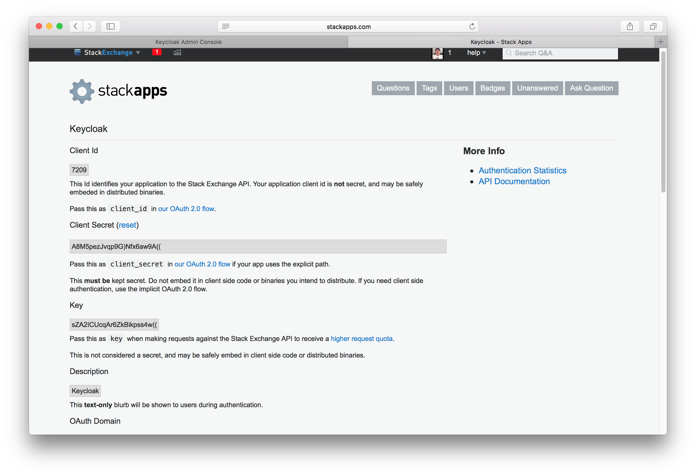

==== StackOverflow

There are a number of steps you have to complete to be able to login to StackOverflow.  First, go to the `Identity Providers` left menu item
and selected `StackOverflow` from the `Add provider` drop down list.  This will bring you to the `Add identity provider` page.

.Add Identity Provider
image:../../../{{book.images}}/stack-overflow-add-identity-provider.png[]

You can't click save yet, as you'll need to obtain a `Client ID`, `Client Secret`, and `Key` from StackOverflow.  One piece of data you'll need from this
page is the `Redirect URI`.  You'll have to provide that to StackOverflow when you register {{book.project.name}} as a client there, so
copy this URI to your clipboard.

To enable login with StackOverflow you first have to register an OAuth application on https://stackapps.com/[StackApps].
Go to http://stackapps.com/apps/oauth/register[registering your application on Stack Apps] url and login.

NOTE: StackOverflow often changes the look and feel of application registration, so these directions might not always be up to date and the
      configuration steps might be slightly different.

.Register Application
image:../../../images/stack-overflow-app-register.png[]

Enter in the application name and the dns domain name of your application and click `Register your Application`.  Type in anything you want
for the other items.

.Settings

Finally, you will need to obtain the client ID, secret, and key from this page so you can enter them back on the {{book.project.name}} `Add identity provider` page.
Go back to {{book.project.name}} and specify those items.

