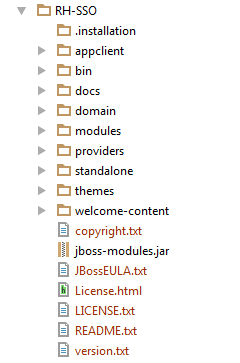
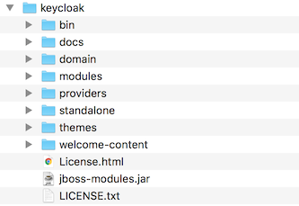

=== Distribution Directory Structure

This chapter walks you through the directory structure of the server distribution.

.distribution directory structure

. 




Let's examine some of the purposes of each directory

_bin/_::
  This contains various scripts to either boot the server or perform some other management action on the server.

_domain/_::
  This contains configuration files and working directory when running {{book.project.name}} in <<fake/../../domain-mode.adoc#,domain mode>>.

_modules/_::
  These are all the Java libraries used by the server.

_providers/_::
  If you are writing extensions to keycloak, you can put your extensions here.  See the link:http://not-implemented-yet[Server Developer Guide] for more information on this.

_standalone/_::
  This contains configuration files and working directory when running {{book.project.name}} in <<fake/../../standalone-mode.adoc#,standalone mode>>.

_themes/_::
  This directory contains all the html, style sheets, javascript files, and images used to display any UI screen displayed by the server.
  Here you can modify an existing theme or create your own.  See the link:http://not-implemented-yet[Server Developer Guide] for more information on this.

