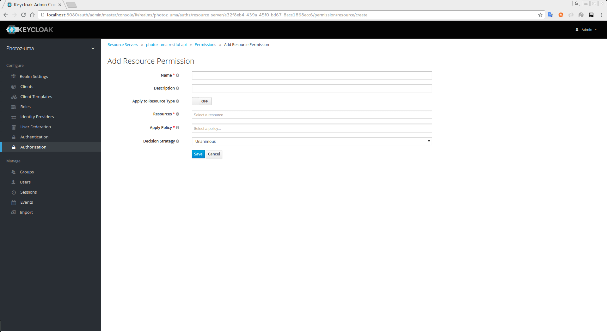

== Creating Resource-based Permissions

A Resource-based permission defines a set of one or more resources to protect using a set of one or more authorization policies.

To create a new permission select the option *Resource-based* in the dropdown located in the right upper corner of the permission listing.

.Add Resource-Based Permission

=== Configuration

* *Name*
+
A human-readable and unique string describing the permission. We strongly suggest you to use names that are closely related with your business and security requirements, so you
can identify them more easily and also know what they actually mean
+
* *Description*
+
A string with more details about this policy
+
* *Apply To Resource Type*
+
Specifies if this permission would be applied to all resources with a given type. When you select this field, you'll be prompted to enter the resource type to protect.
+
** Resource Type
+
Defines the resource type to protect. When defined, this permission is going to be evaluated for all resources matching the type
+
* *Resources*
+
Defines a set of one or more resources to protect

* *Apply Policy*
+
Defines a set of one or more policies to associate with a permission

* *Decision Strategy*
+
The link:decision-strategy.html[Decision Strategy] for this permission