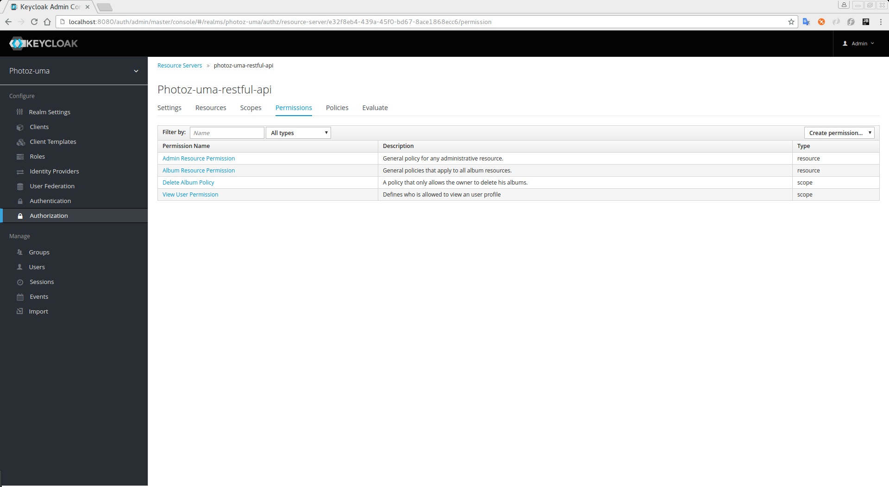

== Managing Permissions

A permission associates the object being protected and the policies that must be evaluated in order to decide whether access should be granted or not.

After creating the resources you want to protect and the policies you want to use to actually protect these resources,
you can start managing permissions. For that, clicking on the *Permissions* tab when editing a resource server.

.Permissions

Permissions can be created to protect two main types of objects:

* *Resource*
* *Scope*

To create a permission, select the permission type you want to create from the dropdown located in the right upper corner of the permission listing.