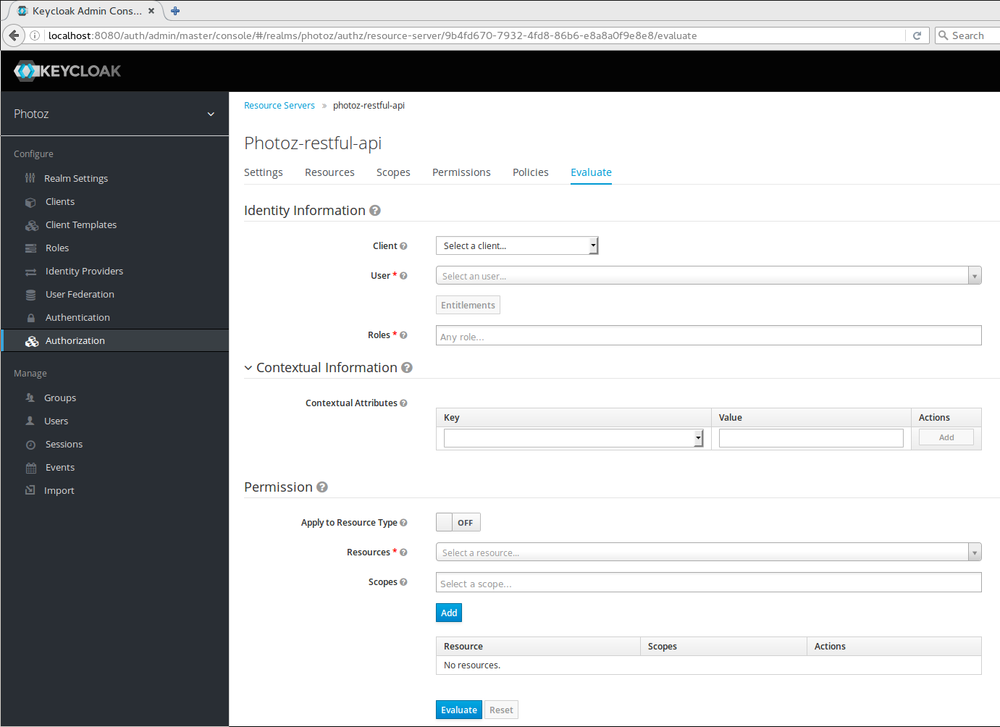

== Policy Evaluation Tool

When designing your policies, you can use an UI to simulate authorization requests and check how your policies are being evaluated.

The *Policy Evaluation Tool* can be accessed by clicking the *Evaluate* tab when editing a resource server. There you may provide different inputs to simulate real authorization requests and check the effect of your policies.

=== Providing Identity Information

The *Identity Information* filters can be used to specify the user asking for permissions.

You can also click *Entitlement* button to obtain all permissions for the user your selected.

=== Providing Contextual Information

The *Contextual Information* filters can be used to define additional attributes to the evaluation context, from where policies can
obtain these same attributes.

=== Providing the Permissions

The *Permissions* filters can be used to build an authorization request. There you can ask for permissions for a set of one or
more resources and scopes.