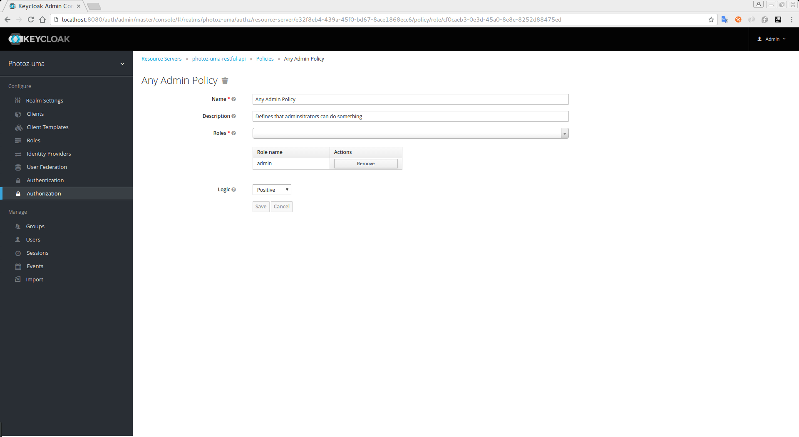

== Role-Based Policy

This type of policy allows you to define conditions for your permissions where only a set of one or more roles is allowed
to access an object.

To create a new policy select the option *Role-Based* in the dropdown located in the right upper corner of the permission listing.

.Add Role-Based Policy

=== Configuration

* *Name*
+
A human-readable and unique string describing the policy. We strongly suggest you to use names that are closely related with your business and security requirements, so you
can identify them more easily and also know what they actually mean
+
* *Description*
+
A string with more details about this policy
+
* *Roles*
+
Specifies which role(s) are allowed by this policy
+
* *Logic*
+
The link:logic.html[logic] of this policy