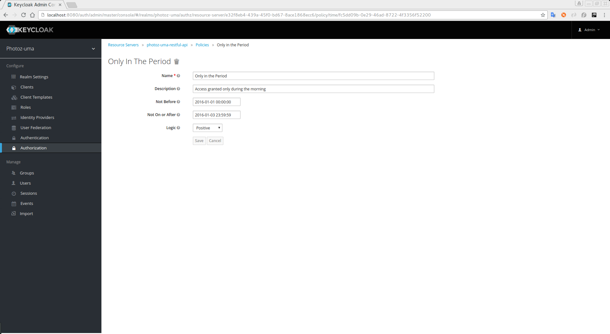

== Time-Based Policy

This type of policy allows you to define time conditions for your permissions.

To create a new policy select the option *Time* in the dropdown located in the right upper corner of the permission listing.

.Add Time Policy

=== Configuration

* *Name*
+
A human-readable and unique string describing the policy. We strongly suggest you to use names that are closely related with your business and security requirements, so you
can identify them more easily and also know what they actually mean
+
* *Description*
+
A string with more details about this policy
+
* *Not Before*
+
Defines the time before which the policy MUST NOT be granted. Only granted if current date/time is after or equal to this value
+
+
* *Not On or After*
+
Defines the time after which the policy MUST NOT be granted. Only granted if current date/time is before or equal to this value
+
* *Logic*
+
The link:logic.html[logic] of this policy