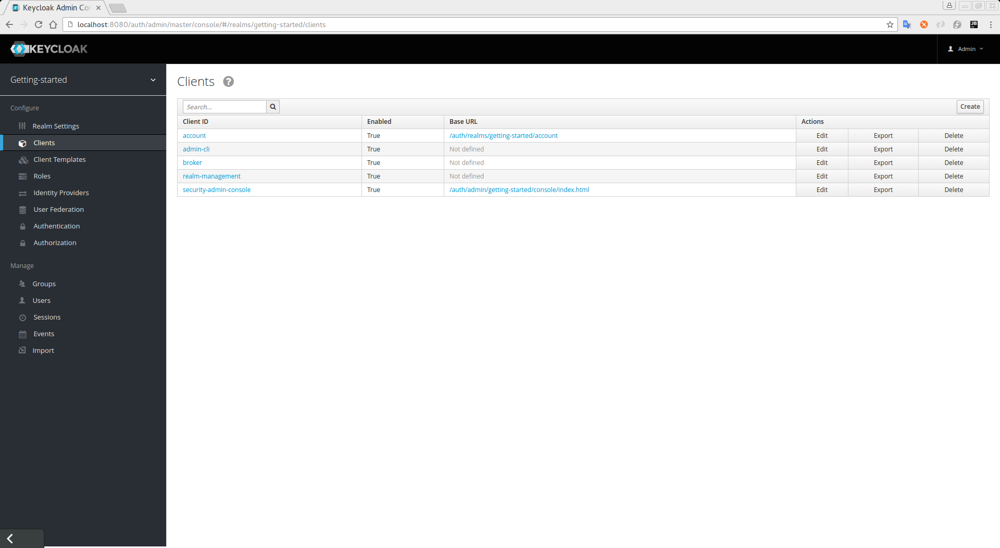
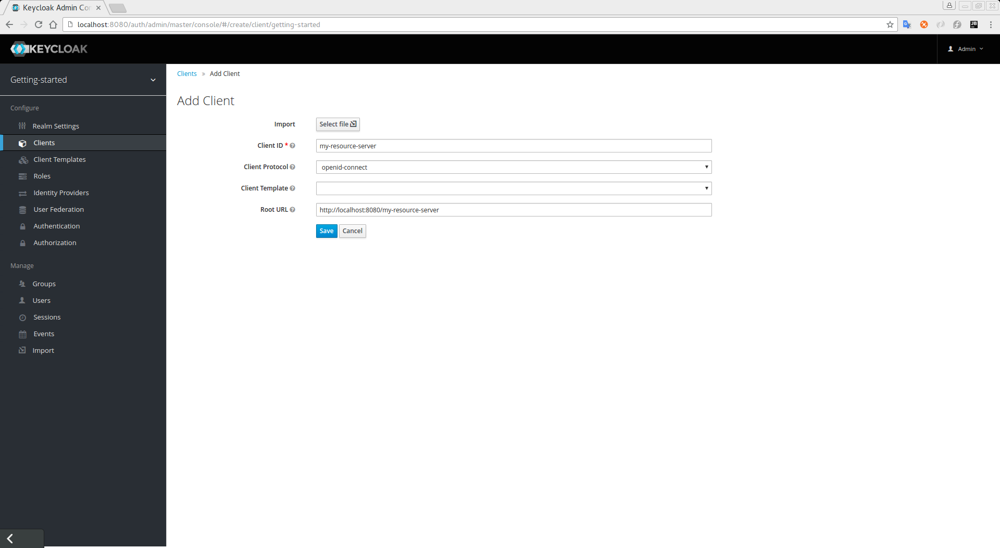

== Creating a Client Application

The first step to enable {{book.project.name}} {{book.project.module}} is create the client application that you want to turn into a resource server. For that, click on the `Clients` left menu item.

.Clients


In this page, click on the `Create` button on the right.

.Create Client


Fill in the fields as follows:

* Enter the `Client ID` of the client. For example, _my-resource-server_.
* Enter the `Root URL` for your application. For instance:
+
```bash
http://${host}:${port}/my-resource-server
```

Finally, click `Save`. This will create the client and bring you to the client `Settings` tab. You should see a page similar to this:

.Client Settings
image:../../images/resource-server/client-enable-authz.png[alt="Client Settings"]