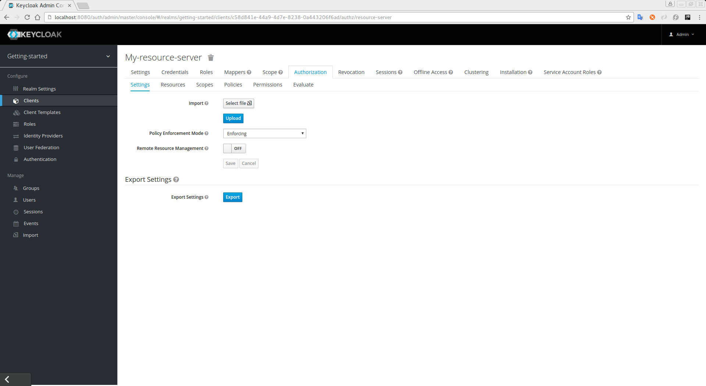
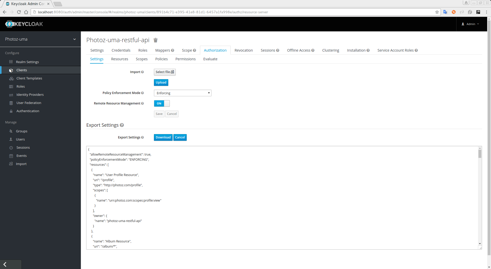

== Exporting and Importing Configuration

All the configuration defined for a resource server can be exported and downloaded. The resulting configuration file contains
every single configuration you defined for:

* Protected Resources and Scopes
* Policies
* Permissions

To export configuration, go to the `Resource Server Settings` page.

.Resource Server Settings

In this page, you'll see a `Export Settings` section, which provides a single `Export` button. Click on that button and you'll see.

.Export Settings

The configuration is exported using a JSON format, which you can copy and paste or click on the `Download` button to download a file with the configuration being exported.

=== Importing

To import a file with the configuration for your resource server, click on the `Select file`. It should open a dialog box from where you can select a file in your
filesystem with the configuration you want to import.

You can use this feature to both create an initial configuration for your resource server or to update the existing configuration.