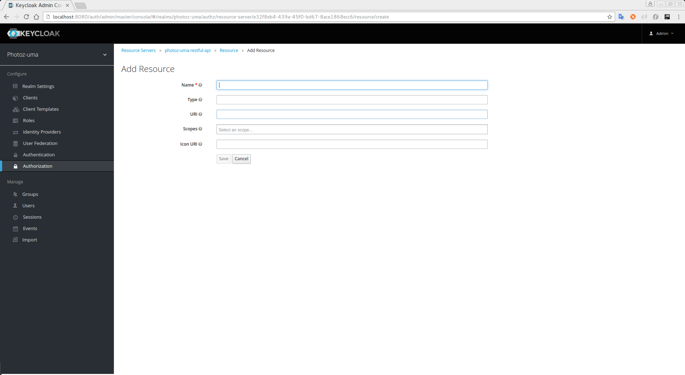

== Creating Resources

Create a resource is pretty straight forward and generic. The main thing you should care about is the granularity of the resources you create. In other words, resources can
be created to represent a set of one or more resources and the way you define them is crucial to start managing permissions.

To create a new resource click on the *Create* button in the right upper corner of the resource listing.

.Add Resource

In {{book.project.name}}, a resource defines a small set of information that is common to different types of resources, such as:

* *Name*
+
A human-readable and unique string describing a set of one or more resources.
+
* *Type*
+
A string uniquely identifying the type of a set of one or more resources. Usually, the type is a URN that can be used to
group different resource instances.

[[_uri]]
* *URI*
+
A URI that provides the location/address for the resource. For HTTP resources, the URI
is usually the relative path used to serve these resources.
+
* *Scopes*
+
One more scopes to associate with the resource

=== Typed Resources

The type field of a resource may be used to group different resources together, so they can be protected using a common set of permissions.

=== Resource Owners
Resources also have an owner. By default, resources are owned by the resource server.

However, resources can also be associated with your users, so you can create permissions based on the resource owner. For instance, only the resource owner is allowed to delete or update a given resource.

=== Managing Resources Remotely

Resource management is also exposed through the link:../service/protection-api.html[Protection API] to allow resource servers to remotely manage their resources.

When using the Protection API, resource servers can be implemented to manage resources owned by their users. In this case, you can
specify the user identifier to configure a resource as belonging to a specific user.

[NOTE]
{{book.project.name}} provides to resource servers completely control over its resources. In the future, we should be able to
allow users to control their own resources as well, approve authorization requests and manage permissions. Specially when using the UMA protocol.