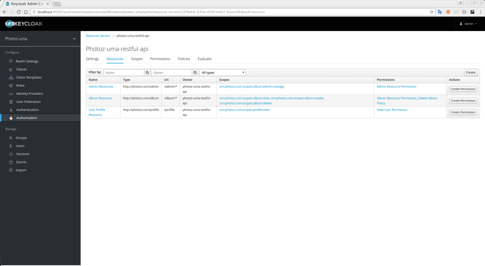

=== Viewing Resources

When you click on *Resource* tab, you'll be redirect to a page listing all the resources associated with a resource server.

.Resources

The resource list provides some very useful information about the protected resources, such as:

* Type
* URI
* Owner
* Associated scopes, if any
* Associated permissions

From there you can also create a permission right away by clicking on `Create Permission` button for the resources you want to create the permission.